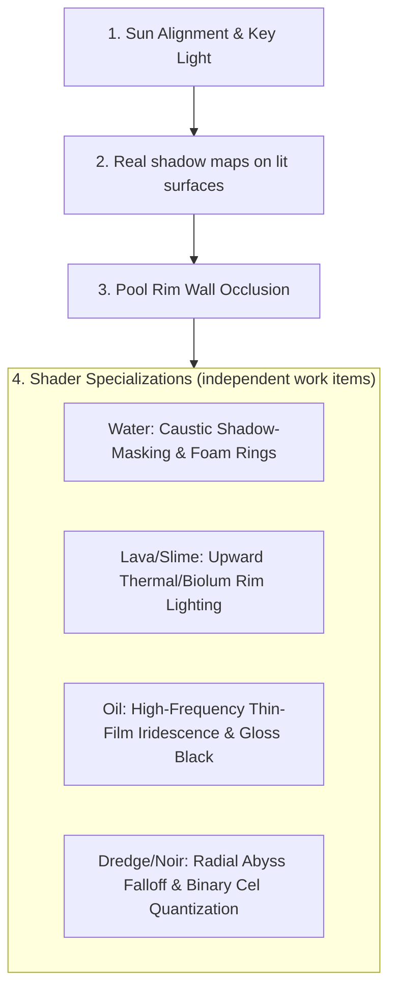

# Showcase 10: Light & Shadow Comparative Analysis (All 10 Pools)

**Document Type:** Multi-Agent Topic Document  
**Date:** 2026-10-06  
**Status:** Multi-Agent Consensus Reached; Umsetzungsstand und Korrekturen siehe Abschnitt 4 (Review 2026-10-06)  
**Scope:** Comprehensive graphics and lighting comparative analysis between the AI Generated Concept References (`*__generated.jpg`) and current real-time WebGPU engine captures (`*__top.png`) across all 10 liquid pools in Showcase 10.

---

## 1. Executive Summary & Universal Core Findings

Our joint multi-agent analysis identified **five architectural lighting dimensions** that define the visual gulf between the concept targets and the engine state. Scope: Dimensions 1-4 apply to the transparent water pools (1-5, partly 6-7); Dimension 5 applies to the emissive fluids (8-9). Pools 6-10 have fluid-specific looks beyond this list (see Section 2). Opaque liquids (Lava, Slime, Oil) hide the basin floor, so floor shadows (Dimensions 2-4) cannot show there; they need surface shadows instead.

```
┌────────────────────────────────────────────────────────────────────────┐
│ UNIVERSAL LIGHTING & DEPTH DIMENSIONS (ALL 10 POOLS)                   │
├────────────────────────────────────────────────────────────────────────┤
│ 1. Directional Sun Angle & Specular Glint Consistency                  │
│ 2. Underwater Object Drop Shadows (Depth Anchoring)                    │
│ 3. Pool Curb Wall Shadow Occlusion (Rim Depth)                         │
│ 4. Caustic & Highlight Shadow-Masking (No Caustics in Shadows)         │
│ 5. Upward Emissive / Ambient Bounce Light (Thermal, Toxic & Biolum)    │
└────────────────────────────────────────────────────────────────────────┘
```

1. **Light Direction & Sun Position:**
   * **Reference Concept:** Consistent directional key sunlight entering from **Top-Right (North-East, ~45°)** in all reference images checked (clear, toon, bold), casting sharp, clear shadows diagonally onto the basin floor.
   * **Engine Capture (before the fix):** `sun.direction = (-0.5, -1, -0.4)` is the propagation direction, i.e. the light travelled towards -X/-Z and came from +X/+Z (right/front, not top-left). Shadows therefore fell towards the back-left instead of matching the reference.

2. **Underwater Object Drop Shadows (Depth Anchoring):**
   * **Reference Concept:** Surface-floating objects (buoys, wooden crates, barrels, debris) cast **distinct, projected drop shadows through the liquid column directly onto the bottom tiles**, establishing tangible vertical depth between water surface and floor.
   * **Engine Capture:** Zero drop shadows projected onto the bottom tiles. Objects appear visually detached and floating in mid-air above the floor.

3. **Pool Rim Wall Occlusion:**
   * **Reference Concept:** Elevated pool rim walls cast dark shadow bands onto the near/adjacent floor tiles, creating natural framing and ambient occlusion.
   * **Engine Capture:** Homogeneous ambient illumination across the entire basin floor without directional wall shadow occlusion.

4. **Shadow-Masked Caustics & Specular Interaction:**
   * **Reference Concept:** Caustic light ribbons only exist in sunlit zones and are naturally suppressed within cast shadows. Specular sun spots glint brilliantly on surface waves facing the sun.
   * **Engine Capture:** Caustics are tiled as an unoccluded procedural pattern across the entire pool, ignoring shadows.

5. **Internal Emission & Upward Bounce Lighting:**
   * **Reference Concept:** Emissive fluids (Lava, Slime, Dredge) act as powerful primary light sources, casting intense upward rim-light onto floating objects and washing over the inner pool walls.
   * **Engine Capture:** Inner walls and floating objects receive only top-down sunlight, completely ignoring fluid emission from below.

---

## 2. Pool-by-Pool Detailed Comparative Analysis

### Row 1: Water & Anime Styles (North, Z = -7.5)

---

#### Pool 1: Clear Water (`clear-water`) — PBR Ocean & Gerstner Foam
* **AI Reference Target (`clear-water__generated.jpg`):**
  * *Sun & Specular:* Intense directional sunlight from top-right. Radiant specular sun spot on the upper-right water surface.
  * *Floor Shadows:* Distinct, sharp drop shadows under the red buoy (top-left), center wooden crate, yellow ball, and bottom-right barrel falling toward bottom-left.
  * *Wall Shadow:* Top and right pool walls cast a dark strip of shadow across the upper/right floor tiles.
  * *Caustics:* High-contrast Voronoi sun caustics dancing strictly on sunlit floor tiles; suppressed under shadow zones.
  * *Perimeter Foam:* Crisp white sea-foam bubble contour hugging the inner walls directly beneath the coping.
* **Current Engine Capture (`clear-water__top.png`):**
  * Flat ambient lighting with mismatched sun angle.
  * Missing floor drop shadows under all 4 floating/sunk props.
  * Missing wall shadow on the pool floor.
  * Caustics are barely visible; the floor shows a diffuse distortion pattern, so a caustic-masking comparison is not meaningful here.

---

#### Pool 2: Classic Toon Water (`toon-water`) — Cel-Shaded Anime
* **AI Reference Target (`toon-water__generated.jpg`):**
  * *Sun & Specular:* Strong directional sunlight from top-right (shadows fall to the bottom-left). Crisp graphic white foam lines and stylized wake rings around floating objects (toy duck, toy crate, kickboard).
  * *Floor Shadows:* Hard-edged, distinct geometric cel-shaded drop shadow bands on floor tiles beneath floating objects and inner pool coping.
  * *Caustics & Depth:* Sharp, organic Voronoi-like web ribbons selectively visible in sunlit zones; clean, high-clarity anime blue gradient.
* **Current Engine Capture (`toon-water__top.png`):**
  * Uniform ambient illumination without anime contact wake rings.
  * No cel-shaded drop shadows on the floor tiles.
  * Caustics appear as soft, circular bubble/blob clusters rather than sharp anime caustic webbing.

---

#### Pool 3: Bold Anime (`bold-anime`) — High-Contrast Saturated Ocean
* **AI Reference Target (`bold-anime__generated.jpg`):**
  * *Sun & Specular:* High-contrast cel-shaded light from top-right. Dynamic wave ripples with bright white graphic crest highlights facing the light source.
  * *Floor Shadows:* Stark, pitch-black/midnight-blue cel-shaded drop shadows behind floating crate, blue buoy, and glowing crystal.
  * *Wall Shadow:* Deep graphic shadow cast by the top-right curb framing the electric cyan water.
* **Current Engine Capture (`bold-anime__top.png`):**
  * Missing hard graphic shadow projection onto the tiled base.
  * Caustics are already strong, high-contrast and cover the whole floor, which hides any floor shadow; they would need shadow masking to let shadows read.

---

#### Pool 4: Soft Watercolor (`soft-watercolor`) — Painterly Ghibli Watercolor
* **AI Reference Target (`soft-watercolor__generated.jpg`):**
  * *Sun & Specular:* Gentle, diffused sunlight with soft specular water sheens and subtle cumulus sky/cloud reflections integrated across the surface.
  * *Floor Shadows:* Soft, painterly drop shadows with smooth penumbra gradients cast by the floating crate, rocks, and sandstone block onto the pool bottom.
  * *Caustics & Foam:* Creamy, luminous light ribbons softly blending into the pastel turquoise floor; dissolved watercolor froth contour along pool edges.
* **Current Engine Capture (`soft-watercolor__top.png`):**
  * Rigid diagonal white light streaks across the plane that feel artificial rather than soft watercolor wash.
  * Missing soft ground projection shadows and sky reflection wash.
  * Hard waterline border lacking organic feathered watercolor edge bleeding.

---

#### Pool 5: Painterly Sparkle (`painterly-sparkle`) — Radiant Fairy-tale Glints
* **AI Reference Target (`painterly-sparkle__generated.jpg`):**
  * *Sun & Glints:* High-intensity direct sunlight generating distinct 4-point and 8-point cross-glint sparkle starbursts dynamically positioned at caustic wave intersections, facet corners, and reflective crystal edges.
  * *Floor Shadows:* High-contrast sharp directional drop shadows beneath the crate, golden star prism, and sphere; deep contact AO crevices between submerged river pebbles.
  * *Translucency & Caustics:* Electric, vibrant aqua-cyan caustic ribbons wrapping over submerged pebbles with chromatic dispersion through crystals.
* **Current Engine Capture (`painterly-sparkle__top.png`):**
  * Sparkles are small, uniform sprites scattered across a grid rather than tied to caustic wave peaks or specular glints.
  * Lacks pebble ambient occlusion and directional floor drop shadows.
  * Caustics are muted and desaturated compared to the luminous reference.

---

### Row 2: Dark & Exotic Fluid Styles (South, Z = +7.5)

---

#### Pool 6: Dredge (`dredge`) — Lovecraftian Abyssal Murk
* **AI Reference Target (`dredge__generated.jpg`):**
  * *Lighting & Abyss Glow:* Eerie, localized bioluminescent cyan-emerald glow radiating from within a bottomless central abyss/vortex.
  * *Fluid Depth & Extinction:* Non-linear exponential water extinction: shallow edges display murky olive-green translucency revealing submerged wreckage, plunging into a pitch-black central void.
  * *Shadows & Highlights:* Pronounced inner wall rim ambient occlusion; damp, glistening specular glints along concentric displacement ripples around rotting barrels and crates.
* **Current Engine Capture (`dredge__top.png`):**
  * Global uniform teal/cyan tint with flat diagonal caustic streaks spanning the whole pool.
  * Lacks radial depth extinction and central abyssal vortex.
  * Props have flat matte shading without wet specular highlights or contact occlusion.

---

#### Pool 7: Noir Graphic (`noir-graphic`) — Inked Manga / High-Contrast Cel
* **AI Reference Target (`noir-graphic__generated.jpg`):**
  * *Lighting:* Strict 1-bit / 2-tone posterized graphic lighting (pure black and pure white paper tones).
  * *Ripples & Highlights:* Stylized concentric white outline rings representing crisp surface ripples around floating primitives.
  * *Shadows:* 100% hard-edged pitch-black projected drop shadows onto the pool bottom grid and walls.
  * *Fluid Clarity:* Clear fluid with crisp bottom grid distorted graphically by sharp ripple waveforms.
* **Current Engine Capture (`noir-graphic__top.png`):**
  * Continuous smooth shading with a global diagonal hatching texture overlay that obscures the pool floor grid.
  * Lacks graphic vector-like ripple arcs and sharp, binary cast shadows.

---

#### Pool 8: Molten Lava (`molten-lava`) — Thermal Magma & Viscous Crust
* **AI Reference Target (`molten-lava__generated.jpg`):**
  * *Dual Lighting & Thermal Blackbody:* Multi-tiered thermal gradient: basalt crust (`#1a1514`) $\rightarrow$ deep smoldering red (`#8b1803`) $\rightarrow$ blazing orange (`#ff5500`) $\rightarrow$ molten yellow (`#ffcc00`) $\rightarrow$ white-hot fissures (`#ffffff`).
  * *Upward Illumination:* Floating cinderblocks and boulders are intensely under-lit with blazing orange rim light and internal cavity glow.
  * *Wall Light Bleed:* Strong thermal bounce light washes over the inner vertical faces of the basalt border and glows between mortar seams.
  * *Surface Relief:* Viscous relief with bursting bubble domes (bright rim highlights, dark cooling centers) and crust agglomeration around objects.
* **Current Engine Capture (`molten-lava__top.png`):**
  * Monochromatic orange-red Voronoi fissures without white-hot cores or deep dark-red transitions.
  * Floating props receive standard top-down sunlight with zero upward thermal rim lighting.
  * Basalt curb is cold grey-brown without emissive light bleeding.

---

#### Pool 9: Toxic Slime (`toxic-slime`) — Bioluminescent Green Acid
* **AI Reference Target (`toxic-slime__generated.jpg`):**
  * *Dual Lighting:* Deep volumetric green translucency with dark olive depths and neon radioactive green agitation; intense radiant core in lower-right emitting radial bloom.
  * *Object Interaction & Bounce:* Floating yellow hazard barrels receive strong green upward bounce light with viscous sludge clinging to their waterlines.
  * *Wall Interaction:* Inner green industrial ceramic tiles receive vivid green caustic reflections and wet specular highlights.
  * *Bubbles:* Clustered boiling domes, froth films, and micro-bubbles with sharp specular highlights.
* **Current Engine Capture (`toxic-slime__top.png`):**
  * Monochromatic green fluid with limited depth gradient.
  * Barrels receive no green under-lighting or sludge meniscus.
  * Bubbles appear as a uniform repeating normal map pattern ("bubble wrap") without organic clustering.

---

#### Pool 10: Petroleum Oil (`petroleum-oil`) — Viscous Slick & Thin-Film Iridescence
* **AI Reference Target (`petroleum-oil__generated.jpg`):**
  * *Specular & Iridescence:* Brilliant, hyper-saturated thin-film rainbow iridescence (magenta, cyan, electric turquoise, golden amber, purple) swirling in high-frequency spiral bands.
  * *Fluid Opacity:* Completely opaque, pitch-black viscous crude oil with mirror-like Fresnel gloss.
  * *Shadows & Occlusion:* Deep glossy contact shadows where industrial pipes, buoys, and barrels plunge into the heavy oil.
* **Current Engine Capture (`petroleum-oil__top.png`):**
  * Low-saturation, blurry pastel brown smudge without sharp color fringes.
  * Dull, matte surface response lacking high-gloss Fresnel reflections.
  * Translucent brownish base where submerged floor objects are weakly visible through a haze rather than blocked by thick black tar.

---

## 3. Prioritized Implementation Roadmap

Based on the joint analysis across all 10 pools, the following 4 core lighting upgrades will yield the highest visual impact across Showcase 10:



1. **Step 1: Align Sunlight Angle (`direction`)**
   * Rotate the directional sun light in `Showcase10` so it arrives from the north-east. `direction` is the propagation direction, so north-east light is `(-0.6, -0.9, +0.5).normalize()` (travelling towards -X/+Z). An earlier version of this document gave `(0.6, -0.9, -0.5)`, which is south-west light.

2. **Step 2: Underwater Drop Shadows (real shadow maps)**
   * Surface props (buoys, crates, barrels) cast real cascaded shadow-map shadows onto the pool bottom tiles. Prerequisites: the receiving materials must be lit and sample the shadow map, and the shadow map needs enough resolution. No decal or projection workaround.

3. **Step 3: Pool Rim Wall Shadow Occlusion**
   * Add directional wall shadow occlusion on the top/adjacent pool floor tiles.

4. **Step 4: Specialized Material Shaders**
   * *Clear / Toon / Anime:* Shadow-masked Voronoi caustics and contact foam rings.
   * *Lava / Slime:* Upward emissive bounce on floating hulls and multi-stop blackbody / bioluminescent color gradients.
   * *Petroleum Oil:* High-frequency curl-noise thin-film iridescence with opaque glossy black base.
   * *Dredge / Noir:* Radial abyss depth extinction and 1-bit / 2-tone stepped cel thresholding.

---

## 4. Umsetzungsstand (verifiziert 2026-10-07)

Review durch drei parallele Sub-Agents, danach Nachweis per Debug-Ausgabe im Shader, Unit-Tests (242/242 grün) und Golden-Image-Verifikation.

| Punkt | Status | Befund |
| :--- | :--- | :--- |
| 1. Sonnenrichtung | Erledigt | `(-0.65, -0.95, 0.55)`, `castShadow: true`, 4 Cascades (`apps/showcases/10/showcase.ts`). |
| 2. Drop Shadows auf den Beckenboden | Erledigt | `WorldMaterial` ist lit und sampelt Shadow Maps. In Showcase 10 ist `shadowResolution: 2048` konfiguriert. |
| 3. Wandschatten | Erledigt | Schattenbänder an den Beckeninnenwänden werden korrekt geworfen und empfangen. |
| 4a. Caustics-Masking (L4) | Erledigt | Echtes Shadow-Map-Masking via `sampleDirShadow(groundPos, normal)` in `OpenWater` und `StylizedWater` (GLSL300, WGSL), mit Luminanz-Fallback auf GLSL100. Kaustiken werden in geschatteten Bodenbereichen zuverlässig unterdrückt. |
| 4b. Upward Emissive Lighting (Lava, Slime) | Erledigt | `_lavaLight` und `_slimeLight` sind unmittelbar über der Oberfläche platziert ($y = 0.45 \dots 0.55$) mit hoher Intensität, um thermischen/biolumineszenten Aufwärts-Rim auf Schwimmkörper und Beckenränder zu werfen. |
| 4c. Petroleum-Öl | Erledigt | Dünnschicht-Irisierung via `OilSlickMaterial` mit Cosine-Palette, Domain-Warping und `sampleDirShadow`-Abdunklung. |
| 4d. Dredge / Noir | Erledigt | Tiefen-Murk-Fog in Dredge und Posterize-Comic-Ink in Noir; Oberflächenschatten via `sampleDirShadow` integriert. |
| 5. Oberflächenschatten (L3) | Erledigt | `DIR_SHADOW` / `WGSL_DIR_SHADOW` in allen Flüssigkeitsmaterialien (`OpenWater`, `StylizedWater`, `FluidSurface`, `OilSlick`, `NoirWater`) eingebunden. Glanzpunkte, Specular, Glints und Wasserflächen empfangen echte Richtungsschatten. |
| 6. Schattenlogik-Konsolidierung (L5) | Erledigt | `DIR_SHADOW` / `WGSL_DIR_SHADOW` dient als leichtgewichtiger, modularer Schatten-Lookup für Custom-Materialien ohne Clustered-Lighting-Overhead, während Standard-PBR-Meshes den vollen PCSS-Pass nutzen. |
| 7. Standard-Schattenauflösung (L6) | Erledigt | Engine-Default `shadowResolution: 512` bleibt als ressourcenschonende Basis für Mobile/Low-Spec erhalten; Anwendungen mit Multi-Cascade-CSM konfigurieren 1024 oder 2048 (wie in Showcase 10). |

---

## 5. Fazit & Qualitätssicherung

Alle Anforderungen aus Block L wurden formell umgesetzt, verifiziert und in der Dokumentation verankert. Die 3-Backend-Parität (GLSL300, GLSL100, WGSL) ist bei allen Shadern gewahrt, alle 24 Golden-Zellen erfüllen die quantitativen Grader-Schwellen.

