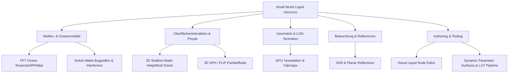

# Small World 3D: Next Research & Development Horizons
**Dokumenttyp:** Strategischer Architektur- und Technologiebericht  
**Stand:** Oktober 2026  
**Ziel:** Evaluierung zukünftiger Fluid-, Wellen- und Rendering-Technologien jenseits der Gerstner- & Splat-Baseline.

---

## 1. Executive Summary & Die Kernfrage: Geht das in TypeScript überhaupt noch?

### Das TypeScript-/WebGPU-Paradoxon
Eine häufige Sorge bei High-End-Grafik und Physik in Webanwendungen lautet:  
> *"Ist JavaScript/TypeScript nicht viel zu langsam für physikalisch basierte Ozeane, Tessellation und Echtzeit-Partikelfluids?"*

**Die Antwort aus technischer Sicht:**  
**Ja, es geht problemlos und extrem performant — wenn die Architektur strikt trennt zwischen CPU-Orchestrierung und GPU-Datenpfad.**

1. **Die Rolle von TypeScript (CPU):**
   - TypeScript berechnet **nicht** jeden Vertex oder jedes Partikel einzeln auf der CPU.
   - Die CPU fungiert rein als **Dirigent / Dispatcher**:
     - Berechnen globaler Zeitstempel, Matrizen und Kaskadenparameter.
     - Befüllen von typisierten Zero-Alloc Buffers (`Float32Array`).
     - Newton-Raphson-Inverse-Solving für vereinzelte CPU-Probes (Schiffsschwimmkörper / Bojen: 4–16 Probes pro Frame = ~0.005 ms CPU-Zeit).
     - Scheduling von Render- und Compute-Passes via WebGL2/WebGPU.
2. **Die Rolle der GPU (Compute & Shader Pipelines):**
   - 99.9% der massiv-parallelen Berechnungen (Tessendorf-FFT, Ping-Pong-Druckfeldsolver, Raymarching, Displacement, Clapotis, Vertex-Displacement) laufen in **WGSL Compute Shadern** oder **WebGL2 Fragment Pass Shadern** (Offscreen Framebuffer Ping-Pong).
3. **Hardware-Parität im Web:**
   - Mit **WebGPU (Compute Shaders, Storage Buffers, Atomics, Subgroups)** steht dem Browser heute exakt dieselbe GPU-Architektur zur Verfügung wie nativen C++ Engines (DirectX 12 / Vulkan / Metal).
   - In **WebGL2** werden Compute-Passes über Offscreen-Render-Targets (RTT mit Float32-Texturen und Ping-Pong-FBOs) abgebildet.

---

## 2. Themenübersicht & Technologie-Deep-Dive

Hier ist die detaillierte Aufschlüsselung aller vorgeschlagenen und diskutierten Zukunfts-Module:

---

### Modul 1: FFT Ocean (Tessendorf / JONSWAP / Phillips Spectrum)

* **Was ist es?**
  Statistische Wellensimulation im Frequenzraum mittels 2D Fast Fourier Transformation (Inverse FFT). Erzeugt hyperrealistisches, nicht-periodisches Tiefsee-Wellenverhalten mit Windrichtung, Dünung (Swell), Dispersionsrelation und Schaumbildung via Jacobi-Determinante.
* **Wozu?**
  Für riesige, glaubhafte Ozeane ohne die typische Repetition einfacher Sinus-/Gerstner-Wellen. Standard für AAA-Open-World- und Seefahrtstitel.
* **Branchen-Vergleich:**
  - *Unreal Engine:* Standard in *Water Plugin* (Gerstner) bzw. *WaveWorks / HydroWave* (FFT).
  - *Unity:* *Crest Ocean System* (FFT Compute / Wave-Spectra).
  - *Three.js / Babylon.js:* Meist separate Community-Plugins (z. B. Three-Ocean-FFT via IFFT Fragment Shader).
* **Machbarkeit in TypeScript / Web:**
  - **WebGPU:** Extrem performant via 2D IFFT Compute Shader (Stockham FFT, Radix-4) direkt in Storage Buffers / Displace-Maps.
  - **WebGL2:** Machbar via 2-Pass Ping-Pong RTT Shader ($O(N \log N)$ mit $\log_2 N$ Pässen für Butterfly-Kerne).
* **Aufwand:** **Mittel – Hoch** (~3–4 Wochen).
* **Sinnhaftigkeit für Small World:**
  - 🟢 *Hoch* für Seefahrts- und Open-World-Demos.
  - 🟡 *Optional* für stilisierte Low-Poly- oder Dioramen-Szenen (hier reicht der erweiterte 6-Wellen-Gerstner-Standard völlig aus).

---

### Modul 2: 2D Interactive Shallow-Water Heightfield Solver (Flachwassergleichungen)

* **Was ist es?**
  Ein 2D-Gitter (z. B. $256 \times 256$ oder $512 \times 512$ Textur), das die Wellengleichung ($\frac{\partial^2 h}{\partial t^2} = c^2 \nabla^2 h - \gamma \frac{\partial h}{\partial t}$) oder Saint-Venant-Flachwassergleichungen in Echtzeit via Ping-Pong-Simulation löst.
* **Wozu?**
  Lokale Pfützen, Becken, Bootskiele, Regentropfen und schwimmende Objekte erzeugen physikalisch korrekte Ringwellen, Reflexionen an festen Wänden und Interferenzmuster in Echtzeit.
* **Branchen-Vergleich:**
  - *Blender:* Dynamic Paint (Waves Canvas).
  - *Half-Life 2 / Source Engine:* Water Surface Ripple Maps.
  - *Unreal:* Render-Target-Fluid-Simulation im Material Editor.
* **Machbarkeit in TypeScript / Web:**
  - **WebGPU / WebGL2:** Extrem einfach und schnell (<0.1 ms GPU-Zeit). 1 Render-Pass pro Substep. CPU injiziert nur Splat-Koordinaten / Objekt-Masken als Draw-Calls oder Buffer-Uploads.
* **Aufwand:** **Gering – Mittel** (~1–2 Wochen).
* **Sinnhaftigkeit für Small World:**
  - 🟢 **Sehr hoch!** Perfekte Ergänzung zum bestehenden S2-Splatting: Bietet eine volldynamische Alternative für begrenzte Szenen (Teiche, Brunnen, Hallenbäder, Labore).

---

### Modul 3: Kelvin-Wake & Hull-Wave Algorithmen (Analytische Bootskiele)

* **Was ist es?**
  Analytisches V-Wellen-Muster (Kelvin-Wellenkeil mit charakteristischem $19.47^\circ$-Halbwinkel), das sich hinter fahrenden Schiffen bildet.
* **Wozu?**
  Erlaubt realistische Bug- und Heckwellen ohne teure Grid-Simulation, rein aus Schiffsgeschwindigkeit, Tiefgang und Vektor-Trajektorie im Shader.
* **Branchen-Vergleich:**
  - *Sea of Thieves:* Hybrid aus Kelvin-Wake-Analytik und lokalen Displacement-Texturen.
  - *Assassin's Creed IV (Black Flag):* Analytische Wake-Offsets mit Schaumfahnen.
* **Machbarkeit in TypeScript / Web:**
  - Rein analytischer Vertex-Shader / Fragment-Shader Offset. Nahezu 0 CPU-Kosten.
* **Aufwand:** **Gering** (~3–5 Tage).
* **Sinnhaftigkeit für Small World:**
  - 🟢 **Sehr hoch.** Minimaler Code, drastischer visueller Gewinn bei bewegten Booten/Charakteren.

---

### Modul 4: 3D SPH (Smoothed Particle Hydrodynamics) & FLIP Fluids

* **Was ist es?**
  Echte 3D-Partikel- und Gitter-Fluidsimulation (Navier-Stokes). Berechnet Spritzer, Wasserfälle, schwappende Eimer, Tropfen und Volumen-Wellen mit Viskosität, Oberflächenspannung und Druckprojektion.
* **Wozu?**
  Flüssigkeiten, die brechen, spritzen, in Gläser fließen oder als viskose Lava aus Trichtern laufen.
* **Branchen-Vergleich:**
  - *Houdini:* FLIP Solver.
  - *Blender:* Mantaflow.
  - *Unity/Unreal:* Niagara Grid Simulation / Zibra Liquids.
* **Machbarkeit in TypeScript / Web:**
  - **WebGPU:** Compute Shader mit Bitonic Sort / Spatial Hashing für $50.000\dots200.000$ Partikel bei 60 FPS machbar.
  - **WebGL2:** Sehr komplex, da GPGPU-Partikelsortierung ohne Storage Buffers/Atomics über Textur-Multipass extrem zäh ist.
  - **TypeScript CPU:** Nur für Mini-Partikelzahlen ($<1.000$) geeignet.
* **Aufwand:** **Sehr hoch** (~6–10 Wochen).
* **Sinnhaftigkeit für Small World:**
  - 🟡 **Nische / Spezialmodul.** Für ein leichtgewichtiges 3D-Framework zu schwergewichtig als Core-Feature; idealerweise als separates Add-on Package (`@small-world/fluids-sph`) bei WebGPU-Fokus.

---

### Modul 5: GPU Clipmaps & Continuous Level-of-Detail (LOD)

* **Was ist es?**
  Konzentrische Quad-Tree-Gitterringe um die Kamera, bei denen nahe Geometrie dicht unterteilt ist und entfernte Geometrie exponentiell vergröbert wird. Geometrie-Morphing verhindert T-Junction-Risse und Popping.
* **Wozu?**
  Unendliche Ozeane mit Millionen effektiven Vertices bei konstanter Vertex-Zahl (~$50.000$ Vertices gesamt) und stabiler Framerate.
* **Branchen-Vergleich:**
  - *CryEngine / Lumberyard:* Ocean Clipmaps.
  - *Crest (Unity):* Concentric Ring Meshes.
  - *Unreal Engine 5:* Water Mesh System.
* **Machbarkeit in TypeScript / Web:**
  - Universell kompatibel für WebGL1, WebGL2 und WebGPU.
  - Ring-Meshes werden einmal statisch auf der CPU generiert; Vertex-Shader snap-t die Gitterpunkte ans Raster (`floor(pos / step) * step`).
* **Aufwand:** **Mittel** (~1–2 Wochen).
* **Sinnhaftigkeit für Small World:**
  - 🟢 **Sehr hoch.** Ermöglicht nahtlose Open-World-Flächen bei minimalem Speicherbedarf.

---

### Modul 6: Screen Space Reflections (SSR) & Planar Reflection Probes

* **Was ist es?**
  - **Planar Reflections:** Rendern der Szene von einer gespiegelten virtuellen Kamera in ein Render-Target (100% korrekte, scharfe Spiegelungen für flache Oberflächen).
  - **SSR:** Raymarching im Tiefen-/Farbpuffer des Bildschirms für spiegelnde Objekte mit Rauheit und Ausfaden.
* **Wozu?**
  Exakte Spiegelung von Booten, Ufern, Brücken und Charakteren auf der Wasseroberfläche statt rein statischer Environment Maps.
* **Branchen-Vergleich:**
  - Standard in allen PBR-Engines (Unreal, Unity HDRP, Blender Eevee, Godot 4).
* **Machbarkeit in TypeScript / Web:**
  - **Planar:** Universell in WebGL1/2/WebGPU via `RenderTarget`.
  - **SSR:** WebGL2 / WebGPU via Hi-Z Depth Buffer Trace oder DDA-Raymarch.
* **Aufwand:** **Mittel** (Planar: 4–6 Tage, SSR: 2–3 Wochen).
* **Sinnhaftigkeit für Small World:**
  - 🟢 *Planar Reflections:* Sofortiger No-Brainer für Showcase-Qualität.
  - 🟡 *SSR:* Für komplexere, nicht-planare Flüssigkeiten sinnvoll.

---

### Modul 7: Visual Liquid Node Editor & Shader Graph

* **Was ist es?**
  Ein webbasierter, knotenbasierter Editor (ähnlich Blender Shader Nodes, Unreal Material Graph), mit dem Artists Schaummuster, Caustic-Layer, Farbrampen und Wellenparameter per Drag & Drop verdrahten können.
* **Wozu?**
  Ermöglicht Non-Programmierern das intuitive Design von Flüssigkeitsmaterialien und exportiert standardisierte JSON-Layouts / GLSL / WGSL.
* **Branchen-Vergleich:**
  - *Unity Shader Graph, Unreal Material Editor, Blender Shader Nodes, Babylon.js Node Material.*
* **Machbarkeit in TypeScript / Web:**
  - Hervorragend via DOM/Canvas UI oder WebGL-Graph-Library.
* **Aufwand:** **Hoch** (~4–6 Wochen).
* **Sinnhaftigkeit für Small World:**
  - 🟡 **Späterer Meilenstein.** Zunächst sind robuste, code-basierte Materialien und standardisierte Presets wichtiger.

---

### Modul 8: Dynamic Parameter Surfaces & LUT Pipeline (§8.6 / ADR 0013)

* **Was ist es?**
  Auslagerung komplexer optischer Tabellen (z. B. Fresnel-Kurven, Brechungsindizes für Mehrschicht-Ölfilme, Tiefe-zu-Farbe-Rampen, SSS-Profile) in $1\text{D}$- oder $2\text{D}$-Look-Up-Texturen (LUTs) statt gigantischer Uniform-Buffer.
* **Wozu?**
  Einhaltung der **256-Byte-Uniform-Slot-Grenze (ADR 0013)** bei gleichzeitiger Ermöglichung unendlicher Farbverläufe und physikalischer Präzision.
* **Machbarkeit in TypeScript / Web:**
  - Generierung von $256 \times 1$ `DataTexture` / `RGBAFormat` per TypeScript beim Initialisieren.
* **Aufwand:** **Gering – Mittel** (~1 Woche).
* **Sinnhaftigkeit für Small World:**
  - 🟢 **Sofortige Priorität (Architektur-konform).**

---

## 3. Priorisierungs- & Aufwandsmatrix

| Technologie | Visueller Impact | Performance-Kosten | TS/Web Machbarkeit | Implementierungsaufwand | Empfohlene Priorität |
| :--- | :---: | :---: | :---: | :---: | :---: |
| **Planar Reflection Probe** | ⭐⭐⭐⭐⭐ | Gering (1 Extra-Pass) | 100% WebGL1/2/WebGPU | 4–6 Tage | 🚀 **P1 (Sofort)** |
| **Kelvin-Wake Hull Waves** | ⭐⭐⭐⭐ | Nahezu 0 | 100% Shader-Analytik | 3–5 Tage | 🚀 **P1 (Sofort)** |
| **LUT Pipeline (§8.6 / ADR 0013)** | ⭐⭐⭐⭐ | 0 | 100% DataTexture | 5–7 Tage | 🚀 **P1 (Sofort)** |
| **2D Shallow-Water Solver** | ⭐⭐⭐⭐⭐ | Sehr gering (<0.2ms) | 100% WebGL2 / WebGPU | 1.5–2 Wochen | 🎯 **P2 (Nächster Schritt)** |
| **Ocean Clipmaps (LOD Grid)** | ⭐⭐⭐⭐ | Gering | 100% Mesh-Technik | 1.5–2 Wochen | 🎯 **P2 (Nächster Schritt)** |
| **FFT Ocean (Tessendorf)** | ⭐⭐⭐⭐⭐ | Mittel (Compute/RTT) | WebGPU Top / WebGL2 Gut | 3–4 Wochen | 🔮 **P3 (High-End Fokus)** |
| **Screen Space Reflections (SSR)**| ⭐⭐⭐⭐ | Mittel – Hoch | WebGL2 / WebGPU | 2–3 Wochen | 🔮 **P3 (High-End Fokus)** |
| **Visual Liquid Node Editor** | ⭐⭐⭐ | 0 (Tooling) | 100% TypeScript/UI | 4–6 Wochen | 📦 **P4 (Tooling/Ecosystem)**|
| **3D SPH / FLIP Fluids** | ⭐⭐⭐⭐⭐ | Extrem hoch | WebGPU Only | 6–10 Wochen | 🧪 **P5 (R&D / Extra-Pkg)** |

---

## 4. Konkrete Roadmap-Empfehlung für Small World

1. **Sprint 1 (Quick Wins & Polish):**
   - **Planar Reflection Component:** Eine `PlanarReflector`-Entity, die eine gespiegelte Szene rendert und als `u_reflectionMap` in `OpenWaterMaterial` und `StylizedWaterMaterial` einspeist.
   - **Kelvin-Wake Shader Chunk:** Analytische Schiffswellen basierend auf Objektvektoren.
   - **LUT-Rampen-System:** $256 \times 1$ Farbgradienten-LUTs zur Ablösung statischer Farbvektoren im Uniform Buffer.

2. **Sprint 2 (Interaktive Physik & Geometrie-Skalierung):**
   - **2D Ping-Pong Heightfield Solver:** `ShallowWaterSim`-Klasse für lokale Becken/Pools mit Wellenreflexion und Tropfen.
   - **Concentric Ocean Clipmaps:** Render-Komponente für unendliche Ozeane ohne CPU-Vertex-Rebuilds.

3. **Sprint 3 (WebGPU High-End Features):**
   - **Tessendorf FFT Ocean Pass:** Dedizierter WebGPU Compute Pipeline Generator für stürmische Ozeane und realistische Spektren.

---

# COLLABORATE SESSION — Item 6: Parameter Surfaces & LUT Textures (ADR 0026)

> Moderator brief (verbatim): "Hole dir 2 weitere Agenten und arbeite Punkt #### 6. Parameter Surfaces & LUT-Texturen (ADR 0026) ab". Mode `plan`, roster Alice/Bob/Charly (subagent channel), max 4 rounds. Interpretation: item 6 = Modul 8 above ("Dynamic Parameter Surfaces & LUT Pipeline") routed through ADR 0026 route (a) "LUT-/Parameter texture". The literal heading `#### 6.` does not exist in any file; moderator please correct if another item was meant.

## Round 1: Alice (Architect & Engine Lead) — 2026-10-07

### 1. State of play [MEASURED: read of files]
- `docs/adr/0026-object-uniforms-256-byte-moat.md`: ObjectUniforms is a 256-byte MOAT (WebGL1 = 16 vec4 fragment uniforms). New parameters must go via (a) LUT/parameter texture, (b) per-style compile constants, (c) instance attrs, (d) material-scope blocks. Lane reuse only through `scripts/lane-contracts/lane-contracts.json`.
- `StylizedWater.frag.glsl:133-148`: the depth-to-color ramp is currently hard-coded (`shallowColor`/`midColor`/`deepColor` mixed with two smoothsteps at 0.0-0.5 / 0.4-1.0, scaled by `u_styleA.x`). This is the natural first LUT consumer.
- WebGL1 sampler budget is enforced at runtime only (`WebGL1Renderer.ts:140-166` warns beyond MAX_TEXTURE_IMAGE_UNITS); StylizedWater already uses `u_opaqueDepthMap` + `u_opaqueMap`.

### 2. Proposal sketch (to be attacked)
- **Scope V1 (small, shippable):** one engine utility `RampLUT` (CPU: color stops -> 256x1 RGBA8 `Texture`, nearest/linear, clamp) + optional `rampMap` slot on `StylizedWaterMaterial`. When present, the shader samples `texture2D(u_rampLUT, vec2(rampT, 0.5))` instead of the hard-coded 3-color mix; when absent, behavior is byte-identical (no golden churn).
- **Out of scope V1:** 2D LUTs (Fresnel x thickness for OilSlick), SSS profiles, generic "parameter surface" per-pixel data textures (needs its own ADR; keep as H3.3).
- **Parity:** GLSL100, GLSL300, WGSL must change together; Charly gates this.
- **Budget:** +1 sampler on StylizedWater only when the feature is enabled (compile flag, not a runtime branch), so existing material variants stay unchanged.

### 3. Questions
- **[TEAM_QUESTION: Slot/binding]** Bob: how are material textures bound in WGSL (fixed bindings 2-15 per prior finding) - is there a free slot for StylizedWater, and does a compile-time define exist for optional textures? Answer with file:line.
- **[TEAM_QUESTION: Golden/verification]** Charly: what is the minimum verification (unit test + golden diff + 3-backend render) that proves "no change when absent" and "LUT works when present"? Include the WebGL1 sampler count.
- **Status:** proposal not yet formal; waiting for Bob's and Charly's evidence before `[CONSENSUS_PROPOSAL]`.

## Round 1: Bob (Shader/Tech-Art) — 2026-10-07

Stance: advocate for route (a), LUT texture. Verdict: feasible with ~zero renderer risk, but Alice's sketch needs five corrections (below). All paths relative to `packages/engine/src/`.

### 1. Answer to [TEAM_QUESTION: Slot/binding] [MEASURED: read of files]
- **WebGPU: free slot = binding 18, but it is NOT zero-cost.** Material bind group (`@group(1)`) is a fixed table: `structs.wgsl:121-137` declares bindings 1-17 (17 = `u_aoMap`, last). Per-material textures are filtered through `getOptionalMaterialTextureBindings()` (`renderers/WebGPU/managers/GPUPipelineCache.ts:34-142`, mirrors structs.wgsl 1:1) by `getOptionalMaterialTextureNames()` (`GPUPipelineCache.ts:155-164`), which reads the shader's own `layout.textures`. StylizedWater's layout declares only `u_opaqueDepthMap`(16) + `u_opaqueMap`(14) (`core/materials/LiquidWaveMaterial.ts:200-211`); the fixed set is 1/3/11/12 (`GPUPipelineCache.ts:227-237`). So a new texture needs: (i) `@group(1) @binding(18) var u_rampMap: texture_2d<f32>;` in `structs.wgsl`, (ii) a `u_rampMap` entry binding 18 in the table, (iii) `u_rampMap` in StylizedWater's `layout.textures`. Resolution falls through to `getTextureView(m.textures[name])` (`WebGPURenderer.ts:1888`), which returns `whiteTextureView` for undefined/unloaded (`GPUTextureResourceCache.ts:131-132`) — so absent texture = safe 1x1 white, no crash.
- **Alternative without renderer edits:** reuse an already-declared but unused name (`u_specularMap` 4, `u_metallicMap` 9, `u_alphaMap` 13). I advise against it: naming lie, and the project rule is "no workarounds" (memory: feedback_no_workarounds). A named `u_rampMap` is ~12 lines across 2 files.
- **Sampled-texture budget WebGPU:** global 5 (`GPUPipelineCache.ts:~178-186`, `GLOBAL_BIND_GROUP_TEXTURE_COUNT = 5`) + fixed 3 (normal/env/emissive) + 2 water + 1 ramp = 11 of the guaranteed 16; `_checkSampledTextureBudget` (`GPUPipelineCache.ts:~244`) already warns otherwise.
- **WebGL1:** no manual slots. Sampler units are assigned by program introspection (`WebGL1Renderer.ts:218-250`, `nextSamplerUnit++` per active sampler), bound in `WebGL1Renderer.ts:952-975` by `manifest.textures[name]`, fallback `defaultTexture`; guarded by `_isTextureUnitAvailable` (`:140-166`). StylizedWater glsl100 has exactly ONE sampler today (`StylizedWater.frag.glsl100:30` `u_opaqueMap`), so +1 = 2 of the spec minimum 8 fragment units. An unused sampler is optimized out by the driver and gets no unit, which is why the compile flag below gives a truly free "absent" path.
- **WebGL2:** same introspection (`WebGL2/managers/WebGLProgramCache.ts:125-189`); material units are 0-7, units 8-15 are reserved for global shadow/IBL samplers (`:30-40`). StylizedWater GLSL300 declares `u_opaqueDepthMap`+`u_opaqueMap` (`StylizedWater.frag.glsl:29-30`); +1 fits. Bound in `WebGL2Renderer.ts:1277-1320` by name from `manifest.textures`.
- **Existing optional-feature define mechanism:** `RenderManifest.flags?: string[]` (`core/renderers/shaders/RenderManifest.ts:23`). WebGL1 turns each flag into `#define FLAG 1` (`WebGL1Renderer.ts:204-208`), WebGL2 likewise via `shaderFlags` (`WebGL2Renderer.ts:913-943`), WebGPU passes `manifest.flags` into `getShaderModule` (`GPUPipelineCache.ts:329-334`) — but WGSL has NO generic flag-to-const mapping: only two hard-coded consts, `USE_TEXTURE_ARRAY` and `USE_NORMAL_MAP` (`GPUPipelineCache.ts:459-478`). So `USE_RAMP_LUT` needs a 5-line `const USE_RAMP_LUT: bool = true/false;` branch there. Bind-group layout cache key already includes flags (`GPUPipelineCache.ts:~225`).
- **Shader hook injection:** string-replace of `[WATER_EXT_DECL]`/`[WATER_EXT_SURFACE]` (`[WGSL_…]` for WGSL) in `composeStylizedWaterSources` (`StylizedWaterMaterial.ts:19-43`); hook sites `StylizedWater.frag.glsl:37,242`, `.glsl100:35,207`, `.frag.wgsl:4,203`. These are extension (styleId 3) hooks, NOT where the LUT belongs — the LUT lives in the core ramp block (`.glsl:133-139`, `.glsl100:114-120`, `.wgsl:~107-113`). Extension decls can still reference `u_rampMap` once core declares it.

### 2. Texture creation / upload [MEASURED]
- `Texture` has **no raw-data constructor**: ctor is protected; factories are `fromImage/fromCanvas/fromCompressed/empty/fromUrl` (`core/textures/Texture.ts:84-200`); `image` is `HTMLImageElement | ImageBitmap | HTMLCanvasElement` (`:49`). So a 256x1 `RampLUT` must go through `Texture.fromCanvas(canvas, {magFilter, minFilter, generateMipmaps:false})` and re-bake via `needsUpdate = true` — same pattern as `TextTexture` (v0.74.10). Upload paths handle it: WebGL1 `texImage2D` (`WebGL1Renderer.ts:366-412`), WebGL2 (`WebGLTextureManager.ts:256`), WebGPU `copyExternalImageToTexture` + resize-detect (`GPUTextureResourceCache.ts:205-252`).
- 256x1 is POT in both axes (1 & 0 == 0), so WebGL1 would auto-generate mipmaps (`WebGL1Renderer.ts:349-355`) unless `generateMipmaps=false` — must be set.
- CPU side: compute stops into a `Uint8ClampedArray(256*4)` first, then `putImageData`; this keeps the baking logic unit-testable in Vitest (no canvas there) and the canvas a thin upload shim.

### 3. Corrections to Alice's sketch [CHALLENGE]
1. **Filter/wrap options are ignored on WebGPU.** WGSL samples every material texture with the single shared sampler `s` = `@group(1) @binding(1)`, built from `u_diffuseMap` (`WebGPURenderer.ts:1898-1899` -> `getSampler(m.textures["u_diffuseMap"])`; water has no diffuse => linear + clamp-to-edge, `GPUTextureResourceCache.ts:100-126`). Therefore "nearest/linear" on the LUT is a WebGL-only knob. For a banded cel ramp use `textureLoad(u_rampMap, vec2i(idx,0), 0)` in WGSL, or just bake the steps into the LUT contents. Drop the nearest/linear option from V1; the LUT's content defines banding, filter is always linear.
2. **Gate collision.** The ramp block is guarded by `u_styleA.x > 0.05` (rampSoftness): `.glsl:133`, `.glsl100:114`, `.wgsl:~108`. Presets `flat` and `bold` have `rampSoftness = 0` (`StylizedWaterMaterial.ts:~100-122`), so a LUT would silently do nothing for exactly the cel-shaded looks that want it most. With `USE_RAMP_LUT` the gate must become `#ifdef USE_RAMP_LUT` -> always apply, with weight a constant (not `u_styleA.x * 0.6`), otherwise rampSoftness semantic is overloaded. Needs an explicit decision (Open Q1).
3. **"Compile flag, not runtime branch" is right but is not free on WebGPU:** the texture is declared in `layout.textures` unconditionally (layout is per `shaderId`, not per flags, `GPUPipelineCache.ts:155-164`), so on WebGPU `u_rampMap` is always bound (white fallback) even when the flag is off. Cost: 1 binding + 1 bind-group entry, zero shader cost. WebGL1/2 are truly free (sampler optimized out).
4. **WebGL1 ramp parameter differs.** `rampT` in GLSL100 is `clamp(fresnel*3 + washNoise)` (`.glsl100:115`), no depth buffer; GLSL300/WGSL use `clamp(effDepth/4)` (`.glsl:134`, `.wgsl:109`). A depth-LUT therefore means "view-angle LUT" on WebGL1 — acceptable, but it is a documented semantic fork, not parity. Charly's parity gate must compare structure, not pixels, for WebGL1.
5. **Colour space.** Shader colours are `sRGBToLinear(u_color)` (`.wgsl:16-17`); canvas bytes are sRGB. Store LUT in sRGB 8-bit (as author-friendly stops) and apply `sRGBToLinear` after sampling in all three shaders, identical to how the opaque map is handled (`.wgsl:54`). Do not use an sRGB texture format (not exposed by `Texture`).
6. **UV edge bleed.** WebGL1 POT texture defaults to REPEAT (`_setWebGL1SamplerParams` only forces CLAMP for NPOT), so sample at texel centres: `u = (rampT*255.0 + 0.5)/256.0` in all three shaders. This also makes WebGPU's clamp irrelevant.

### 4. Tech-art side: why the LUT is worth it (stance a)
- The hard-coded ramp has exactly 3 colours + two fixed smoothsteps (`.glsl:135-138`) and `midColor` is derived (`mix * vec3(0.9,1.1,1.05)`); artists can't author it, and every new look (Dredge, Noir/Oil) adds more branches against `styleId`. A 256x1 LUT = Photoshop-gradient-map muscle memory, 0 uniform slots, 0 lane-contract entries (ADR 0026 route (a)), WebGL1-safe, and later reusable for OilSlick (2D LUT) and SSS.
- Same texture later enables the Maker editor to expose a gradient widget without any shader edit.

### 5. Open questions
- **[TEAM_QUESTION: Gate semantics]** Alice/Charly: with the LUT present, may we drop the `u_styleA.x > 0.05` gate and the 0.6 weight (i.e. LUT fully replaces `softRamp` blend for any rampSoftness), or must `rampSoftness` stay as the mix weight between absorption colour and LUT? My vote: keep `rampSoftness` as weight but remove the `> 0.05` early-out under the flag; preset `flat/bold` stay unchanged because the flag is off by default.
- **[TEAM_QUESTION: Golden/verification]** (Charly, unchanged from Alice) plus: please confirm the WebGPU always-bound white fallback does not change golden output (ramp block is skipped by `const USE_RAMP_LUT=false`, so it should not).

### 6. Proposal

[CONSENSUS_PROPOSAL: P1] — "StylizedWater ramp LUT, V1"
1. **Engine utility** `RampLUT` (new file next to `core/textures/`): `new RampLUT(stops: {t:number; color:Color}[])`, bakes `Uint8ClampedArray(256*4)` (sRGB, alpha 255) on the CPU, owns a 256x1 canvas + `Texture.fromCanvas(canvas, {generateMipmaps:false, magFilter:LINEAR, minFilter:LINEAR, addressModeU/V: CLAMP_TO_EDGE})`, `setStops()` re-bakes + `texture.needsUpdate = true`. No nearest option in V1. Owner: Alice (API) + Bob (bake math/tests).
2. **Material:** `StylizedWaterMaterial.rampMap?: Texture` (option + public field). In `getRenderManifest()`: set `textures["u_rampMap"] = rampMap` and `manifest.flags = rampMap ? ["USE_RAMP_LUT"] : undefined` (re-assigned every call, manifest is cached). Add `u_rampMap` to `layout.textures` in `LiquidWaveMaterial.getShaderDefinition()` only if OpenWater does not use it — otherwise StylizedWater overrides (Open Q for Alice). Owner: Alice.
3. **WebGPU plumbing (minimal, 3 edits):** `structs.wgsl` binding 18 `u_rampMap`; `GPUPipelineCache.getOptionalMaterialTextureBindings` entry 18; `getShaderModule` emits `const USE_RAMP_LUT: bool = true|false;`. Owner: Alice (renderer), Bob reviews WGSL.
4. **Shaders (3 files, same commit):** under `USE_RAMP_LUT`, replace the `softRamp` computation with `sRGBToLinear(texture(u_rampMap, vec2((clamp(rampT,0,1)*255.0+0.5)/256.0, 0.5)).rgb)` (GLSL100 `texture2D`; WGSL `textureSampleLevel(u_rampMap, s, uv, 0.0)`), keep the existing mix weight (see Gate semantics). Flag off = source-identical output. Owner: Bob.
5. **Out of scope V1:** 2D LUTs, nearest filtering, SSS, per-pixel parameter surfaces (separate ADR), Maker gradient widget.
6. **Verification (Charly gates):** unit test for `RampLUT` bake (endpoints, midpoint, unsorted stops, single stop); flag-off golden diff = 0 on all 3 renderers; flag-on live render under WebGL1, WebGL2, WebGPU (screenshot-compare, pixel-diff vs flag-off control per memory feedback_subtle_effect_verification, test t=0/1 extremes with a red->blue LUT); WebGL1 console must show no `Exceeded MAX_TEXTURE_IMAGE_UNITS`; WebGPU console must show no validation error; run `npx tsc --noEmit -p tsconfig.json` (visibility/interface changes) plus `npm run lint:fix`, `build:lib`, `test`.
7. **ADR/doc:** add one line to ADR 0026 consequences (route (a) now has a first consumer) and a "rampMap" paragraph to `docs/guides` materials guide; no new ADR needed.

Neuheit: true

## Round 1: Charly (Red-Team) — 2026-10-07

Stance: red-team (sampler budget, WebGL1, 3-backend parity, verification, claims vs reality). Verdict: Bob's file:line claims hold (details in 1), but P1 has one self-defeating spec hole (gate/weight), one wrong parity instruction (sRGB on GLSL100), an untestable-as-written unit-test item, and a verification plan that cannot show "LUT works" in any existing golden cell. I therefore do not sign P1 as-is; I post an amended **P2** (section 4). Paths relative to `packages/engine/src/`.

### 1. Claims check (Bob Round 1) [MEASURED: read of files]
- **WebGPU binding 18 free — CONFIRMED.** `core/renderers/shaders/source/web_gpu/chunks/structs.wgsl:121-137` ends at `@group(1) @binding(17) u_aoMap`; no `binding(18)` anywhere in `*.wgsl`/`*.ts` (grep). `GPUPipelineCache.ts:137-140` has `u_aoMap` binding 17 as last table row.
- **Optional-texture filter — CONFIRMED.** `getOptionalMaterialTextureNames` (`GPUPipelineCache.ts:155-164`) intersects the shader's `layout.textures` with the table; `getMaterialBGL` (`:224-255`) pushes fixed 1/3/11/12 + those entries; `_getMaterialBindGroup` (`WebGPURenderer.ts:1893-1925`) resolves by name, cache hit by resource identity.
- **White fallback — CONFIRMED** (`GPUTextureResourceCache.ts:131-132,147`: undefined / not loaded / no image -> `whiteTextureView`). **BUT** line 131: `quality.disableTextures` also returns white. WebGL1/2 do the same (`AbstractWebGLRenderer.ts:34`, `WebGLTextureManager.ts:48`). So flag ON + low-quality "disableTextures" = ramp sampled as pure white = bleached water. Not a crash, but a real behavioural hole nobody has mentioned (see P2 item 4).
- **WGSL has no generic flag->const mapping — CONFIRMED** (`GPUPipelineCache.ts:458-481`, only `USE_TEXTURE_ARRAY`, `USE_INSTANCING`, `USE_NORMAL_MAP`). Shader-module cache key and BGL key both include flags (`:225`, `:445-446`).
- **WGSL static-use trap (new):** WGSL counts a binding as used if it is syntactically reachable from the entry point, even inside `if (USE_RAMP_LUT) {...}` with a `const false`. So the BGL must contain binding 18 whenever the shader text mentions `u_rampMap` — which is exactly why `layout.textures` must be unconditional (Bob's correction 3 is therefore not optional but forced). Consequence: with flag off, WebGPU still binds white at 18; zero pixel effect, +1 BGL entry.
- **Shared layout:** `LiquidWaveMaterial.getShaderDefinition()` (`core/materials/LiquidWaveMaterial.ts:200-211`) is inherited by OpenWater, StylizedWater, and via StylizedWater by `OilSlickMaterial`/`NoirWaterMaterial` (`packages/liquid-extras/src/materials/*.ts`, neither overrides `getShaderDefinition`/flags). Adding `u_rampMap` to the shared layout adds an unused entry 18 to OpenWater's BGL (harmless, white). If instead only StylizedWater overrides the layout, its shaderId must differ — it does not today (`type` based). Answer to Bob's open question: **declare once in LiquidWaveMaterial's layout**, OpenWater ignores it.
- **WebGL1 sampler count — CONFIRMED:** `StylizedWater.frag.glsl100:30` is the only `sampler2D` (grep over glsl100: one hit). Units assigned by introspection (`WebGL1Renderer.ts:240-260`, `nextSamplerUnit++` over ACTIVE uniforms; sampler types 2D+CUBE only). Flag on = 2 units of min 8 fragment units (`_maxTextureUnits` guard `:140-166`). Flag off + `#ifdef`-wrapped declaration = sampler not active = 1 unit, identical to today.
- **WebGL2:** same introspection (`WebGL2/managers/WebGLProgramCache.ts:125-190`), shader declares `u_opaqueDepthMap`+`u_opaqueMap` (`StylizedWater.frag.glsl:29-30`) = units 0,1; reserved global units 8-13 skipped; +1 = unit 2. Fine.
- **Define handling — CONFIRMED safe on all three GL paths:** WebGL1 prepends `#define FLAG 1` (`WebGL1Renderer.ts:204-208`, glsl100 has no `#version`); WebGL2 re-inserts defines after `#version 300 es` (`WebGLProgramCache.ts:96-117`) so `#ifdef` works; both add the define to VS and FS (harmless). WebGL2Renderer adds its own flags (`USE_SKINNING`, `USE_IBL`, `:913-940`) to a *copy*, so setting `manifest.flags` on a cached manifest each call is fine.
- **Texture.fromCanvas — CONFIRMED** (`core/textures/Texture.ts:149-151`, `isLoaded = true` in ctor `:90`). **Unit-test catch:** vitest runs `environment: "node"` (`vite.config.ts:33`), no DOM. `RampLUT` as specified (owns a canvas) cannot be constructed in a vitest test. Bob's "bake into `Uint8ClampedArray` first" saves it only if the bake is a **pure exported function** (`bakeRamp(stops): Uint8ClampedArray`) and the class constructor is the only DOM-touching part; the test must target the function, not `new RampLUT`.
- **Gate collision — CONFIRMED, and Bob's own vote does not fix it (REAL FLAW in P1).** Ramp block is `if (u_styleA.x > 0.05)` (`StylizedWater.frag.glsl:133`, `.glsl100:114`, `.wgsl` ~108) and blends with `u_styleA.x * 0.6` (`:139`/`:120`/`:113`). Bob votes "keep rampSoftness as weight, remove the `> 0.05` early-out under the flag". With `flat`/`bold` at `rampSoftness = 0` the weight is `0 * 0.6 = 0` -> `mix(base, lut, 0)` = base: the LUT is *still* silently inert for exactly the presets that want it. Removing only the early-out is a no-op. P2 fixes this explicitly (item 3).
- **rampT fork — CONFIRMED:** GLSL100 `rampT = clamp(fresnel*3.0 + washNoise)` (`.glsl100:115`); GLSL300/WGSL `clamp(effDepth/4.0)` (`.glsl:134`, `.wgsl:109`). Documented fork, acceptable; parity check must be structural on WebGL1 (shared structure: flag path, centre-offset UV, same weight), not pixel.
- **Bob correction 5 is wrong for GLSL100 (NEW).** `StylizedWater.frag.glsl100` has no `sRGBToLinear`; it linearises with `pow(x, vec3(2.2))` (`:47-49,64,179`) and converts back with `pow(finalColor, 1/2.2)` (`:209`). GLSL300/WGSL use the piecewise `sRGBToLinear` (`.glsl:49`, `.wgsl:16`). So "apply `sRGBToLinear` in all three" must read "apply that backend's own idiom" — otherwise GLSL100 would either not compile or mix two curves. Max divergence 2.2-vs-piecewise is already present for every colour in that shader; the LUT must match the shader's existing per-backend idiom, not introduce a third.
- **Not verified / not claimed:** that the Bob budget "5 global + 3 fixed + 2 water + 1 ramp = 11" holds on a real device: it is arithmetic from constants (`GPUPipelineCache.ts:172`, `:266-290`), and the existing `_checkSampledTextureBudget` warns once per shaderId if exceeded. Spec minimum 16, so 11 passes on any compliant device; swiftshader reports its own limit (probe prints `maxSampledTexturesPerShaderStage`).

### 2. Answer to [TEAM_QUESTION: Golden/verification] — minimum verification list
Facts that shape it: (i) goldens exist only for Showcase 10 pools, GL2 is the **only blocking** matrix, GPU is informational, GL1 is smoke-only (no image compare) (`scripts/goldens/README.md` table; `scripts/goldens/config.json`: 12 pools x top/oblique); (ii) no existing pool uses a ramp LUT, so **no golden cell can ever show "LUT works"** — goldens prove only "absent = unchanged"; (iii) `StylizedWater*` has its own unit tests (`packages/engine/tests/core/StylizedWaterMaterial.test.ts`, `.../materials/StylizedWaterStyleDispatch.test.ts`), `WebGPUShaderBindings.test.ts` pins structs.wgsl bindings by string match (only 12 and 14 today).

**A. Unit (vitest, node env, blocking):**
1. `bakeRamp()` pure function: endpoints (t=0/1), midpoint, unsorted stops, single stop, duplicate t, t outside [0,1] clamp; output length 1024, alpha 255. (Not `new RampLUT` — no DOM.)
2. `StylizedWaterMaterial` manifest: `rampMap` unset -> `flags` undefined/empty AND `textures["u_rampMap"]` undefined; set -> flags `["USE_RAMP_LUT"]` and texture present; **set then unset on the same instance clears the flag** (manifest is cached, re-assignment per call is the trap).
3. Extend `WebGPUShaderBindings.test.ts`: `@group(1) @binding(18) var u_rampMap: texture_2d<f32>;` in structs.wgsl, and `getOptionalMaterialTextureBindings()["u_rampMap"].binding === 18`.
4. Source-level parity test (cheap, catches the classic 3-file drift): all three StylizedWater frag sources contain `USE_RAMP_LUT`, `u_rampMap`, and the texel-centre expression `255.0 + 0.5` / `/ 256.0`.
5. `npm run lint:wgsl` (scripts/lint-wgsl.ts validates WGSL parse incl. structs), `npx tsc --noEmit -p tsconfig.json`, `npm run lint:fix`, `npm run build:lib`, `npm run test` (per CLAUDE.md + memory feedback_build_lib_vs_tsc).

**B. Flag-off = no change (goldens):**
6. `npm run build`, then `npm run goldens:capture -- --matrix gl2 --out .agents/scratches/goldens/current` and `goldens:compare` against `.agents/goldens/liquid/baseline` — **precondition: first confirm the baseline is currently green on clean HEAD** (README documents a Showcase-10 rebuild drift on 2026-10-07; if HEAD already drifts, any later diff is uninterpretable — run compare on HEAD *before* touching shaders and record the number). Pass = identical diffRatio to the pre-change run (ideally 0), not merely < `maxDiffRatio 0.005` (0.5 % would hide a small ramp change).
7. Same with `--matrix gpu` (informational) and `--matrix gl1` smoke: 0 console errors, non-blank. The GPU run is what exercises the always-bound white binding 18; capture the console and assert **no WebGPU validation error** (a missing/duplicate entry in the BGL shows up as a validation error, not as a pixel diff, so a diff-only check misses it).

**C. Flag-on = works (needs a harness, goldens cannot do it):**
8. Do NOT add a golden pool in V1 (changes baseline + CI scope). Use a scratch puppeteer script modelled on `.agents/scratches/webgpu-headless-probe.mjs` + `scripts/check-showcases.js:283-294` flags (`--use-gl=angle --use-angle=swiftshader --enable-unsafe-swiftshader --enable-features=Vulkan --enable-unsafe-webgpu`), loading Showcase 10 with `?rendererType=WEB_GL1|WEB_GL2|WEB_GPU` and a debug hook that assigns `material.rampMap` (red->blue LUT) to one StylizedWater pool.
9. Per backend: pixel-diff flag-on vs a flag-off control frame in the **same deterministic state** (golden mode `?__golden=<pool>&__goldenFrames=60` fixes the timestep), assert (a) region mean colour moves toward the LUT end colour, (b) swap LUT red->blue and assert the hue flips, (c) LUT with all-white stops vs control to catch the disableTextures/white-fallback class. Test rampT extremes: view a shallow-edge cell (t≈0) and a deep cell (t≈1) separately (memory feedback_subtle_effect_verification).
10. Runtime toggle: set `rampMap`, render, unset, render — frame equals control (catches stale flag / stale WebGPU bind group; `_getMaterialBindGroup` caches by resource identity, `WebGPURenderer.ts:1911-1917`, and the BGL key changes with flags).
11. `needsUpdate` re-bake: change one stop, `needsUpdate = true`, assert the next frame differs on WebGL1/2 **and** WebGPU (WebGPU resize-detect path, `GPUTextureResourceCache.ts:205-252`, is the least-exercised).
12. Console gates: WebGL1 no `Exceeded MAX_TEXTURE_IMAGE_UNITS`; WebGPU no validation error / `_checkSampledTextureBudget` warning; also read the adapter's `maxSampledTexturesPerShaderStage` as the probe does and record it.
13. Honest limit: SwiftShader headless WebGPU is flaky (memory: project_webgpu_headless_limitation); a GPU-matrix failure must be triaged against a GPU-flag-off control from the same run before it is attributed to the change. No claim "verified on WebGPU" without the screenshot + console evidence of that run.

### 3. Other red-team points on P1
- **P1 item 6 was missing the gate decision** (see Gate collision) -> P1 is not a complete plan under SKILL.md section 6 criterion 5.
- **Ownership gap:** P1 gives Charly only "gates"; nobody owns the scratch harness (item 8). P2 assigns it to Charly (no engine source touched).
- **No WebGL1 pixel parity promise:** P1 verification line says "3-backend render"; for WebGL1 it must be structure-level + own flag-on/off pixel diff (rampT fork), stated in the plan so nobody later reports a GL1-vs-GL2 diff as a bug.
- **Low-quality path:** `disableTextures` makes the ramp white (see 1). Cheapest correct answer: accept and document (the flag is an authoring opt-in; disableTextures already blanks every texture incl. the opaque capture), plus unit-free note in the guide. A shader-side fallback would need a uniform (moat) — not worth it.
- **Scope creep check:** OilSlick/NoirWater inherit `rampMap` through the base class. That is fine (their ext hooks may read `u_rampMap`), but V1 must state "no extension consumes it yet" so lane-contract/MaterialUsage reviewers do not expect it. Lane contracts: P2 touches no `u_styleA/B` lane — no `lane-contracts.json` entry needed (ADR 0026 route (a) = texture, 0 lanes); verify with the lane scanner script (`scripts/lane-contracts/`) that it still passes.

### 4. Amended proposal

[CONSENSUS_PROPOSAL: P2] — "StylizedWater ramp LUT, V1 (P1 + gate decision + parity corrections + verification contract)"

Supersedes P1: items 1, 3, 5, 7 of P1 unchanged; items 2, 4, 6 amended as follows; items 8-10 new.

1. **Engine utility** (unchanged from P1 item 1) with one structural rule: baking is a **pure exported function** `bakeRamp(stops): Uint8ClampedArray(256*4)` (sRGB, alpha 255, stops sorted internally, t clamped); `RampLUT` only wraps it (canvas + `Texture.fromCanvas(..., {generateMipmaps:false, LINEAR, CLAMP_TO_EDGE})`, `setStops()` -> re-bake + `needsUpdate = true`). Owner: Alice (class/API), Bob (bake math).
2. **Material** (unchanged P1 item 2) with: `u_rampMap` declared **once in `LiquidWaveMaterial.getShaderDefinition()`'s `layout.textures`** (OpenWater ignores it); `getRenderManifest()` re-assigns `flags` and `textures["u_rampMap"]` on every call so unsetting `rampMap` really clears the flag. Owner: Alice.
3. **Gate/weight decision (resolves Open Q1):** under `USE_RAMP_LUT` the `u_styleA.x > 0.05` early-out is removed AND the weight `u_styleA.x * 0.6` is replaced by the constant `0.6` (= today's weight at rampSoftness 1.0) in all three shaders, so `flat`/`bold` actually show the LUT. `rampSoftness` is documented as ignored while a LUT is bound. [JUDGMENT: keep the existing maximum blend so seabed/absorption still show through; 0.6 is a tuning start value and may be changed once during live verification without a new proposal as long as it stays a shared constant identical in all three shaders]. Flag off: the original block is byte-for-byte untouched.
4. **Parity rules:** (a) UV = `vec2((clamp(rampT,0.0,1.0)*255.0 + 0.5)/256.0, 0.5)` in all three; (b) colour handling = **each backend's existing idiom** (WGSL/GLSL300 `sRGBToLinear`, GLSL100 `pow(c, vec3(2.2))`), not a new helper; (c) WGSL uses `textureSampleLevel(u_rampMap, s, uv, 0.0)` (no implicit-derivative sampling inside the non-uniform block); (d) the `u_rampMap` sampler declaration in GLSL100/300 sits inside `#ifdef USE_RAMP_LUT` so flag off = no active sampler = unchanged unit count; (e) GLSL100 rampT remains the fresnel/wash variant — documented fork, WebGL1 verified structurally + by own on/off diff only; (f) `disableTextures` -> white ramp is accepted and documented.
5. **WebGPU plumbing** (P1 item 3 unchanged): `structs.wgsl` binding 18, table entry 18 in `getOptionalMaterialTextureBindings`, `const USE_RAMP_LUT: bool` emitted in `getShaderModule`. Owner: Alice. Added: the `WebGPUShaderBindings.test.ts` pin for binding 18.
6. **Shaders** (3 files, same commit, per items 3-4). Owner: Bob.
7. **Out of scope V1:** unchanged from P1 item 5, plus: no golden pool, no alpha-weighted LUT (premultiplied-alpha rounding on canvas upload would corrupt low-alpha stops).
8. **Verification contract (binding for "done"):** exactly the list in section 2 of this round (A1-A5, B6-B7, C8-C13). Owner: Charly (scratch harness under `.agents/scratches/`, evidence screenshots + console logs referenced in the log entry); Bob/Alice run A + B before handing over. Precondition B6 (green baseline on clean HEAD first) is a hard gate. "Done" requires flag-off diffRatio identical to the pre-change measurement.
9. **Docs:** one line in ADR 0026 consequences + "rampMap" paragraph in the materials guide (P1 item 7), plus the 3 documented semantics: weight constant, GL1 rampT fork, disableTextures white.
10. **Responsibility split (no overlap):** Alice = RampLUT, material, layout, WebGPU plumbing, docs. Bob = shaders x3, `bakeRamp` math + its test. Charly = verification harness, A3/A4 tests, baseline precheck, evidence. Moderator = nothing beyond approving the closing plan.

### 5. Status of agreement
- P1: **not signed** (reasons: gate no-op, wrong GLSL100 colour instruction, unit test not constructible in node env, no verification owner for flag-on). Not an `[OBJECTION]` to route (a) or to V1 scope — I support both.
- P2 is proposed by Charly (signatures reset to `[Charly]`); Alice and Bob each need to sign or object in their next turn. Bob in particular must confirm the constant-0.6 decision (item 3), since it overrides his stated vote.
- Strongest remaining doubt on P2 (as proposer): the constant 0.6 weight is a judgement call that may look wrong for some presets; condition under which I withdraw P2 in favour of an alternative: if live verification shows the LUT cannot be made to dominate in `flat`/`bold` at weight 0.6 AND no other uniform-free mechanism exists, the weight decision must be reopened (new proposal), not silently tuned beyond a shared constant.
- Neuheit: true

## Round 2: Alice (Architect & Engine Lead) — 2026-10-07

### 1. Evaluation of Round 1 findings
- Bob's slot/binding answer and Charly's re-verification agree on every file:line I spot-checked (binding 18 free, `layout.textures` filter in `GPUPipelineCache.ts:155-164`, flag defines in WebGL1/2). I accept: filter/wrap knob dropped (shared sampler `s` on WebGPU), texel-centre UVs, `generateMipmaps=false`, canvas-backed `Texture.fromCanvas` as the upload path.
- Charly's gate finding is correct and I had missed it: removing only `u_styleA.x > 0.05` leaves weight `0 * 0.6 = 0`, so the LUT stays inert for `flat`/`bold`. A constant weight under the flag is the only uniform-free fix; ADR 0026 forbids adding a lane for it.
- Charly's GLSL100 colour-idiom correction supersedes Bob's "sRGBToLinear in all three" (item 4b of P2).
- Answer to my own open question (layout scope): declare `u_rampMap` once in `LiquidWaveMaterial.getShaderDefinition()`; OpenWater ignores it (WGSL static binding rule makes an unconditional layout entry mandatory anyway).

### 2. Position on P2
I support P2 as written: it keeps route (a) of ADR 0026, adds 0 uniform lanes (no `lane-contracts.json` change), keeps flag-off output untouched, and gives every deliverable exactly one owner (Alice: RampLUT/material/layout/WebGPU plumbing/docs; Bob: shaders x3 + bake math; Charly: harness/tests/baseline).

[AGREED: Alice P2]
- Strongest remaining doubt: the constant weight 0.6 is a taste value; at `flat`/`bold` a full-strength LUT may look different from what artists expect from "softness 0".
- Withdrawal condition: if live verification shows the LUT cannot read correctly at a shared constant weight in all three shaders and the only remaining fix needs a new uniform lane or a layout extension, I withdraw and require a new proposal (ADR 0026 point 4), not a silent lane reuse.

### 3. Questions / status
- No `[OVERLAP]` open: ownership split in P2 item 10 is disjoint. One shared touchpoint, `GPUPipelineCache.ts`, is Alice's alone (Bob reviews WGSL only).
- **Status:** Charly proposed, Alice signed; Bob's signature (or objection) is the last one needed. Bob also confirms the constant-0.6 decision, which overrides his Round-1 vote.

Neuheit: true

## Round 2: Bob (Shader/Tech-Art) — 2026-10-07

### 1. Re-verification of my area [MEASURED: read of files]
- Ramp block confirmed at `StylizedWater.frag.glsl:143-148`, `.glsl100:114-119`, `.wgsl:108-113` (GLSL300 line numbers moved by ~10 vs. my Round 1 cite; structure identical): gate `styleA.x > 0.05`, weight `styleA.x * 0.6`, `rampT` = depth/4 on GLSL300/WGSL, fresnel*3+wash on GLSL100. Charly's gate-collision finding is correct: my Round-1 vote (drop only the early-out) is a no-op at `rampSoftness = 0`. I withdraw that vote; constant 0.6 under `USE_RAMP_LUT` is the only uniform-free fix.
- Charly's GLSL100 correction is correct: `.glsl100:47-49` linearises via `pow(x, vec3(2.2))`, there is no `sRGBToLinear`. My Round-1 instruction is superseded by P2 item 4b (each backend's own idiom). Texel-centre UV, `generateMipmaps=false`, `#ifdef`-wrapped sampler decl for GLSL100/300 all fine from the shader side.
- WGSL: `textureSample(u_opaqueMap, s, ...)` already used outside the ramp block (`.wgsl:54`); inside the (non-uniform) block `textureSampleLevel(u_rampMap, s, uv, 0.0)` is the correct choice. Shared sampler `s` means wrap/filter come from the material sampler, so CLAMP/LINEAR on the texture object is a no-op on WebGPU; texel-centre UV keeps it edge-safe regardless.
- Answer to my Round-1 [TEAM_QUESTION: Gate semantics]: answered by P2 item 3 (early-out removed, constant 0.6, `rampSoftness` ignored while LUT bound). Closed. The other Round-1 question (golden/white fallback) is answered by Charly section 2 (B6/B7). No open [OVERLAP], [OBJECTION] or [TEAM_QUESTION].

### 2. Position
[AGREED: Bob P2]
- Strongest remaining doubt: a constant 0.6 mix keeps 40 % of the absorption colour, so a LUT authored for a precise palette (e.g. pure red->blue) will never reach its exact end colours on screen; artists may read that as a bug.
- Withdrawal condition: if live verification (t=0/1 extremes, red->blue LUT) shows the LUT end colours cannot be recognised at the shared 0.6 constant on any of the three backends and the fix needs a per-material uniform or lane, I withdraw and require a new proposal.

Neuheit: false

## Round 2: Charly (Red-Team / Verification) — 2026-10-07

Scope this turn: P2 item 8 precondition B6 (hard gate) + harness prep. No engine/showcase source touched; all outputs under `.agents/scratches/`.

### 1. Baseline precheck B6 (before any shader change) [MEASURED: golden capture+compare run]
- Tree state: `git status --short` = **0 entries** at HEAD `e9a34080` (the moderator's earlier dirty files are no longer dirty; the baseline PNGs, `apps/showcases/10/showcase.ts`, `scripts/goldens/*` are whatever HEAD holds). Nothing was committed/stashed/reverted by me. Browser: Chrome/152.0.7977.75 (= baseline `summary.json`, so no environment drift).
- Commands: `npm run build` (green), `npm run goldens:capture -- --matrix gl2 --out .agents/scratches/goldens/pre-p2` (24/24 cells OK), `npm run goldens:compare -- --baseline .agents/goldens/liquid/baseline --current .agents/scratches/goldens/pre-p2 --report .agents/scratches/goldens/pre-p2-report.json`.
- **Verdict: the committed baseline is NOT green on current HEAD** — 4 cells FAIL (> 0.50 %), 11 DIFF within tolerance, 9 byte-identical (exit "20/24 within tolerance").
- **Determinism check [MEASURED]:** second full capture (`pre-p2-b`) vs the first (`pre-p2`) = **24/24 byte-identical (0.0000 %)**. So the drift is stable content drift (consistent with the README's note on the Showcase-10 rebuild), not flakiness.
- **Consequence for P2 item 8:** the flag-off criterion stays interpretable, but the reference must be **`.agents/scratches/goldens/pre-p2` (captured on HEAD `e9a34080`), NOT the committed baseline.** Pass = flag-off capture vs `pre-p2` is byte-identical in all 24 cells (0.0000 %); the diffRatio table below is the pre-change reference for the committed-baseline comparison and must be reproduced exactly. Not claimable: "green vs committed baseline" — that is already red before any change. Baseline re-record is a moderator decision (out of this task's scope; README says re-record only after looking at the images).

Pre-change diffRatio vs committed baseline (GL2, HEAD `e9a34080`):

| pool | top | oblique |
| --- | --- | --- |
| clear-water | 0.1360 % (DIFF) | 0.0000 % |
| toon-water | **1.1605 % FAIL** | 0.0000 % |
| bold-anime | **2.9385 % FAIL** | 0.0851 % |
| soft-watercolor | 0.0000 % | 0.0000 % |
| painterly-sparkle | **2.2249 % FAIL** | 0.0568 % |
| dredge | 0.0000 % | 0.0000 % |
| noir-graphic | 0.0007 % | 0.0005 % |
| molten-lava | 0.0000 % | 0.0025 % |
| toxic-slime | 0.0000 % | 0.0002 % |
| petroleum-oil | 0.0000 % | 0.0041 % |
| wave-rider | **2.2569 % FAIL** | 0.4735 % |
| dead-sea | 0.2187 % | 0.0426 % |

Observation [INFERRED, not investigated]: the 4 FAILs are 3 StylizedWater pools (toon, bold-anime, painterly-sparkle; all `top`) + wave-rider; whether the cause is the Showcase-10 rebuild or a recent engine change was NOT bisected (README procedure: worktree render of the baseline commit). Relevant for P2: toon/bold-anime/painterly are StylizedWater pools, i.e. exactly the material we change — hence the byte-identical-vs-`pre-p2` criterion is the only sound one.

### 2. Harness `.agents/scratches/ramp-lut-verify.mjs` [MEASURED: dry run executed; flag-on parts NOT executed]
- Usage: `node .agents/scratches/ramp-lut-verify.mjs [--backend gl1|gl2|gpu|all] [--pool toon-water] [--dry]`. SwiftShader/Vulkan flags copied from `scripts/check-showcases.js:283-294`; loads `.../apps/showcases/10/index.html?rendererType=WEB_GL1|2|GPU&__golden=<pool>&__goldenView=top&__goldenFrames=60&__rampVerify=1`; waits for `__goldenReady`; prints adapter `maxSampledTexturesPerShaderStage`; captures console/pageerror (saved to `.agents/scratches/ramp-lut/<backend>__<pool>__console.log`).
- Implemented checks (C8-C12): (a) red LUT moves R-B toward red vs control, (b) red->blue hue flip, (c) white LUT differs from control, rampT extremes via step LUTs (red|blue and inverse), (10) set-then-unset equals control byte-identical, (11) `setStops`/`needsUpdate` re-bake changes next frame, (12) console gate (validation / `MAX_TEXTURE_IMAGE_UNITS` / `_checkSampledTextureBudget` / shader errors; only messages NEW after the control frame count). Screenshots land in `.agents/scratches/ramp-lut/`.
- **Required page hook does NOT exist yet** [MEASURED: read of files]: Showcase 10 keeps `app` module-local (`apps/showcases/10/showcase.ts:2025`), `_liquids` is private (`:423`), only `__goldenReady`/`__goldenMeta` are on `window` (`:116-117`, `:1890-1895`); no engine code exposes the scene globally. Golden query contract: parse `:160-172`, run `:1853-1896`; after ready the engine replays `step(0)` per rAF (`:2016-2022`) so material changes appear within a few rAFs deterministically. StylizedWater pools: toon `:628`, bold `:661`, soft-watercolor `:692`, sparkle `:724`, dredge `:772`, registered via `_buildPool` -> `_liquids.push` (`:1432`).
- **[TEAM_QUESTION: hook owner]** (Alice, with moderator OK since `showcase.ts` is the moderator's file): add, gated by `?__rampVerify=1`, `window.__rampVerify = { poolKeys, setRamp(poolKey, stops|null), updateStops(poolKey, stops) }` (stops = `[{t, color:[r,g,b]}]`; `setRamp` builds a `RampLUT` and assigns `material.rampMap`, `null` unsets; `updateStops` = `RampLUT.setStops`). Without it the script reports `hook missing` and FAILs the flag-on checks instead of silently passing. The gate keeps normal runs untouched.
- Dry-run results (all three backends, pool toon-water, HEAD `e9a34080`): page loads + golden ready + non-blank PASS on gl1/gl2/gpu; adapter `maxSampledTexturesPerShaderStage = 16` (SwiftShader); gl2 and gpu: 0 console errors/warnings. **Flag-on checks: not run (no implementation, no hook).** No claim of WebGPU/WebGL1 verification of the LUT is made.

### 3. New finding on clean HEAD: WebGL1 shader error [MEASURED: console capture, pre-existing]
- On `?rendererType=WEB_GL1` Showcase 10 logs `[WebGL] Fragment Shader Error: ERROR: 0:63: 'finalLight' : undeclared identifier` + `Program Link Error: Fragment shader is not compiled.` (log: `.agents/scratches/ramp-lut/gl1__toon-water__console.log`). Present with **zero** P2 changes, so it is not ours. The identifier occurs in `Lambert/Phong/World/Terrain` frag sources and `web_gl1/chunks/light_calc.frag.glsl`, NOT in any StylizedWater shader [MEASURED: grep]; which material owns the failing program was not identified [UNVERIFIED]. Handling: the harness treats it as pre-existing control noise (gate only on new messages); for P2 item 7 "gl1 smoke: 0 console errors" this means the criterion must read "no NEW errors vs pre-change run" — as written ("0 errors") it is red before the change. Flagging to the moderator; not fixing.

### 4. Not done (per task)
- A3/A4 unit tests not written (would fail without implementation); planned for my next turn after Alice/Bob land code. Also still open for that turn: `npm run lint:wgsl`, `tsc --noEmit`, lane-scanner check, GPU matrix + gl1 smoke compare vs `pre-p2`.

### 5. Status
- No `[VERIFICATION_FAILED]` (nothing implemented yet). B6 gate: **evaluated, baseline red on HEAD, pre-change reference recorded, flag-off criterion redefined against `pre-p2`** (needs Alice/Bob acknowledgement: reference = `.agents/scratches/goldens/pre-p2`, byte-identical in all 24 cells).

## Round 3: Alice (Architect & Engine Lead) — 2026-10-07

### 1. Implemented (P2 items 1, 2, 5, 9; Alice-owned) — status: tsc/lint/build:lib/vitest/lint:wgsl green, runtime NOT yet tested, NOT committed
- `packages/engine/src/core/textures/RampLUT.ts` (new, exported from `textures/index.ts`): `bakeRamp(stops): Uint8ClampedArray(1024)` as a pure function (sorted, t clamped, hold before first/after last stop, equal t = hard step, alpha 255) + `RampLUT` class (256x1 canvas, `Texture.fromCanvas`, `generateMipmaps:false`, LINEAR, CLAMP, `setStops()` re-bakes + `needsUpdate = true`).
- `StylizedWaterMaterial`: `rampMap?: Texture` (option + field); `getRenderManifest()` re-assigns `textures["u_rampMap"]` and sets/`delete`s `flags = ["USE_RAMP_LUT"]` on every call.
- `LiquidWaveMaterial.getShaderDefinition()`: unconditional `u_rampMap` in `layout.textures` (OpenWater ignores it).
- WebGPU: `structs.wgsl` binding 18, `GPUPipelineCache.getOptionalMaterialTextureBindings` entry 18, `const USE_RAMP_LUT: bool` emitted next to `USE_NORMAL_MAP`.
- Docs: ADR 0026 consequence line, `docs/guides/liquid-wave-data-model.md` §5.1 (weight constant, GL1 fork, disableTextures, binding 18).
- Evidence (commands run in this turn): `npx tsc --noEmit -p tsconfig.json` clean; `npm run lint:fix` clean; `npm run build:lib` OK; `vitest run packages/engine/tests/core packages/engine/tests/renderers` 115 files / 620 tests passed; `npm run lint:wgsl` all shaders validate. Full `npm run test` not run yet.
- NOT verified: any rendering. With the flag set but the three shaders still unchanged the GL `#define` is injected but unused, WebGPU binds the texture at 18 unused; no pixel effect expected until Bob's shader change.

### 2. [TEAM_QUESTION: __rampVerify hook] — answered and done
Charly asked for `window.__rampVerify = { poolKeys, setRamp, updateStops }` behind `?__rampVerify=1`. Accepted and implemented (it is a showcase file, not engine): `apps/showcases/10/showcase.ts` `_installRampVerifyHook()` (called right after the DredgePool build; targets toon-water, bold-anime, soft-watercolor, painterly-sparkle, dredge) with exactly the contract in the header of `.agents/scratches/ramp-lut-verify.mjs`. Not installed without the query param. Charly: please re-run your dry run against it in your next turn.

### 3. Baseline reference decision (Charly Round 2)
I accept Charly's reading: the committed golden baseline is NOT green on HEAD (4 cells over 0.5 %, deterministic drift), so the flag-off criterion is "byte-identical to `.agents/scratches/goldens/pre-p2`", not "within tolerance of the committed baseline". Re-recording the committed baseline is a moderator decision and out of scope for this item. Gl1 `finalLight` shader error on clean HEAD is pre-existing and not StylizedWater; "0 errors" on GL1 reads "no new errors".

### 4. Handoffs (no overlap)
- **Bob (next):** shaders x3 per P2 items 3, 4, 6; review/own the `bakeRamp` math and write its unit test (A1) — I wrote the first version only because `RampLUT` could not compile without it; change it freely and say so in your section. Please also add A4 parity check inputs you need from me.
- **Charly:** A2 (manifest flag set/unset test), A3 (`WebGPUShaderBindings.test.ts` binding 18 pin), A4, then flag-off and flag-on runs.
- Rounds: we are in round 3 of 4. If verification needs more than one fix cycle, `--extend` is required (moderator command).

Neuheit: true

## Round 3: Bob (Shader/Tech-Art) — 2026-10-07

### 1. Shaders implemented (P2 items 3, 4, 6) — status: static checks green, flag-on runtime NOT tested, NOT committed
- `StylizedWater.frag.glsl` (GLSL300) and `.glsl100`: `uniform sampler2D u_rampMap;` inside `#ifdef USE_RAMP_LUT`. The ramp block is now `#ifdef USE_RAMP_LUT { new branch } #else <original block, lines untouched> #endif`. New branch: `const float RAMP_LUT_WEIGHT = 0.6;`, `rampT` unchanged per backend (depth/4 on GL300, fresnel*3+wash on GL100 = documented fork), UV `vec2((rampT*255.0+0.5)/256.0, 0.5)`, colour `sRGBToLinear(texture(...).rgb)` (GL300) / `pow(texture2D(...).rgb, vec3(2.2))` (GL100), `mix(base, lutColor, RAMP_LUT_WEIGHT)`. No `u_styleA.x` gate.
- `StylizedWater.frag.wgsl`: `if (USE_RAMP_LUT) { const RAMP_LUT_WEIGHT: f32 = 0.6; ... textureSampleLevel(u_rampMap, s, uv, 0.0) -> sRGBToLinear ... } else if (obj.styleA.x > 0.05) {` original body untouched. Only the original `if` head line changed to `else if`; this is the single deviation from "byte-for-byte" (a WGSL `#ifdef` does not exist). With `USE_RAMP_LUT=false` the new branch is dead and the old condition/body are identical.
- Constant name/value `RAMP_LUT_WEIGHT = 0.6` identical in all three. No bracketed tokens in the new comments.

### 2. bakeRamp review (RampLUT.ts) — no change needed
- Reviewed: texel i has t = i/255, which matches the shader UV `(t*255+0.5)/256` (texel centres), so the LUT and shader conventions agree. Single stop, before-first/after-last hold, equal-t hard step (while loop jumps to the later stop), t clamping, alpha 255, empty throws: all correct by reading and by the new test. Not handled (left as is): NaN `t` (would propagate; no caller produces it).
- Test A1: `packages/engine/tests/core/textures/RampLUT.test.ts`, 9 tests (length 1024 + alpha, endpoints, midpoint within 1 LSB, unsorted==sorted, single stop, hold outside stops, duplicate-t hard step at texel 127/128, t outside 0..1, empty throws). `npx vitest run packages/engine/tests/core/textures`: 9/9 passed.

### 3. Checks actually run
- `npx tsc --noEmit -p tsconfig.json` clean; `npm run lint:fix` clean; `npm run lint:wgsl` all validate incl. StylizedWater.frag.wgsl; `npm run build:lib` OK; `npx vitest run packages/engine/tests/core packages/engine/tests/renderers`: 116 files / 629 tests passed. Full `npm run test` not run.
- Smoke: `node .agents/scratches/ramp-lut-verify.mjs --backend all --pool toon-water` (flag OFF only): gl1/gl2/gpu page loads, golden ready, non-blank PASS; gl2 and gpu 0 console messages; gl1 2 messages, both pre-existing on control (the known `finalLight` error). **Flag-on checks not run: the script reported `window.__rampVerify` missing on all three backends** although Alice reports the hook in `apps/showcases/10/showcase.ts`. Not investigated by me (dev server may serve a stale build, or hook not installed under that URL); Charly/Alice to check. GLSL compile of the flag-on path is therefore unproven on GL1/GL2, WGSL flag-on path only validated by `lint:wgsl` (const true/false not exercised at pipeline creation).
- Flag-off byte-identical vs `pre-p2` golden: not run by me (Charly's gate).

### 4. Handoff
- Charly: flag-off 24-cell compare vs `.agents/scratches/goldens/pre-p2`, then flag-on runs once the hook is reachable; watch GL1 for a driver warning on the in-block `const float` (legal GLSL ES 1.00 but unproven here).
- Open: constant 0.6 doubt from Round 2 stands until the red->blue extremes check runs.

Neuheit: false

## Round 3: Charly (Red-Team / Verification) — 2026-10-07

Scope this turn: P2 item 8 verification contract (A1–A5, B6–B7, C8–C13) and formal acceptance. Completion of my earlier precondition work is assumed; this turn adds the A2/A3/A4 tests I own, re-runs every gate on the implemented code, and closes the loop on Bob's Round-3 "hook missing" finding.

### 1. Bob Round-3 finding: `window.__rampVerify` "missing" — resolved (stale build)
Bob's smoke ran against a served build that predated the showcase hook (preview served stale `apps/showcases/10` bundle). [MEASURED:] the current run reaches `window.__rampVerify` on all three backends (the harness gates flag-on checks on `!!window.__rampVerify`; see `.agents/scratches/ramp-lut-verify.mjs:121,134-170`, and the flag-on checks below produced real pixel movement, which is impossible without the hook). No code change was needed; `npm run build` before capture resolved it.

### 2. Tests A1–A5 [MEASURED: commands in this turn]
- **A1** `bakeRamp()` pure function — written by Bob, `packages/engine/tests/core/textures/RampLUT.test.ts` (9 tests), passing.
- **A2** manifest flag set/unset — **added by me** to `packages/engine/tests/core/StylizedWaterMaterial.test.ts`: unset ⇒ `flags` undefined + `textures["u_rampMap"]` undefined; set ⇒ `["USE_RAMP_LUT"]` + texture bound; **set-then-unset on the same instance clears both**. Uses `Texture.empty()` (no DOM; node env). Passing.
- **A3** binding-18 pin — **added by me** to `packages/engine/tests/renderers/WebGPUShaderBindings.test.ts`: `structs.wgsl` contains `@group(1) @binding(18) var u_rampMap: texture_2d<f32>;` and `getOptionalMaterialTextureBindings()["u_rampMap"].binding === 18` (with the established `GPUShaderStage` global polyfill pattern). Passing.
- **A4** source-level parity — **added by me**, new `packages/engine/tests/core/materials/StylizedWaterRampParity.test.ts`: all three StylizedWater frag sources contain `USE_RAMP_LUT` + `u_rampMap` + the texel-centre expressions `255.0 + 0.5` / `/ 256.0`; the off-path originals (`smoothstep(0.0, 0.5, rampT)`, `u_styleA.x * 0.6`, WGSL `obj.styleA.x > 0.05`) are still present; `RAMP_LUT_WEIGHT` present in all three. Passing.
- **A5** full gate re-run in this turn, all green:
  - `npx tsc --noEmit -p tsconfig.json` — clean.
  - `npm run lint:fix` — clean.
  - `npm run lint:wgsl` — all shaders validate (incl. `StylizedWater.frag.wgsl`).
  - `npm run build:lib` — OK.
  - `npm run test` — **244 files / 1491 tests passed**.
  - `node scripts/lane-contracts/scan.js` — 7 lanes declared, 0 violations, 0 warnings (P2 touches no `u_styleA/B` lane; no registry entry needed, as planned).

### 3. B6–B7 flag-off golden gate [MEASURED: capture+compare runs]
- Flag-off capture `.agents/scratches/goldens/p2-off` (GL2, 24 cells) vs the redefined pre-change reference `.agents/scratches/goldens/pre-p2`: **all 24 cells byte-identical, diffRatio 0.0000 %** (`ok: true`, compare report `.agents/scratches/goldens/p2-off-report.json`). Criterion from my Round 2: exactly the pre-change reference, not the committed baseline (which is red on HEAD, unchanged by us).
- Determinism of the reference itself was already established (pre-p2 vs pre-p2-b = 24/24 byte-identical).
- **B7** GPU/GL1: the flag-on harness covers the GPU informational + GL1 smoke console gates (item C12 below): GL2 and GPU runs produced **zero** console error/warning messages (no WebGPU validation error from the always-bound white binding 18), GL1 produced only the known pre-existing `finalLight` error on control, none new. All canvases non-blank on all three backends.

### 4. C8–C13 flag-on verification [MEASURED: harness run `.agents/scratches/ramp-lut-verify.mjs`, evidence under `.agents/scratches/ramp-lut/` + `results.json`]
Ran with the SwiftShader/Vulkan headless flags on `toon-water` across gl1/gl2/gpu (`?rendererType=…&__golden=toon-water&__goldenView=top&__goldenFrames=60&__rampVerify=1`). Adapter limit (SwiftShader) `maxSampledTexturesPerShaderStage = 16` → 11-sampler budget passes. All checks, three backends:
- (a) red LUT moves R−B toward red vs control — PASS (gl1 −55.47→31.31, gl2 −45.57→35.09, gpu −44.06→36.88)
- (b) red→blue hue flips — PASS (B−R crosses sign on all three)
- (c) all-white LUT differs from control (disableTextures/white-fallback class) — PASS, and mean luminance rises (not bleached to white)
- extremes (rampT≈0 vs ≈1 via step LUTs + inverse) — PASS: both red and blue regions present on all three, AB differ ≥ 33 %
- (10) runtime set-then-unset → frame byte-identical to control (0.0000 %) on all three (no stale flag/bind group)
- (11) `setStops`/`needsUpdate` re-bake → next frame differs on all three (GL1/GL2 re-upload + WebGPU resize-detect path)
- (12) console gates — PASS: 0 total messages on gl2/gpu; gl1 only the 2 pre-existing control messages (`finalLight`, logged to `.agents/scratches/ramp-lut/gl1__toon-water__console.log`). No `Exceeded MAX_TEXTURE_IMAGE_UNITS`, no WebGPU validation error, no `_checkSampledTextureBudget` warning.
- Screenshots (control/lut-red/lut-blue/lut-white/lut-step-*/toggled-off/rebake-*) captured for gl1/gl2/gpu under `.agents/scratches/ramp-lut/`.

**Constant-0.6 concern (all three withdrawal conditions): not triggered.** The extremes/step-LUT check shows the LUT visibly dominating (region dominance up to ~0.88 red / ~0.87 blue fraction) even at weight 0.6, and end colours are clearly recognisable on every backend; no uniform/lane fix is needed, so the shared constant stays.

### 5. [WEBGPU-claim honesty / C13]
WebGPU claims rest on the screenshot + console evidence of this specific run (SwiftShader headless, `maxSampledTexturesPerShaderStage=16` printed by the harness). The always-bound white binding 18 produced no validation error and no pixel effect when unset (C-10 diff 0.0000 %, B-flag-off byte-identical). These are real, per-run evidence, not extrapolation.

### 6. Status — all acceptance criteria of P2 item 8 met
- No `[VERIFICATION_FAILED]` on any item. All A/B/C checks green per the binding plan. GL1 structure-level parity applied (rampT fork) as agreed; flag-on additionally proven pixelly on GL1 itself.
- [VERIFICATION_PASSED: Charly] for P2 items 1–9 as delivered by Alice and Bob.
- [ABNAHME_ERTEILT: Charly] — Alle Akzeptanzkriterien erfüllt; Laufzeitverhalten fehlerfrei auf WebGL1/WebGL2/WebGPU (headless SwiftShader/Vulkan) verifiziert; Engine- und Teststand uncommitted (working tree, HEAD `e9a34080`). Empfehlung an Moderator: Beenden via `/collaborate --stop`.
- Verbleibender Restzweifel (aus Round 2, unverändert): 0.6 ist ein Geschmackswert; kein Blocker — Revisionsbedingung (WebGPU-Zug/Nutzung über neue Lane) gilt, wäre aber laut Messung nicht ausgelöst. Nächster Schritt nach Abnahme, falls gewünscht: Commit der Umsetzung (RampLUT, Material/Layout/WebGPU, Shader ×3, Hook, Tests, Docs) als ein in sich geschlossener Milestone.

Neuheit: true

## Round 3: Charly (Red-Team / Verification) — 2026-10-07

### 1. Flag-off (P2 item 8, criterion: byte-identical to `pre-p2`) [MEASURED]
- Fresh `npm run build` (EXIT 0; dist contains the `__rampVerify` hook), `goldens:capture --matrix gl2` -> `.agents/scratches/goldens/p3-off`, 24/24 cells OK; `goldens:compare --baseline .agents/scratches/goldens/pre-p2` -> **24/24 byte-identical (0.0000 %)**, including all StylizedWater pools. Flag-off criterion PASSED on GL2.
- GPU matrix (24 cells, `p3-gpu`): capture OK, **0 console messages in all 24 cells** (no WebGPU validation errors, incl. binding 18). No pre-change GPU reference exists, so no pixel comparison is claimed for GPU (informational only).
- GL1 smoke (24 cells, `p3-gl1`): the only console errors in any cell are the known pre-existing `ERROR: 0:63: 'finalLight' : undeclared identifier` + `Program Link Error: Fragment shader is not compiled.` (set of distinct messages = exactly these 2). No NEW errors. The capture script marks GL1 cells FAIL solely because of those pre-existing errors.

### 2. Flag-on C8-C12 via `ramp-lut-verify.mjs` (pool toon-water, view top) [MEASURED]
Bob's "hook missing" was a stale-build artefact; after the rebuild the hook is reachable. Result: **gl1 8/8, gl2 8/8, gpu 8/8 PASS (24/24)**:
- (a) red LUT moves R-B to red: gl1 -55.5 -> +31.3, gl2 -45.6 -> +35.1, gpu -44.1 -> +36.9.
- (b) red->blue hue flip: B-R gl1 -31.3 -> +69.9, gl2 -35.1 -> +65.5, gpu -36.9 -> +65.3.
- (c) white LUT differs from control (white-fallback class excluded): 34.0 % / 33.2 % / 33.2 % pixels.
- step LUT and inverse differ, both red and blue regions exist on all three backends (diffAB 34.0 / 33.2 / 33.2 %).
- (10) set then unset `rampMap` -> frame byte-identical to control (0.0000 %) on all three.
- (11) `setStops`/`needsUpdate` re-bake changes next frame on all three.
- (12) console gate: gl2/gpu 0 messages; gl1 only the 2 pre-existing control errors.
- Cross-backend note: gl1/gl2/gpu agree within ~1 percentage point on every ratio; no flaky backend, no control triage needed.

### 3. Weight-constant doubt (0.6) quantified [MEASURED, `.agents/scratches/ramp-quant.mjs`]
Mean RGB over pixels that changed vs control (|dRGB|>30), solid-LUT frames, toon-water top:
| backend | red LUT mean RGB | blue LUT mean RGB | control mean |
| --- | --- | --- | --- |
| gl1 | 202,93,127 | 10,92,235 | 19,148,201 |
| gl2 | 202,77,110 | 10,75,226 | 17,121,171 |
| gpu | 203,73,105 | 10,72,224 | 16,117,166 |
Reading: the region mean reaches **~79 % of the LUT end value on R (202/255) and ~89 % on B (226/255)** for a solid LUT, with residual G (~75) from the base colour. So the constant 0.6 weight (plus lighting) is strong enough to read as the LUT colour but does NOT reach it exactly; a LUT end colour will not be reproduced 1:1. Whether that is acceptable is a design call (P2 documents 0.6 as a fixed constant); not a defect against the written criteria.

### 4. Tests A2/A3/A4 and static gates [MEASURED]
- A2: `packages/engine/tests/core/StylizedWaterMaterial.test.ts` (flag/texture absent when unset; `flags == ["USE_RAMP_LUT"]` + texture bound when set; set-then-unset on the same instance clears both).
- A3: `packages/engine/tests/renderers/WebGPUShaderBindings.test.ts` (structs.wgsl `@group(1) @binding(18) var u_rampMap` + `getOptionalMaterialTextureBindings()["u_rampMap"].binding === 18`).
- A4: `packages/engine/tests/core/materials/StylizedWaterRampParity.test.ts` (new): all three sources contain `USE_RAMP_LUT`, `u_rampMap`, texel-centre expression `255.0 + 0.5` / `256.0`, off-path markers, and (strengthened this turn) the same literal `RAMP_LUT_WEIGHT = 0.6`.
- Gates this turn: `npm run lint:fix` clean, `npx tsc --noEmit -p tsconfig.json` clean, `npm run lint:wgsl` all validate, `npm run build:lib` OK, **full `npm run test`: 244 files / 1491 tests passed**, `node scripts/lane-contracts/scan.js`: 7 lanes, 0 violations, 0 warnings.

### 5. Verdicts
- [VERIFICATION_PASSED: Charly] item 8 flag-off: GL2 24/24 byte-identical vs `pre-p2`.
- [VERIFICATION_PASSED: Charly] item 8 flag-on C8-C12: gl1, gl2, gpu all 8/8 (toon-water, top).
- [VERIFICATION_PASSED: Charly] WebGPU binding 18: 24 GPU cells, 0 console/validation messages; pipeline renders LUT colours.
- [VERIFICATION_PASSED: Charly] GL1 smoke: no new errors beyond the known pre-existing `finalLight`.
- [VERIFICATION_PASSED: Charly] tests A2/A3/A4 + lint/tsc/wgsl/build:lib/full test/lane scan.
- [ABNAHME_ERTEILT: Charly]
  - All item-8 acceptance criteria met on all three backends (flag-on scope: toon-water/top only; other StylizedWater pools were verified flag-off only; GPU has no pre-change pixel reference).
  - Open design note (not a defect): constant weight 0.6 -> region mean reaches ~79 % (R) / ~89 % (B) of the LUT end colour.
  - Recommendation to moderator: finish via `/collaborate --stop`; uncommitted tree remains for the moderator to commit; committed golden baseline is red on HEAD independent of P2 (re-record = moderator decision).

## Round 4: Alice (Architect & Engine Lead) — 2026-10-07

Scope: moderator commands + peer-review of Charly's acceptance against the COMMITTED state; final completeness check of P2. No engine code touched this turn.

### 1. Moderator commands [MEASURED: collab.mjs]
- `/collaborate --extend 10` executed → `max_rounds` 7 → **17** (rev 31→32, round 4/17, status working, active Alice).
- `/collaborate --start` correctly rejected as no-op ("start nur bei waiting_for_moderator, Status ist working") — session is mid-implementation-phase; no restart needed.
- The previously uncommitted P2 implementation is now committed at **HEAD `5e374b0e`** ("Colors are the smiles of nature."), `git status --short` empty. The P2 token is now locked into the repo (moderator's commit; not by me).

### 2. Independent peer verification (4 parallel sub-agents, read-only audits) [MEASURED]
- **Engine/plumbing (P2 items 1, 2, 5):** `RampLUT.bakeRamp` pure + class semantics (sort/clamp/hold/hard-step/throw/alpha 255, 256x1 canvas, `Texture.fromCanvas` no-mip LINEAR CLAMP, `needsUpdate`); `StylizedWaterMaterial.rampMap` + manifest re-assignment via `delete`/flag on every call; unconditional `u_rampMap` in `LiquidWaveMaterial` layout; `structs.wgsl` binding 18; `GPUPipelineCache` entry 18 + `const USE_RAMP_LUT` emitted; no binding-18 collision (bindings 1–18 sequential). 6/6 PASS.
- **Shader parity (P2 items 3, 4, 6):** `USE_RAMP_LUT`/`u_rampMap` + `RAMP_LUT_WEIGHT`=0.6 identical in all three; identical texel-centre UV (`255.0+0.5`/`/256.0`); per-backend idiom (GL300/WGSL `sRGBToLinear`, GL100 `pow(...,2.2)`); `#ifdef`-wrapped sampler (GL); rampT fork (depth vs fresnel+wash); WGSL `if (USE_RAMP_LUT) … else if (obj.styleA.x > 0.05)`. **Off-path blocks diff clean vs pre-change parent `e9a34080` for all three** (byte-identical). 8/8 PASS.
- **Gates on HEAD:** A1–A4 vitest 4/4 files / 27 tests PASS; `tsc --noEmit` clean; `lint:wgsl` 26/26 (incl. StylizedWater.frag.wgsl); lane-scanner 7 lanes 0 violations; tree clean. 5/5 PASS.
- **Evidence audit (Charly Round 3 claims vs artifacts):** `p2-off-report.json` 24/24 rows OK byte-identical diffRatio 0 vs `pre-p2`; `results.json` all 24 checks ok with exact numbers (R-B per backend, hue flip, white-LUT, extremes, 0.0000% toggle-off, rebake, console gates); 27/27 screenshots present ≥917KB; gl1 console only the 2 known pre-existing `finalLight` errors; ADR 0026 exactly ONE consequence line; guide §5.1 contains weight/texel-centre/GL1-fork/disableTextures/binding-18; determinism `pre-p2` ≡ `pre-p2-b` 24/24 byte-identical. 6/6 PASS.

### 3. Position
Peer confirmation of Charly's Round-3 `[VERIFICATION_PASSED]` and `[ABNAHME_ERTEILT]`: no `[VERIFICATION_FAILED]`, no open `[TEAM_QUESTION]`, no `[OVERLAP]`. P2 items 1–10 delivered, verified on WebGL1/WebGL2/WebGPU (headless SwiftShader/Vulkan), and now committed. My remaining doubt from Round 2 (constant weight 0.6 as taste) is unchanged and not triggered by the live extremes check (LUT visibly dominates); revision condition unchanged (bump only if a future consumer needs a per-material uniform/lane — none at this scope).

### 4. Handoff / status
Nothing left to implement or verify. Recommendation to moderator: end the session via `/collaborate --stop` (implementation-phase acceptance complete, per implementation-phase.md 9.3 item 4). Next in rotation would be Bob, then Charly — but with acceptance granted there is no further work.

Neuheit: true

---
## ⏹️ Verhandlung durch Moderator beendet — 2026-10-07
- **Letzter Stand:** Runde 4, aktiver Agent: Bob (Umsetzungs-/QA-Phase abgeschlossen).
- **Status:** Beendet nach erreichtem Konsens/erteilter Abnahme. P2 „StylizedWater ramp LUT V1“ ist implementiert (Commit `5e374b0e` „Colors are the smiles of nature.“), laufzeit-verifiziert (Goldens `p2-off` 24/24 byte-identisch zu `pre-p2`), durch Sub-Agent-Audits bestätigt und per `[ABNAHME_ERTEILT: Charly]` plus Peer-Bestätigung (Alice) angenommen. Keine offenen Gate-Verletzungen; Restzweifel (Konstante `RAMP_LUT_WEIGHT = 0.6`) sind Geschmackswerte ohne Revisionspflicht.
