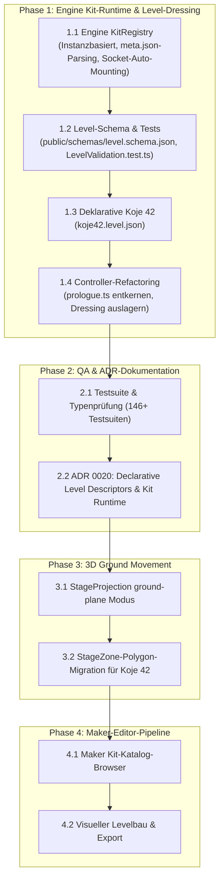

# Plan 0 from Phase 1: Architektur-Weichenstellung & Datengetriebene Szenen-Pipeline

> **Status:** Genehmigter Masterplan für den Übergang von imperativen TypeScript-Szenen zu datengetriebenen Level-Deskriptoren und smarter Kit-Metadaten-Auswertung.  
> **Datum:** 2026-09-18  
> **Referenzen:** [ADR 0010 (Maker)](../../docs/adr/0010-maker-editor-architecture.md), [ADR 0011 (Asset-Kits)](../../docs/adr/0011-modular-asset-kits-and-remote-catalog.md), [ADR 0016 (Stage Zones)](../../docs/adr/0016-2-5d-stage-zones-as-a-gltf-extension.md), [ADR 0017 (glTF Extension Registry)](../../docs/adr/0017-gltf-extension-plugin-registry.md), [ADR 0019 (Environment Texturing)](../../docs/adr/0019-modular-environment-texturing-and-scale-doctrine.md).

---

## 1. Kontext & Ausgangsdiagnose

Die initiale Implementierung des Prologs (*Koje 42*, `apps/sample-apps/the-whisper/scenes/prologue/prologue.ts`, 1772 Zeilen) wurde als **imperativer Monolith** aufgebaut:
- 14 Kit-Props werden im TypeScript-Code mit hardkodierten Pfaden, Positionen, Skalierungen und Rotationen geladen.
- Sockets und Lichtquellen (`FlameGlow`, `BulbLight`, `CyanideColorkeySpot`) werden manuell im Code erzeugt und verdrahtet.
- Material-PBR-Werte (`roughness`, `metallic`) werden per `traverse`-Schleifen überschrieben.
- Die Spielerbewegung läuft über ein isoliertes, handgeschriebenes `MathUtils.clamp()`-AABB-System statt über `StageMovementBehavior` / `StageZone`.
- Hotspots, deutsche Monologe und Kamera-Fahrten stehen als Code-Literale in derselben Datei.

### Die drei identifizierten Brüche
1. **Metadaten-Bruch:** Das `meta.json`-Schema (ADR 0011) definiert bereits `recommendedScale` und `sockets[].recommendedLight` (z. B. Laterne: Scale 0.35, Socket `FlameGlow` bei `[0, 0.16, 0]`, Farbe `#d49a3d`, Intensity 3.5). `prologue.ts` tippte diese Werte bisher erneut von Hand ein.
2. **Szenen-Bruch:** Szene ist aktuell 100 % Code statt Daten-Asset. Jede Änderung am Raum-Layout erfordert TS-Code-Edits und Re-Kompilierung.
3. **Bewegungs-Bruch:** Die Koje nutzt ein improvisiertes AABB-Clamp statt der etablierten `StageZone`-Engine-Infrastruktur.

---

## 2. Kritische Einsprüche & Grundsatzentscheidungen

Im Architektur-Sparring wurden drei fundamentale Einsprüche und Leitprinzipien festgehalten:

### Einwand 1: Bewegung & Projektions-Falle ($v \to Y$ vs. $v \to Z$)
- `StageProjection` (`"flat-plane"` aus ADR 0016) projiziert $v \to Y$ auf eine vertikale 2.5D-Kulissenwand (Backdrop).
- Koje 42 ist jedoch ein **echter 3D-Boden** ($X/Z$-Ebene bei $Y = 0$). Eine naive Umstellung auf `"flat-plane"` würde die Achsen vertikal spiegeln.
- **Entscheidung:** Bewegung wird in diesem Meilenstein nicht überstürzt, sondern in Phase 3 als eigene, saubere Erweiterung gelöst: Einführung von `{ mode: "ground-plane", width, depth, y }` in `StageProjection` für Koje 42, `character-diorama` und künftige Isometrie-/3D-Böden.

### Einwand 2: Realistische Zeilentrennung (Dressing vs. Gameplay/Story)
- Die Aufteilung trennt **Dressing (Raum, Props, Lichter, PBR $\to$ Daten/JSON)** von **Story & Gameplay (Timeline, Verzweigungen, Dialoge, Modals $\to$ schlanker TypeScript-Controller)**.
- Der TypeScript-Controller schrumpft von 1772 Zeilen auf einen fokussierten, lesbaren Gameplay-Controller (~600–800 Zeilen State-Machine- & Story-Code).

### Einwand 3: Prefab-Defaults vs. Level-Instance-Overrides (Unity/Unreal-Standard)
- `meta.json` fungiert als **Default-Quelle** (Typ/Prefab).
- Das Level-Config (`koje42.level.json`) besitzt **explizites Override-Recht** (z. B. Lichtintensität 2.5 statt 3.5 für düstere Bunker-Atmosphäre).
- Narrative, raumspezifische Lichter (wie der smaragdgrüne `CyanideColorkeySpot` auf der Leichenschublade) leben in einer eigenständigen `lights[]`-Sektion im Level-Config.

---

## 3. Architektur-Grundgesetze für Small World

1. **Instanzbasierte `KitRegistry` (Kein Singleton):**
   - Gemäß Kern-Architekturregel von Small World gibt es keine globalen Singletons.
   - `KitRegistry` wird via Constructor Injection oder Scene-Context bereitgestellt.
2. **Standardisierte Schemas & Validierung:**
   - Jedes Level-Config folgt einem formalen JSON-Schema (`public/schemas/level.schema.json`).
   - Unit-Tests validieren alle Level-Configs automatisch per Ajv (analog zu `AssetKitValidation.test.ts`).
3. **Zweistufige Prop-Auflösung:**
   - `registry.loadProp("bunker/kerosene_lantern")` lädt das `.glb`, liest `meta.json`, skaliert automatisch auf `recommendedScale` und instanziiert deklarierte Sockets/Lichter.
   - Das Level-Descriptor-System überschreibt bei Bedarf gezielte Attribute (`position`, `rotation`, `scale`, `lightOverrides`).

---

## 4. Phasen- & Umsetzungsplan



### Detaillierte Arbeitspakete für Phase 1 (Aktueller Fokus)

#### Schritt 1.1: `KitRegistry` im `@small-world/engine`
- **Pfad:** `packages/engine/src/loaders/kit/KitRegistry.ts`
- **Verantwortlichkeit:**
  - Auflösen von Kit-IDs (`<kit>/<prop>`) zu `model.glb` und `meta.json`.
  - Automatisches Anwenden von `recommendedScale`.
  - Automatisches Erzeugen von `PointLight` / `SpotLight` an deklarierten `sockets[]`.
  - Caching von `meta.json` und geladenen Geometrien.
  - Vollständige Entkopplung (kein globaler Singleton, reine DI).
- **Unit-Tests:** `packages/engine/tests/loaders/KitRegistry.test.ts`.

#### Schritt 1.2: `level.schema.json` & Validierung
- **Pfad:** `public/schemas/level.schema.json`
- **Struktur:**
  - `id`, `name`, `version`, `environment` (Wände, Boden, Decke, Texturzuweisungen).
  - `props`: Array aus `{ id, kitProp, position, rotation, scale, lightOverrides, materialOverrides }`.
  - `lights`: Array aus eigenständigen Szenenlichtern (`SpotLight`, `PointLight`, `DirectionalLight`).
  - `hotspots`: Array aus Interaktionspunkten (`id`, `name`, `position`, `radius`, `promptText`, `monologue`).
  - `stageZone`: Optionale 2.5D/3D-Zonendefinition.
- **Validierung:** `packages/engine/tests/loaders/LevelValidation.test.ts`.

#### Schritt 1.3: `koje42.level.json`
- **Pfad:** `apps/sample-apps/the-whisper/scenes/prologue/koje42.level.json`
- Extraktion aller 14 Props, PBR-Material-Bindings (`concrete_board`, `brick_aged`, `steel_corroded`, etc.), Decken-/Kerosin-Lichter, Hotspots und Monologe in die deklarative JSON-Datei.

#### Schritt 1.4: Refactoring von `prologue.ts`
- Ersetzen von `_buildBunkerRoom()`, `_loadPropKits()` und `_applyKitTextures()` durch einen schlanken Level-Loader:
  ```typescript
  const level = await this.kitRegistry.loadLevel("/scenes/prologue/koje42.level.json", this.scene);
  ```
- Fokussierung der Klasse auf Gameplay, Cinematic-Timeline, Dialoge, Modals und Area-Transitions.

---

## 5. Abnahmekriterien & Qualitätsstandards

1. **100 % Strict TypeScript:** Kein `any`, saubere Schnittstellen und explizite Typen.
2. **100 % Testabdeckung:** Alle bestehenden 835 Tests bleiben grün, neue Tests für `KitRegistry` und `LevelValidation` hinzugefügt.
3. **Visuelle & Funktionale Parität:** Koje 42 sieht im Browser absolut identisch aus und verhält sich exakt wie vor dem Refactoring.
4. **Dokumentation:** Aktualisierung des Dev-Logs (`apps/sample-apps/the-whisper/docs/log.md`) und Erstellung von `docs/adr/0020-declarative-level-descriptors-and-kit-runtime.md`.

---

## 6. Kompendium: „Vom 2D-Konzeptbild zur fertig spielbaren 3D-Szene“ (Q&A-Referenz)

Dieses Kompendium hält alle während der Entstehung von *Koje 42* getroffenen Grundsatzfragen, Diskussionen und Antworten schriftlich und dauerhaft fest.

```mermaid
flowchart LR
    A["1. 2D-Konzeptgrafik<br/>(4 Kardinal-Ansichten)"] --> B["2. Freisteller-Extraktion<br/>(Isolierte Requisiten)"]
    B --> C["3. Tripo3D Ingest<br/>(Game-Ready .glb + PBR)"]
    C --> D["4. Kit-Packaging<br/>(meta.json, kit.json, Sockets)"]
    D --> E["5. Modularer Shell-Bau<br/>(ADR 0019 PBR-Kachelsystem)"]
    E --> F["6. PBR-Decals & Aufputz<br/>(Tiefen, Reliefs, Emissive)"]
    F --> G["7. Level-Deskriptor<br/>(koje42.level.json)"]
    G --> H["8. Story-Controller<br/>(TypeScript State-Machine)"]
```



---

### Frage 1: Warum kann eine KI nicht einfach das 2D-Raumbild komplett in eine 3D-Szene umwandeln?
**Antwort & Begründung:**
- **Matsch-Geometrie:** Wird ein ganzer Raum mit allen Wänden, Möbeln und Böden in ein 3D-Netzwerk (z. B. Tripo3D) geworfen, entsteht eine einzige zusammenhängende, geschmolzene "Gummizelle". Tische verschmelzen mit dem Boden, Stühle mit den Wänden.
- **Eingebranntes Licht:** Schatten und Lichtreflexionen der Konzeptgrafik werden fest in die Textur gebacken. Ein dynamisches Bewegen von Lichtquellen (z. B. Novotnys Laterne oder flackernde Deckenlampen) ist unmöglich.
- **Fehlende Interaktivität:** Man kann keine Schublade öffnen, kein Lüftungsgitter abschrauben und keine Kollisionsboxen für einzelne Objekte definieren.
- **Die Small-World-Doktrin:** 
  $$\text{2D-Raum} \implies \text{Modularer Raum-Shell (PBR-Kacheln)} + \text{Isolierte Requisiten (Tripo3D)} + \text{In-Engine-Assemblierung}.$$

---

### Frage 2: Wie werden Wände und modulare Räume strukturiert, damit sie nicht monoton wirken?
**Antwort & Begründung:**
- Räume variieren stark in ihrer Größe (von der $7 \times 7\,\text{m}$ Koje 42 bis zu $30\,\text{m}$ langen Fluren und Katakomben). Reine Textur-Kachelung führt unweigerlich zu sichtbaren Wiederholungsmustern (Tiling-Artefakte).
- **Die 4-Säulen-Skalierungsdoktrin ([ADR 0019](../../docs/adr/0019-modular-environment-texturing-and-scale-doctrine.md)):**
  1. **Struktureller Rhythmus:** Wandflächen werden im festen $3{,}5\,\text{m}$-Raster durch vertikale Stahlbeton-Pilaster/Säulen (`FlakturmKit.createPillar`) unterbrochen.
  2. **Horizontale Zonierung (Baseboard):** Der untere Wandmeter erhält eine separate Sockelleiste mit Feuchtigkeits-, Schimmel- und Salzausblühungs-Texturen (`concrete_damp_efflorescence`). Der obere Bereich nutzt Schalungsbeton (`concrete_panel_smooth` oder `concrete_board`).
  3. **Decken-Kassetten & Unterzüge:** Decken werden durch Quer- und Längsträger (`createBeam`) in Kassetten aufgeteilt.
  4. **Aufputz-Infrastruktur:** Leitungsrohre (`createConduitRun`), Verteilerdosen und Schalter brechen die glatten Flächen organisch auf.

---

### Frage 3: Sind Decals in Small World nur flache „Aufkleber“ oder haben sie echte Materialeigenschaften?
**Antwort & Begründung:**
- Decals in Small World sind **keine** unbeleuchteten, flachen 2D-Sticker.
- Sie werden als vollwertige `StandardMaterial`-Instanzen auf Polygon-Trägern gerendert und besitzen:
  - **Diffuse Map:** Albedo-Farbkanal mit Alphatransparenz für nahtlose Kanten.
  - **Normal Map:** Echte Oberflächennormalen für Risse, abgeplatzten Putz, Nieten und Kantenabplatzungen (wirft bei flachem Lichteinfall plastische Schatten).
  - **Roughness & Metallic:** Nasser Beton glänzt speckig, korrodierter Stahl reflektiert metallisch, während Ziegel rau und matt bleiben.
  - **Emissive Map:** Phosphoreszierende Leuchtstreifen (`guide_stripe_glow`) und Warnmarkierungen strahlen eigenes Licht in den Bloom-Pass der Engine ab.

---

### Frage 4: Haben wir nach den 3D-Meshes alles, um einen Raum aufzubauen, oder braucht es noch Code?
**Antwort & Begründung:**
- **Ja, es braucht Code — aber an der richtigen Stelle:**
  - **Daten (JSON / glTF):** Wo steht welcher Tisch? Welcher Hocker gehört davor? Welche Skalierung hat die Lampe? Welche PBR-Textur liegt auf welcher Wand? $\implies$ **Reine Daten-Ebene (`koje42.level.json`).**
  - **Code (TypeScript):** Was passiert, wenn Novotny die Kaffeemühle anklickt? Wie läuft das Verhör mit Hawelka ab? Welche Wahlmöglichkeiten hat der Spieler im Dialog? Wann schaltet die Kamera in die Kältekammer um? $\implies$ **Interaktive Logik-Ebene (`prologue.ts`).**

---

### Frage 5: In welcher Sprache wird die Logik implementiert?
**Antwort & Begründung:**
- **Strict TypeScript:** 100 % typisiert, strikte Null-Prüfung, **striktes Verbot von `any`**.
- **Keine globalen Singletons:** Alle Systeme (`KitRegistry`, `HotspotManager`, `TerminalModal`) werden per Dependency Injection oder Szenen-Kontext übergeben. Das garantiert, dass mehrere Engine-Instanzen auf einer Seite koexistieren können.

---

### Frage 6: Wie verhält sich `meta.json` zur Spielszene? (Defaults vs. Overrides)
**Antwort & Begründung:**
- **`meta.json` = Prefab-Default:** Jedes Prop definiert seine physikalische Grundkonfiguration (`recommendedScale`, Sockets wie `FlameGlow` an der Kerosinlampe, Standard-Lichtfarbe `#d49a3d`, Standard-Intensität $3{,}5$).
- **`level.json` = Szenen-Instanz-Override:** Die konkrete Szene kann diese Werte gezielt überschreiben (z. B. `intensity: 2.5` für eine dunklere, düstere Bunker-Koje).
- **Narrative Lichter:** Lichter, die an keinem Prop hängen (wie der smaragdgrüne Blausäure-Fokus-Spot `CyanideColorkeySpot` auf Františeks Hals), leben in einer eigenständigen `lights[]`-Sektion im Level-Deskriptor.

---

### Frage 7: Wie unterscheidet sich die Spielerbewegung in 2.5D-Bühnen von echten 3D-Räumen?
**Antwort & Begründung:**
- **2.5D-Backdrop (`flat-plane`):** Die Spielfigur bewegt sich auf einer vertikal gemalten Kulissenwand ($v \to Y$). Die Skalierung der Figur wird künstlich mit der Bildhöhe verkleinert.
- **Echter 3D-Boden (`ground-plane`):** Die Spielfigur bewegt sich auf einer horizontalen Ebene ($X/Z$-Koordinaten bei $Y = 0$). Die Tiefenskalierung entsteht natürlich durch die 3D-Perspektivkamera der Engine.
- **Architektur-Entscheidung:** Koje 42 bleibt im aktuellen Meilenstein ein echter 3D-Boden. In Phase 3 wird `StageProjection` um `{ mode: "ground-plane" }` erweitert, um beide Welten in einem einheitlichen `StageZone`-Polygon-System zu vereinen.

