# 🌋 Thermo-Nuclear Code Quality Review (Repository-Wide)

> **Datum:** 2026-09-18  
> **Prüfumfang:** Vollständige Codebasis von Small World (619 TypeScript-Dateien, ~99.145 Zeilen, 148 Testsuiten, alle Shaders in WGSL/GLSL, Engine Core, Loaders, glTF-Extensions, Tools & Sample Apps).  
> **Angewandter Standard:** [`.agents/skills/thermo-nuclear-code-quality-review-revised/SKILL.md`](../skills/thermo-nuclear-code-quality-review-revised/SKILL.md)  
> **Status:** Genehmigter Prüfbericht & Sanierungs-Fahrplan.

---

## 1. Executive Summary & System-Health

```
┌────────────────────────────────────────────────────────────────────────────────────────┐
│                        Small World Engine System Health Status                         │
├──────────────────────────────┬─────────────────────────────┬───────────────────────────┤
│ TypeScript (tsc --noEmit)    │ 0 Fehler (619 Dateien)      │ Strict + exactOptional    │
│ WGSL Linter (lint:wgsl)      │ 0 Fehler (26 Shader)        │ wgsl_reflect validiert    │
│ Unit Tests (vitest)          │ 846 / 846 grün (148 Suiten) │ 100 % Pass Rate           │
│ ESLint (eslint .)            │ 0 Fehler, 0 Warnungen       │ Clean                     │
└──────────────────────────────┴─────────────────────────────┴───────────────────────────┘
```

Die Codebasis zeichnet sich durch ein **außerordentlich hohes architektonisches Grundniveau** aus (strikte Typensicherheit, kein `any`, sauberes mathematisches Koordinatensystem, konsequente Trennung von WebGL/WebGPU-Pipelines).

Dennoch hat der thermo-nukleare Scan in den Tiefen der Subsysteme **kritische Randfälle, GPU-Ressourcenlecks und GC-Hotspots** identifiziert, die in der folgenden Matrix nach Dringlichkeit aufgeschlüsselt sind:

---

## 2. Master-Finding-Matrix

| Subsystem | Blocker (P0) | Major (P1) | Minor / Judo (P2) |
| :--- | :---: | :---: | :---: |
| **1. Renderer & Shader (WebGPU / WebGL2 / WebGL1)** | 5 | 5 | 4 |
| **2. Engine Core, Math, Physics & Scene Graph** | 3 | 6 | 5 |
| **3. Loaders, glTF Extensions & Kit Pipeline** | 3 | 5 | 5 |
| **4. Tools, Editor (`MakerApp`) & Sample Apps** | 3 | 5 | 5 |
| **Gesamt** | **14** | **21** | **19** |

---

## 3. 🔴 BLOCKER (P0: Kritische Bugs, GPU-Lecks & Fehlerpfade)

### 3.1 Rendersystem & Shaders

#### [BLK-R1] Out-of-Bounds State-Corruption im Clustered Lighting ✅ *(BEHOBEN)*
- **Datei:** [`packages/engine/src/renderers/passes/WebGLClusterCullPass.ts`](../../packages/engine/src/renderers/passes/WebGLClusterCullPass.ts#L62-L71)
- **Status:** **Behoben** & regressionstestiert in [`packages/engine/tests/renderers/WebGLClusterCullPass.test.ts`](../../packages/engine/tests/renderers/WebGLClusterCullPass.test.ts).
- **Szenario:** Bei Resize oder Grid-Änderungen prüfte der Code `if (this._grid.length < gridHeight * CLUSTER_TEX_WIDTH * 4)`. Für alle Grids $\le 1024$ Zellen (`gridHeight = 1`) ergab die Prüfung `false`. `_pointCounts` und `_spotCounts` blieben fälschlicherweise bei `Uint8Array(1)`. Zugriffe auf Zelle $> 0$ lasen `undefined` / schrieben `NaN`, wodurch Lichtquellen in WebGL2 ab Zelle 1 verloren gingen und die Szene schwarz blieb.
- **Abhilfe:** Reallokation von `_grid` und `_pointCounts`/`_spotCounts` entkoppelt und an `if (this._pointCounts.length < numClusters)` gebunden.

#### [BLK-R2] Out-of-Bounds Spot Shadow Array-Zugriff in WGSL & GLSL Shaders ✅ *(BEHOBEN)*
- **Dateien:** 
  - [`packages/engine/src/core/renderers/shaders/source/web_gpu/chunks/lighting.wgsl`](../../packages/engine/src/core/renderers/shaders/source/web_gpu/chunks/lighting.wgsl#L113)
  - [`packages/engine/src/core/renderers/shaders/source/web_gpu/chunks/lighting_pbr.wgsl`](../../packages/engine/src/core/renderers/shaders/source/web_gpu/chunks/lighting_pbr.wgsl#L187)
  - [`packages/engine/src/core/renderers/shaders/source/web_gl2/chunks/light_calc.frag.glsl`](../../packages/engine/src/core/renderers/shaders/source/web_gl2/chunks/light_calc.frag.glsl#L198)
  - [`packages/engine/src/core/renderers/shaders/source/web_gl2/chunks/light_calc_pbr.frag.glsl`](../../packages/engine/src/core/renderers/shaders/source/web_gl2/chunks/light_calc_pbr.frag.glsl#L317)
- **Status:** **Behoben** & regressionstestiert in [`packages/engine/tests/renderers/SpotLightPCSS.test.ts`](../../packages/engine/tests/renderers/SpotLightPCSS.test.ts).
- **Szenario:** Clustered Loops iterieren über bis zu 64 Spotlights (`j` / `i`), während `spotShadowInfo`, `spotShadowMatrices` und Shadow-Textur-Layers auf 4 Einträge fixiert sind. Bei $j \ge 4$ las der Shader uninitialisierte Uniform-Daten und triggerte PCSS-Sampling auf ungültigen Texture-Layers bzw. Out-of-Bounds Buffer Reads.
- **Abhilfe:** Striktes `if (j < 4u && global.spotShadowInfo[j].z > 0.5)` in WGSL und `if (i < 4 && u_spotShadowInfo[i].z > 0.5)` in GLSL eingebaut.

#### [BLK-R3] 60-FPS-Pipeline-Rebuild Churn im Post-Processing ✅ *(BEHOBEN)*
- **Dateien:**
  - [`packages/engine/src/renderers/post/passes/BloomPassGPU.ts`](../../packages/engine/src/renderers/post/passes/BloomPassGPU.ts#L267)
  - [`packages/engine/src/renderers/passes/PostProcessPass.ts`](../../packages/engine/src/renderers/passes/PostProcessPass.ts#L252-L264)
- **Status:** **Behoben** & regressionstestiert in [`packages/engine/tests/renderers/PostProcessPassUniforms.test.ts`](../../packages/engine/tests/renderers/PostProcessPassUniforms.test.ts).
- **Szenario:** `BloomPassGPU.execute()` erzeugte pro Frame ein neues `GPUTextureView`-Objekt via `createView()`. `PostProcessPass` erkannte geänderte View-Referenzen und baute pro Sekunde 60-mal das gesamte `GPURenderPipeline`-Objekt synchron neu (`createShaderModule`, `createRenderPipeline`, `createBindGroup`).
- **Abhilfe:** `BloomPassGPU` gibt gecachtes `this._mipViews[0]` zurück (und nutzt wiederverwendbare Uniform-Arrays). In `PostProcessPass` wurde die `GPURenderPipeline`-Kompilierung vollständig von dynamischen `GPUBindGroup`-Texture-Views entkoppelt, sodass View-Wechsel niemals einen Pipeline-Rebuild triggern.

#### [BLK-R4] Stale `dLight`-Referenz-Leck bei gelöschten Richtlichtern ✅ *(BEHOBEN)*
- **Dateien:**
  - [`packages/engine/src/renderers/AbstractRenderer.ts`](../../packages/engine/src/renderers/AbstractRenderer.ts#L126-L139)
  - [`packages/engine/src/interfaces/LightData.ts`](../../packages/engine/src/interfaces/LightData.ts#L20)
- **Status:** **Behoben** & regressionstestiert in [`packages/engine/tests/renderers/AbstractWebGLRenderer.test.ts`](../../packages/engine/tests/renderers/AbstractWebGLRenderer.test.ts).
- **Szenario:** `extractLights()` leerte `pLights`/`sLights`/`aLights`, setzte aber `_lightData.dLight` nie auf `undefined` zurück. Wurde ein Sonnenlicht gelöscht oder unsichtbar geschaltet (`isVisible = false`), blieben CSM-Schattenpässe endlos für das Geisterlicht aktiv.
- **Abhilfe:** `this._lightData.dLight = undefined;` zu Beginn von `extractLights()` ergänzt und `LightDataInterface.dLight` typisiert als `DirectionalLight | undefined`.

#### [BLK-R5] Fallback-Kaskaden-Abbruch in `RendererFactory.ts` ✅ *(BEHOBEN)*
- **Datei:** [`packages/engine/src/renderers/RendererFactory.ts`](../../packages/engine/src/renderers/RendererFactory.ts#L52-L105)
- **Status:** **Behoben** & regressionstestiert in [`packages/engine/tests/renderers/RendererFactory.test.ts`](../../packages/engine/tests/renderers/RendererFactory.test.ts).
- **Szenario:** Schlug WebGPU fehl und WebGL2 scheiterte ebenfalls (z. B. Driver-Blocklist oder Context-Fehler), stürzte der Renderer wegen verschachtelter `if (!fallbackToWebGL2)`-Bedingungen mit `throw e` ab, statt auf WebGL1 weiterzukaskadieren.
- **Abhilfe:** `RendererFactory.create()` auf eine lineare, robuste Kandidaten-Kaskade (`_getFallbackCandidates`) umgestellt: Jeder Backend-Kandidat (`WebGPU` $\to$ `WebGL2` $\to$ `WebGL1`) prüft DeviceCaps und fängt Initialisierungsfehler ab, um nahtlos zum nächsten Fallback weiterzuleiten.

---

### 3.2 Engine Core, Math & Physics

#### [BLK-C1] 2D-GPU-Textur-Leck beim Beenden ✅ *(BEHOBEN)*
- **Datei:** [`packages/engine/src/renderers/WebGL2/managers/WebGLTextureManager.ts`](../../packages/engine/src/renderers/WebGL2/managers/WebGLTextureManager.ts#L369-L375)
- **Status:** **Behoben** & regressionstestiert in [`packages/engine/tests/renderers/TextureRefCounting.test.ts`](../../packages/engine/tests/renderers/TextureRefCounting.test.ts).
- **Szenario:** `WebGLTextureManager.dispose()` leerte nur `_texCubeCache`. Alle 2D-`WebGLTexture`-Objekte in `_texCache` sowie die Zähler in `_texRefCounts` und `_texCubeRefCounts` blieben ungelöscht im VRAM bzw. Memory des Browsers hängen.
- **Abhilfe:** `dispose()` löscht nun alle `_texCache`-Texturen via `gl.deleteTexture()`, leert `_texCache` und resettet `_texRefCounts` sowie `_texCubeRefCounts`.

#### [BLK-C2] Octree-Extents-Bug im Physik-Broadphase ✅ *(BEHOBEN)*
- **Datei:** [`packages/engine/src/physix/broadphase/PhysicsBroadphase.ts`](../../packages/engine/src/physix/broadphase/PhysicsBroadphase.ts#L68-L76)
- **Status:** **Behoben** & regressionstestiert in [`packages/engine/tests/physix/broadphase/PhysicsBroadphase.test.ts`](../../packages/engine/tests/physix/broadphase/PhysicsBroadphase.test.ts).
- **Szenario:** Beim Rebuild des Octrees wurde nur `center` aktualisiert, während `min`/`max` auf Frame-1-Werten einfroren (und Instanzen mit `_worldMin`/`_worldMax` teilten). Bewegte Körper außerhalb des initialen Bereichs scheiterten an `containsVolume()` und fielen in den $O(N \times M)$ Fallback.
- **Abhilfe:** `_tree.root.bounds.min` und `_tree.root.bounds.max` via `copyFrom(this._worldMin)` / `copyFrom(this._worldMax)` vor `_tree.clear()` synchronisiert sowie bei der Instanziierung geklont.

#### [BLK-C3] `Matrix4.scale()` Overload-Crash ✅ *(BEHOBEN)*
- **Datei:** [`packages/engine/src/math/Matrix4.ts`](../../packages/engine/src/math/Matrix4.ts#L577-L627)
- **Status:** **Behoben** & regressionstestiert in [`packages/engine/tests/math/Matrix4.test.ts`](../../packages/engine/tests/math/Matrix4.test.ts).
- **Szenario:** Aufruf mit 3 Zahlen ohne `target` (z. B. `Matrix4.scale(2, 3, 4)`) warf `TypeError: Cannot read properties of undefined (reading 'identity')`, da `target` optional war und ohne Fallback dereferenziert wurde.
- **Abhilfe:** Eindeutige TypeScript-Overload-Signaturen (`scale(s, target?)` und `scale(x, y, z, target?)`) definiert und robuste Fallback-Instanziierung (`out = target ?? new Matrix4()`) mit Rückgabe des Matrix-Objekts implementiert.

---

### 3.3 Loaders & glTF Pipeline

#### [BLK-L1] Permanentes Cache-Poisoning bei Netzwerkfehlern ✅ *(BEHOBEN)*
- **Datei:** [`packages/engine/src/loaders/AssetManager.ts`](../../packages/engine/src/loaders/AssetManager.ts#L191-L273)
- **Status:** **Behoben** & regressionstestiert in [`packages/engine/tests/loaders/AssetManagerCachePoisoning.test.ts`](../../packages/engine/tests/loaders/AssetManagerCachePoisoning.test.ts).
- **Szenario:** Schlägt ein Fetch in `loadJson`, `loadText`, `loadBinary` oder `loadImage` fehl, blieb das abgelehnte Promise dauerhaft in der Cache-Map. Wiederholte Ladeversuche schlugen sofort fehl, ohne das Netzwerk erneut anzufragen.
- **Abhilfe:** In den `catch`-Blöcken von `loadJson`, `loadText`, `loadBinary` und `loadImage` wird der Cache-Key bei Fehlschlägen sofort aus der jeweiligen Map gelöscht (`this._textCache.delete(url)`, etc.), sodass nachfolgende Ladeversuche das Netzwerk sauber erneut anfragen.

#### [BLK-L2] Deadlock bei Stream-Fehler in `streamBinary` ✅ *(BEHOBEN)*
- **Datei:** [`packages/engine/src/loaders/AssetManager.ts`](../../packages/engine/src/loaders/AssetManager.ts#L282-L342)
- **Status:** **Behoben** & regressionstestiert in [`packages/engine/tests/loaders/AssetManagerCachePoisoning.test.ts`](../../packages/engine/tests/loaders/AssetManagerCachePoisoning.test.ts).
- **Szenario:** Bricht ein Chunk-Stream ab, wurde `_checkCompletion(trackingKey)` übersprungen. `assetManager.isLoaded` blieb dauerhaft `false`, Szenenübergänge froren ein.
- **Abhilfe:** `streamBinary` vollständig in `try ... finally` gekapselt, Cache-Poisoning bei Stream-Fehlern via `_binaryCache.delete(url)` behoben und Loader-Tracking garantiert aufgeräumt.

#### [BLK-L3] Unaligned TypedArray `RangeError` ✅ *(BEHOBEN)*
- **Datei:** [`packages/engine/src/loaders/gltf/GltfBinaryParser.ts`](../../packages/engine/src/loaders/gltf/GltfBinaryParser.ts#L77-L117)
- **Status:** **Behoben** & regressionstestiert in [`packages/engine/tests/loaders/gltf/GltfBinaryParser.test.ts`](../../packages/engine/tests/loaders/gltf/GltfBinaryParser.test.ts).
- **Szenario:** Bei nicht ausgerichteten Byte-Offsets (`byteOffset % 4 !== 0` für `Float32Array`/`Uint32Array` oder `byteOffset % 2 !== 0` für `Uint16Array`) warf der JavaScript-`TypedArray`-Konstruktor einen fatalen `RangeError`.
- **Abhilfe:** `GltfBinaryParser.getBufferData()` prüft die Ausrichtung (`byteOffset % bytesPerElement === 0`); unaligned Chunks werden via `buffer.slice()` in einen sauber ausgerichteten ArrayBuffer kopiert, inkl. striktem Overflow-Guard gegen Buffer-Überläufe.

---

### 3.4 Tools, Editor & Sample Apps

#### [BLK-T1] Zombie-Event-Listener & Engine-Lecks auf Tool-Unmount ✅ *(BEHOBEN)*
- **Dateien:**
  - [`packages/engine/src/tools/maker/MakerApp.ts`](../../packages/engine/src/tools/maker/MakerApp.ts)
  - [`packages/engine/src/tools/MaterialStudio.ts`](../../packages/engine/src/tools/MaterialStudio.ts)
  - [`packages/engine/src/tools/Pixler.ts`](../../packages/engine/src/tools/Pixler.ts)
- **Status:** **Behoben.**
- **Szenario:** `MaterialStudio.unmount()` stoppte den Render-Loop nicht; `MakerApp` und `Pixler` entfernten keine anonymen Window- und Canvas-Listener. Unmounten oder Hot-Reloading hinterließ Zombie-Listener, die ganze Szenen-Graphen im Speicher festhielten.
- **Abhilfe:** `MaterialStudio.unmount()` zerstört die eingebettete `MaterialStudioApp` (`this._app.destroy()`); `Pixler` und `MakerApp` nutzen `AbortController`-Signale für alle DOM- und Window-Events und räumen diese in `unmount()` bzw. `destroy()` rückstandslos ab.

#### [BLK-T2] Undo-Stack Duplikations-Bug bei Gruppen ✅ *(BEHOBEN)*
- **Datei:** [`packages/engine/src/tools/maker/MakerApp.ts`](../../packages/engine/src/tools/maker/MakerApp.ts)
- **Status:** **Behoben** & regressionstestiert in [`packages/engine/tests/tools/maker/MakerFeatures.test.ts`](../../packages/engine/tests/tools/maker/MakerFeatures.test.ts).
- **Szenario:** Waren Parent und Child gemeinsam selektiert, duplizierte `duplicateSelection()` den Child-Node doppelt (einmal über den geklonten Parent, einmal separat als Waise).
- **Abhilfe:** `_getTopLevelSelection()` implementiert: Filtert rekursiv alle Kindelemente heraus, deren Vorfahren bereits in der Selektion enthalten sind, und sichert `duplicateSelection()`, `deleteSelection()` und `groupSelection()` ab.

#### [BLK-T3] Import-Side-Effects in `ibl-gen.ts` ✅ *(BEHOBEN)*
- **Datei:** [`packages/engine/src/tools/ibl-gen.ts`](../../packages/engine/src/tools/ibl-gen.ts)
- **Status:** **Behoben.**
- **Szenario:** Modul führte beim reinen Importieren `document.addEventListener("DOMContentLoaded")` aus, erzeugte Offscreen-Canvases und instanziierte WebGL2-Kontexte.
- **Abhilfe:** DOM-Initialisierung in `initIBLGenTool()` gekapselt und Auto-Start mit striktem `#dropzone`-DOM-Guard versehen, sodass das Modul side-effect-frei importiert werden kann.

---

## 4. 🟠 MAJOR (P1: Performance, GC-Druck & Schnittstellen)

### 4.1 Performance & GC-Optimierung
1. **[MAJ-01] ~770 Vector3D-Allokationen pro Frame in `updateGlobalUBO()` ✅ *(BEHOBEN)***
   - **Dateien:** 
     - [`packages/engine/src/renderers/WebGL2/WebGL2UniformBuffer.ts`](../../packages/engine/src/renderers/WebGL2/WebGL2UniformBuffer.ts#L48-L62)
     - [`packages/engine/src/renderers/WebGL2/WebGL2Renderer.ts`](../../packages/engine/src/renderers/WebGL2/WebGL2Renderer.ts#L1435-L1570)
   - **Status:** **Behoben** & regressionstestiert in [`packages/engine/tests/renderers/WebGL2UniformBufferSetters.test.ts`](../../packages/engine/tests/renderers/WebGL2UniformBufferSetters.test.ts).
   - **Lösung:** `WebGL2UniformBuffer` um direkte skalare Methoden `setVec3(offset, x, y, z)` und `setVec4(offset, x, y, z, w)` erweitert. `WebGL2Renderer.updateGlobalUBO()` schreibt Ambient-, Directional-, Point-, Spot- und Area-Light-Werte nun direkt ohne temporäre `Vector3D`-Objekte (spart ~46.000 GC-Allokationen pro Sekunde).

2. **[MAJ-02] Jim-Arvo-AABB-Transformations-Judo ✅ *(BEHOBEN)***
   - **Datei:** [`packages/engine/src/physix/BoundingBox.ts`](../../packages/engine/src/physix/BoundingBox.ts#L207-L235)
   - **Status:** **Behoben** & regressionstestiert in [`packages/engine/tests/physix/BoundingBoxTransform.test.ts`](../../packages/engine/tests/physix/BoundingBoxTransform.test.ts).
   - **Lösung:** `BoundingBox.transform(matrix)` auf den Algorithmus von Jim Arvo umgestellt ($O(1)$, 0 Vektoren, 0 Arrays, keine MathPool-Acquires mehr nötig).

3. **[MAJ-03] `Raycaster` transformiert alle Mesh-Vertices in Weltkoordinaten ✅ *(BEHOBEN)***
   - **Datei:** [`packages/engine/src/physix/Raycaster.ts`](../../packages/engine/src/physix/Raycaster.ts#L88-L230)
   - **Status:** **Behoben** & regressionstestiert in [`packages/engine/tests/physix/Raycaster.test.ts`](../../packages/engine/tests/physix/Raycaster.test.ts).
   - **Lösung:** Der Suchstrahl (Ray) wird **einmal** via `worldMatrix.invert()` in den Objekt-Lokalraum transformiert. Der Möller-Trumbore-Schnittpunkttest liest die Vertex-Koordinaten direkt aus den flachen Puffern (`_intersectTriangleDirect`), ohne pro Dreieck 3 Vektoren zu allokieren oder 4x4-Matrizen zu multiplizieren (spart bei 5.000 Dreiecken 15.000 Vektortransformationen pro Frame).

4. **[MAJ-04] MathPool-Thrashing in `EulerIntegrator` ✅ *(BEHOBEN)***
   - **Dateien:**
     - [`packages/engine/src/physix/solvers/EulerIntegrator.ts`](../../packages/engine/src/physix/solvers/EulerIntegrator.ts#L30-L125)
     - [`packages/engine/src/math/Quaternion.ts`](../../packages/engine/src/math/Quaternion.ts#L267-L310)
   - **Status:** **Behoben** & regressionstestiert in [`packages/engine/tests/physix/solvers/EulerIntegrator.test.ts`](../../packages/engine/tests/physix/solvers/EulerIntegrator.test.ts) und [`packages/engine/tests/math/Quaternion.test.ts`](../../packages/engine/tests/math/Quaternion.test.ts).
   - **Lösung:** `integrateVelocity`, `applyDisplacement` und `integrateAngular` vollständig auf 0-Allokations-Skalarrechnung umgestellt. Die Rotationsintegration nutzt direkte geschlossene Quaternion-Formeln für Euler YXZ ($\Delta q \cdot q_{\text{current}}$ und closed-form $q \to \text{Euler}$) ohne Matrix-Kompositionen, Decompose-Aufrufe oder MathPool-Thrashing (spart 12 MathPool-Acquires pro rotierendem Körper pro Physik-Substep).

5. **[MAJ-05] Transiente `GPUTextureView`-Allokationen in Schatten-Pässen ✅ *(BEHOBEN)***
   - **Dateien:** 
     - [`packages/engine/src/renderers/passes/CascadedShadowPassGPU.ts`](../../packages/engine/src/renderers/passes/CascadedShadowPassGPU.ts)
     - [`packages/engine/src/renderers/passes/SpotShadowPassGPU.ts`](../../packages/engine/src/renderers/passes/SpotShadowPassGPU.ts)
   - **Status:** **Behoben.**
   - **Lösung:** Per-Layer-`GPUTextureView`-Arrays (`_cascadeLayerViews`, `_layerViews`) werden direkt bei der FBO-Allokation / beim Resize vorberechnet und im Render-Loop wiederverwendet, statt jeden Frame 8+ temporäre `createView()`-Allokationen zu erzeugen.

---

### 4.2 UX, Tooling & Architektur
6. **[MAJ-06] Tastatur-Shortcuts kollidieren mit Formularfeldern ✅ *(BEHOBEN)***
   - **Dateien:**
     - [`packages/engine/src/core/Input.ts`](../../packages/engine/src/core/Input.ts#L37-L46)
     - [`packages/engine/src/tools/Pixler.ts`](../../packages/engine/src/tools/Pixler.ts)
     - [`packages/engine/src/tools/maker/MakerApp.ts`](../../packages/engine/src/tools/maker/MakerApp.ts)
     - [`apps/sample-apps/the-whisper/ui/ViennaMapModal.ts`](../../apps/sample-apps/the-whisper/ui/ViennaMapModal.ts)
   - **Status:** **Behoben** & regressionstestiert in [`packages/engine/tests/core/Input.test.ts`](../../packages/engine/tests/core/Input.test.ts).
   - **Lösung:** Universeller Guard `isEditingTextInput()` in `core/Input.ts` bereitgestellt (prüft `INPUT`, `TEXTAREA`, `SELECT` sowie `contenteditable` / `isContentEditable`). Alle Tools (`Pixler`, `MakerApp`, `ViennaMapModal`) nutzen nun diesen zentralen Guard, um Tastatur-Shortcuts zuverlässig zu unterdrücken, wenn der Benutzer in Formularfeldern oder editierbaren UI-Elementen tippt.

7. **[MAJ-07] Shift+Arrow Muscle-Memory-Inversion in `MakerApp.ts` ✅ *(BEHOBEN)***
   - **Datei:** [`packages/engine/src/tools/maker/MakerApp.ts`](../../packages/engine/src/tools/maker/MakerApp.ts#L1950-L2110)
   - **Status:** **Behoben** & regressionstestiert in [`packages/engine/tests/tools/maker/MakerFeatures.test.ts`](../../packages/engine/tests/tools/maker/MakerFeatures.test.ts).
   - **Lösung:** `Shift` standardisiert als `10x`-Multiplikator für Translation (5.0m statt 0.5m) und Skalierung (2.5 statt 0.25) sowie als `6x` (90°-Vierteldrehung) für Rotation. Vertikale Verschiebung/Skalierung/Roll auf `PageUp`/`PageDown` gelegt, sodass `Shift+Pfeiltasten` nun intuitiv 10x in horizontaler Blickrichtung verschiebt (*Photoshop/Blender/Figma-Konvention*).

8. **[MAJ-08] glTF Extension Registry Duplikation ✅ *(BEHOBEN)***
   - **Datei:** [`packages/engine/src/loaders/gltf/GltfExtensionRegistry.ts`](../../packages/engine/src/loaders/gltf/GltfExtensionRegistry.ts)
   - **Status:** **Behoben** & regressionstestiert in [`packages/gltf-extensions/tests/Register.test.ts`](../../packages/gltf-extensions/tests/Register.test.ts).
   - **Lösung:** `registerGltfExtension()` dedupliziert Plugins anhand von `plugin.name` und aktualisiert vorhandene Registrierungen; `unregisterGltfExtension(name)` für sicheres Unregistering bereitgestellt.

9. **[MAJ-09] `KhrTextureBasisu` nutzt rohes `fetch()` ✅ *(BEHOBEN)***
   - **Datei:** [`packages/gltf-extensions/src/basisu/KhrTextureBasisu.ts`](../../packages/gltf-extensions/src/basisu/KhrTextureBasisu.ts#L50-L56)
   - **Status:** **Behoben** & regressionstestiert in [`packages/gltf-extensions/tests/KhrTextureBasisu.test.ts`](../../packages/gltf-extensions/tests/KhrTextureBasisu.test.ts).
   - **Lösung:** Rohes `fetch()` durch `assetManager.loadBinary(url)` ersetzt. Dadurch greifen Base-URL-Auflösung, Authentifizierungs-Header, Ladefortschritts-Tracking und AssetManager-Caching nahtlos.

10. **[MAJ-10] Monolithische Dateien über 1.000 Zeilen**
    - *Betroffen:* `MaterialStudio.ts` (2.197 Z.), `MakerApp.ts` (2.147 Z.), `character-diorama/showcase.ts` (1.918 Z.), `prologue.ts` (1.438 Z.), `ViennaMapModal.ts` (1.011 Z.), `Pixler.ts` (1.047 Z.).
    - *Lösung:* Schrittweise Modularisierung in fokussierte Domain-Services.

---

## 5. 🟡 MINOR & CODE-JUDO (P2: Eleganz, Bereinigung & Dead Code)

1. **[MIN-01] Toter Mock-AI-Chatbot in `Xtractor.ts` ✅ *(BEHOBEN)***
   - **Datei:** [`packages/engine/src/tools/Xtractor.ts`](../../packages/engine/src/tools/Xtractor.ts#L740-L815)
   - **Status:** **Behoben.**
   - **Lösung:** 90 Zeilen toter Fake-AI-Code (`setTimeout`, Doom-Zahlen-Regex) entfernt und durch einen deterministischen, sofort reagierenden Command-Processor für Sprite-Slicing (`slice <N>`, `teile <N>`) ersetzt.

2. **[MIN-02] Literal `\\n` statt echtem `\n` in `MapGenerator.ts` ✅ *(BEHOBEN)***
   - **Datei:** [`packages/engine/src/tools/MapGenerator.ts`](../../packages/engine/src/tools/MapGenerator.ts#L410-L425)
   - **Status:** **Behoben.**
   - **Lösung:** `getMapString()` gibt nun echte Newlines (`\n`) aus. `loadMapString()` unterstützt sowohl Standard-Zeilenumbrüche (`/\r?\n/`) als auch abwärtskompatible escaped Newlines (`\\n`).

3. **[MIN-03] Globale CSS-Verschmutzung in `MaterialStudio.ts` ✅ *(BEHOBEN)***
   - **Datei:** [`packages/engine/src/tools/MaterialStudio.ts`](../../packages/engine/src/tools/MaterialStudio.ts#L180-L235)
   - **Status:** **Behoben.**
   - **Lösung:** Globale CSS-Variablen (`:root`), universelle Resets (`* { box-sizing }`), globale `body`-Regeln und Scrollbar-Selektoren vollständig in `.swf-ms-container` gekapselt, um DOM-Stylesheets übergeordneter Seiten nicht mehr zu überschreiben.

4. **[MIN-04] Duplizierte prozedurale Geometrie durch Kit-Aufrufe konsolidiert ✅ *(BEHOBEN)***
   - **Dateien:** 
     - [`apps/sample-apps/the-whisper/builder/BunkerKit.ts`](../../apps/sample-apps/the-whisper/builder/BunkerKit.ts#L320-L375)
     - [`apps/sample-apps/the-whisper/scenes/flakturm-tunnel/showcase.ts`](../../apps/sample-apps/the-whisper/scenes/flakturm-tunnel/showcase.ts#L790-L796)
   - **Status:** **Behoben** & regressionstestiert in [`apps/sample-apps/the-whisper/tests/BunkerKit.test.ts`](../../apps/sample-apps/the-whisper/tests/BunkerKit.test.ts).
   - **Lösung:** Handheld-Laternen-Geometrie aus `flakturm-tunnel/showcase.ts` als wiederverwendbaren `BunkerKit.createHeldLantern()`-Builder extrahiert und redundante Inlined-Mesh-Generierung eliminiert.

5. **[MIN-05] `Raycaster` & `Ray` um Unterstützung für `BoundingType.OBB` erweitert ✅ *(BEHOBEN)***
   - **Dateien:** 
     - [`packages/engine/src/physix/Ray.ts`](../../packages/engine/src/physix/Ray.ts#L117-L203)
     - [`packages/engine/src/physix/Raycaster.ts`](../../packages/engine/src/physix/Raycaster.ts#L74-L78)
   - **Status:** **Behoben** & regressionstestiert in [`packages/engine/tests/physix/Ray.test.ts`](../../packages/engine/tests/physix/Ray.test.ts) und [`packages/engine/tests/physix/Raycaster.test.ts`](../../packages/engine/tests/physix/Raycaster.test.ts).
   - **Lösung:** 0-Allokations-Slab-Schnittpunkttest `Ray.intersectsOBB(obb)` entlang der lokalen orthogonalen OBB-Achsen implementiert und `Raycaster.intersectObjects()` für `BoundingType.OBB` freigeschaltet.

---

## 6. 🛠️ Priorisierter Sanierungs-Fahrplan

```mermaid
flowchart TD
    classDef done fill:#064e3b,stroke:#10b981,stroke-width:2px,color:#ecfdf5;
    classDef pending fill:#1e293b,stroke:#64748b,stroke-width:1px,color:#f8fafc;

    subgraph Batch 1: Engine P0 Blockers
        B1A["1.1 AssetManager Cache-Poisoning & Stream Fix (BLK-L1/L2) ✅"]:::done
        B1B["1.2 WebGLClusterCull Buffer Realloc (BLK-R1) ✅"]:::done
        B1C["1.3 WGSL/GLSL Spot Shadow Bounds Guard (BLK-R2) ✅"]:::done
        B1D["1.4 TextureManager 2D Texture Disposal (BLK-C1) ✅"]:::done
        B1E["1.5 PhysicsBroadphase Octree Min/Max Fix (BLK-C2) ✅"]:::done
        B1F["1.6 BloomPassGPU View Churn Fix (BLK-R3) ✅"]:::done
        B1G["1.7 DirectionalLight & Fallback Cascade (BLK-R4/R5) ✅"]:::done
        B1H["1.8 Matrix4.scale Overload Fix (BLK-C3) ✅"]:::done
        B1I["1.9 GltfBinaryParser Unaligned Offset Fix (BLK-L3) ✅"]:::done
        B1A --> B1B --> B1C --> B1D --> B1E --> B1F --> B1G --> B1H --> B1I
    end

    subgraph Batch 2: GC- & Performance-Judo
        B2A["2.1 Jim Arvo Affine AABB Transform (MAJ-02) ✅"]:::done
        B2B["2.2 WebGL2 UBO setVec3/setVec4 Direct Write (MAJ-01) ✅"]:::done
        B2C["2.3 Raycaster Local-Space Inverted Transform (MAJ-03) ✅"]:::done
        B2D["2.4 EulerIntegrator 0-Allocation Dynamics (MAJ-04) ✅"]:::done
        B2E["2.5 ShadowPassGPU Cached Layer Views (MAJ-05) ✅"]:::done
        B1I --> B2A --> B2B --> B2C --> B2D --> B2E
    end

    subgraph Batch 3: Tool & App Hardening
        B3A["3.1 MakerApp Multi-Selection Duplicate Fix (BLK-T2) ✅"]:::done
        B3B["3.2 Tool Lifecycle dispose/unmount (BLK-T1) ✅"]:::done
        B3C["3.3 Global Keyboard Shortcut Input Guard (MAJ-06) ✅"]:::done
        B3D["3.4 MakerApp Shift+Arrow 10x Nudge (MAJ-07) ✅"]:::done
        B3E["3.5 KhrTextureBasisu AssetManager loadBinary (MAJ-09) ✅"]:::done
        B3F["3.6 IBL Gen Safe Init / No Side-Effects (BLK-T3) ✅"]:::done
        B3G["3.7 GltfExtensionRegistry Deduplication (MAJ-08) ✅"]:::done
        B2E --> B3A --> B3B --> B3C --> B3D --> B3E --> B3F --> B3G
    end

    subgraph Batch 4: Monolith Extraction & Polish
        B4A["4.1 MakerApp Domain Splitting (MAJ-10)"]:::pending
        B4B["4.2 MaterialStudio Modul-Extraktion (MAJ-10)"]:::pending
        B4C["4.3 Minor Code-Judo & Cleanup (MIN-01..05) ✅"]:::done
        B3G --> B4A --> B4B --> B4C
    end
```



### Aktueller Umsetzungsstand

- [x] **[BLK-R1]** `WebGLClusterCullPass`: Buffer-Reallokation & Clustered-Lighting-Desync behoben.
- [x] **[BLK-R2]** WGSL & GLSL: Spot-Shadow Out-of-Bounds Guards für Shader integriert.
- [x] **[BLK-R3]** `BloomPassGPU` & `PostProcessPass`: 60-FPS WebGPU Pipeline Rebuild Churn eliminiert.
- [x] **[BLK-R4]** `AbstractRenderer`: Stale Directional-Light-Referenzen beim Ausblenden bereinigt.
- [x] **[BLK-R5]** `RendererFactory`: WebGPU $\to$ WebGL2 $\to$ WebGL1 Fallback-Kaskade gehärtet.
- [x] **[BLK-C1]** `WebGLTextureManager`: 2D-GPU-Textur & RefCount-Lecks bei `dispose()` behoben.
- [x] **[BLK-C2]** `PhysicsBroadphase`: Octree-Extents-Update für dynamische Collider korrigiert.
- [x] **[BLK-C3]** `Matrix4.scale()`: Overload-Signaturen und Fallback-Validierung repariert.
- [x] **[BLK-L1]** `AssetManager`: Cache-Poisoning behoben (automatische Cache-Eviction abgelehnter Promises bei Netzwerkfehlern).
- [x] **[BLK-L2]** `AssetManager`: `streamBinary` try-finally Kapselung gegen Deadlocks & Cache-Bereinigung.
- [x] **[BLK-L3]** `GltfBinaryParser`: Unaligned Byte-Offsets & Buffer-Overflow-Guards für TypedArrays implementiert.
- [x] **[BLK-T1]** Tool-Lifecycle: `MaterialStudio.unmount()` zerstört Engine-Loop; `Pixler` & `MakerApp` bereinigen alle Window/DOM-Listeners via `AbortController`.
- [x] **[BLK-T2]** `MakerApp`: `_getTopLevelSelection()` verhindert redundantes Duplizieren/Löschen von Kind-Elementen bei hierarchischer Mehrfachauswahl.
- [x] **[BLK-T3]** `ibl-gen`: Import-Side-Effects eliminiert, Initialisierung sauber in `initIBLGenTool()` gekapselt.
- [x] **[MAJ-01]** `WebGL2UniformBuffer` & `WebGL2Renderer`: Skalare `setVec3`/`setVec4`-Writes eliminieren per-Frame Vector3D-Allokationen in `updateGlobalUBO()`.
- [x] **[MAJ-02]** `BoundingBox`: Jim-Arvo-Transformationsalgorithmus eliminiert temporäre Vektoren und MathPool-Thrashing.
- [x] **[MAJ-03]** `Raycaster`: Lokale Ray-Transformation via `worldMatrix.invert()` eliminiert 15.000 Vektortransformationen pro Picking-Frame.
- [x] **[MAJ-04]** `EulerIntegrator` & `Quaternion`: 0-Allokations-Dynamik und geschlossene Quaternion-Integration eliminieren 12 MathPool-Acquires pro Substep.
- [x] **[MAJ-05]** `CascadedShadowPassGPU` & `SpotShadowPassGPU`: Vorab gecachte `GPUTextureView`-Arrays für Shadow-Layer eliminieren per-Frame View-Allokationen.
- [x] **[MAJ-06]** `Input`: Zentraler `isEditingTextInput()`-Guard verhindert Shortcut-Kollisionen bei Formularfeld-Eingaben in `Pixler`, `MakerApp` und `ViennaMapModal`.
- [x] **[MAJ-07]** `MakerApp`: `Shift` standardisiert als 10x-Multiplikator (*Photoshop/Blender/Figma-Konvention*), Vertikalbewegung auf `PageUp`/`PageDown`.
- [x] **[MAJ-08]** `GltfExtensionRegistry`: Plugin-Registrierungen werden anhand von `plugin.name` dedupliziert; `unregisterGltfExtension()` ergänzt.
- [x] **[MAJ-09]** `KhrTextureBasisu`: Rohes `fetch()` durch `assetManager.loadBinary()` ersetzt (inkl. Base-URL- & Caching-Unterstützung).
- [x] **[MIN-01]** `Xtractor`: Toter Mock-AI-Code entfernt und durch deterministischen Slice-Processor ersetzt.
- [x] **[MIN-02]** `MapGenerator`: Escaped `\\n` durch echte Newlines (`\n`) ersetzt.
- [x] **[MIN-03]** `MaterialStudio`: CSS-Styles und globale Resets in `.swf-ms-container` isoliert.
- [x] **[MIN-04]** `BunkerKit` & `flakturm-tunnel`: Laternen-Geometrie zentralisiert und de-dupliziert.
- [x] **[MIN-05]** `Ray` & `Raycaster`: `intersectsOBB()` (0 Allokationen) & `BoundingType.OBB`-Picking implementiert.
