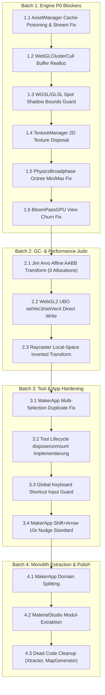

# 🌋 Thermo-Nuclear Code Quality Review (Repository-Wide)

> **Datum:** 2026-09-18  
> **Prüfumfang:** Vollständige Codebasis von Small World (619 TypeScript-Dateien, ~99.145 Zeilen, 148 Testsuiten, alle Shaders in WGSL/GLSL, Engine Core, Loaders, glTF-Extensions, Tools & Sample Apps).  
> **Angewandter Standard:** [`.agents/skills/thermo-nuclear-code-quality-review-revised/SKILL.md`](../skills/thermo-nuclear-code-quality-review-revised/SKILL.md)  
> **Status:** Genehmigter Prüfbericht & Sanierungs-Fahrplan.

---

## 1. Executive Summary & System-Health

```
┌────────────────────────────────────────────────────────────────────────────────────────┐
│                        Small World Engine System Health Status                         │
├──────────────────────────────┬─────────────────────────────┬───────────────────────────┤
│ TypeScript (tsc --noEmit)    │ 0 Fehler (619 Dateien)      │ Strict + exactOptional    │
│ WGSL Linter (lint:wgsl)      │ 0 Fehler (26 Shader)        │ wgsl_reflect validiert    │
│ Unit Tests (vitest)          │ 846 / 846 grün (148 Suiten) │ 100 % Pass Rate           │
│ ESLint (eslint .)            │ 0 Fehler, 0 Warnungen       │ Clean                     │
└──────────────────────────────┴─────────────────────────────┴───────────────────────────┘
```

Die Codebasis zeichnet sich durch ein **außerordentlich hohes architektonisches Grundniveau** aus (strikte Typensicherheit, kein `any`, sauberes mathematisches Koordinatensystem, konsequente Trennung von WebGL/WebGPU-Pipelines).

Dennoch hat der thermo-nukleare Scan in den Tiefen der Subsysteme **kritische Randfälle, GPU-Ressourcenlecks und GC-Hotspots** identifiziert, die in der folgenden Matrix nach Dringlichkeit aufgeschlüsselt sind:

---

## 2. Master-Finding-Matrix

| Subsystem | Blocker (P0) | Major (P1) | Minor / Judo (P2) |
| :--- | :---: | :---: | :---: |
| **1. Renderer & Shader (WebGPU / WebGL2 / WebGL1)** | 5 | 5 | 4 |
| **2. Engine Core, Math, Physics & Scene Graph** | 3 | 6 | 5 |
| **3. Loaders, glTF Extensions & Kit Pipeline** | 3 | 5 | 5 |
| **4. Tools, Editor (`MakerApp`) & Sample Apps** | 3 | 5 | 5 |
| **Gesamt** | **14** | **21** | **19** |

---

## 3. 🔴 BLOCKER (P0: Kritische Bugs, GPU-Lecks & Fehlerpfade)

### 3.1 Rendersystem & Shaders

#### [BLK-R1] Out-of-Bounds State-Corruption im Clustered Lighting ✅ *(BEHOBEN)*
- **Datei:** [`packages/engine/src/renderers/passes/WebGLClusterCullPass.ts`](../../packages/engine/src/renderers/passes/WebGLClusterCullPass.ts#L62-L71)
- **Status:** **Behoben** & regressionstestiert in [`packages/engine/tests/renderers/WebGLClusterCullPass.test.ts`](../../packages/engine/tests/renderers/WebGLClusterCullPass.test.ts).
- **Szenario:** Bei Resize oder Grid-Änderungen prüfte der Code `if (this._grid.length < gridHeight * CLUSTER_TEX_WIDTH * 4)`. Für alle Grids $\le 1024$ Zellen (`gridHeight = 1`) ergab die Prüfung `false`. `_pointCounts` und `_spotCounts` blieben fälschlicherweise bei `Uint8Array(1)`. Zugriffe auf Zelle $> 0$ lasen `undefined` / schrieben `NaN`, wodurch Lichtquellen in WebGL2 ab Zelle 1 verloren gingen und die Szene schwarz blieb.
- **Abhilfe:** Reallokation von `_grid` und `_pointCounts`/`_spotCounts` entkoppelt und an `if (this._pointCounts.length < numClusters)` gebunden.

#### [BLK-R2] Out-of-Bounds Spot Shadow Array-Zugriff in WGSL & GLSL Shaders ✅ *(BEHOBEN)*
- **Dateien:** 
  - [`packages/engine/src/core/renderers/shaders/source/web_gpu/chunks/lighting.wgsl`](../../packages/engine/src/core/renderers/shaders/source/web_gpu/chunks/lighting.wgsl#L113)
  - [`packages/engine/src/core/renderers/shaders/source/web_gpu/chunks/lighting_pbr.wgsl`](../../packages/engine/src/core/renderers/shaders/source/web_gpu/chunks/lighting_pbr.wgsl#L187)
  - [`packages/engine/src/core/renderers/shaders/source/web_gl2/chunks/light_calc.frag.glsl`](../../packages/engine/src/core/renderers/shaders/source/web_gl2/chunks/light_calc.frag.glsl#L198)
  - [`packages/engine/src/core/renderers/shaders/source/web_gl2/chunks/light_calc_pbr.frag.glsl`](../../packages/engine/src/core/renderers/shaders/source/web_gl2/chunks/light_calc_pbr.frag.glsl#L317)
- **Status:** **Behoben** & regressionstestiert in [`packages/engine/tests/renderers/SpotLightPCSS.test.ts`](../../packages/engine/tests/renderers/SpotLightPCSS.test.ts).
- **Szenario:** Clustered Loops iterieren über bis zu 64 Spotlights (`j` / `i`), während `spotShadowInfo`, `spotShadowMatrices` und Shadow-Textur-Layers auf 4 Einträge fixiert sind. Bei $j \ge 4$ las der Shader uninitialisierte Uniform-Daten und triggerte PCSS-Sampling auf ungültigen Texture-Layers bzw. Out-of-Bounds Buffer Reads.
- **Abhilfe:** Striktes `if (j < 4u && global.spotShadowInfo[j].z > 0.5)` in WGSL und `if (i < 4 && u_spotShadowInfo[i].z > 0.5)` in GLSL eingebaut.

#### [BLK-R3] 60-FPS-Pipeline-Rebuild Churn im Post-Processing ✅ *(BEHOBEN)*
- **Dateien:**
  - [`packages/engine/src/renderers/post/passes/BloomPassGPU.ts`](../../packages/engine/src/renderers/post/passes/BloomPassGPU.ts#L267)
  - [`packages/engine/src/renderers/passes/PostProcessPass.ts`](../../packages/engine/src/renderers/passes/PostProcessPass.ts#L252-L264)
- **Status:** **Behoben** & regressionstestiert in [`packages/engine/tests/renderers/PostProcessPassUniforms.test.ts`](../../packages/engine/tests/renderers/PostProcessPassUniforms.test.ts).
- **Szenario:** `BloomPassGPU.execute()` erzeugte pro Frame ein neues `GPUTextureView`-Objekt via `createView()`. `PostProcessPass` erkannte geänderte View-Referenzen und baute pro Sekunde 60-mal das gesamte `GPURenderPipeline`-Objekt synchron neu (`createShaderModule`, `createRenderPipeline`, `createBindGroup`).
- **Abhilfe:** `BloomPassGPU` gibt gecachtes `this._mipViews[0]` zurück (und nutzt wiederverwendbare Uniform-Arrays). In `PostProcessPass` wurde die `GPURenderPipeline`-Kompilierung vollständig von dynamischen `GPUBindGroup`-Texture-Views entkoppelt, sodass View-Wechsel niemals einen Pipeline-Rebuild triggern.

#### [BLK-R4] Stale `dLight`-Referenz-Leck bei gelöschten Richtlichtern ✅ *(BEHOBEN)*
- **Dateien:**
  - [`packages/engine/src/renderers/AbstractRenderer.ts`](../../packages/engine/src/renderers/AbstractRenderer.ts#L126-L139)
  - [`packages/engine/src/interfaces/LightData.ts`](../../packages/engine/src/interfaces/LightData.ts#L20)
- **Status:** **Behoben** & regressionstestiert in [`packages/engine/tests/renderers/AbstractWebGLRenderer.test.ts`](../../packages/engine/tests/renderers/AbstractWebGLRenderer.test.ts).
- **Szenario:** `extractLights()` leerte `pLights`/`sLights`/`aLights`, setzte aber `_lightData.dLight` nie auf `undefined` zurück. Wurde ein Sonnenlicht gelöscht oder unsichtbar geschaltet (`isVisible = false`), blieben CSM-Schattenpässe endlos für das Geisterlicht aktiv.
- **Abhilfe:** `this._lightData.dLight = undefined;` zu Beginn von `extractLights()` ergänzt und `LightDataInterface.dLight` typisiert als `DirectionalLight | undefined`.

#### [BLK-R5] Fallback-Kaskaden-Abbruch in `RendererFactory.ts` ✅ *(BEHOBEN)*
- **Datei:** [`packages/engine/src/renderers/RendererFactory.ts`](../../packages/engine/src/renderers/RendererFactory.ts#L52-L105)
- **Status:** **Behoben** & regressionstestiert in [`packages/engine/tests/renderers/RendererFactory.test.ts`](../../packages/engine/tests/renderers/RendererFactory.test.ts).
- **Szenario:** Schlug WebGPU fehl und WebGL2 scheiterte ebenfalls (z. B. Driver-Blocklist oder Context-Fehler), stürzte der Renderer wegen verschachtelter `if (!fallbackToWebGL2)`-Bedingungen mit `throw e` ab, statt auf WebGL1 weiterzukaskadieren.
- **Abhilfe:** `RendererFactory.create()` auf eine lineare, robuste Kandidaten-Kaskade (`_getFallbackCandidates`) umgestellt: Jeder Backend-Kandidat (`WebGPU` $\to$ `WebGL2` $\to$ `WebGL1`) prüft DeviceCaps und fängt Initialisierungsfehler ab, um nahtlos zum nächsten Fallback weiterzuleiten.

---

### 3.2 Engine Core, Math & Physics

#### [BLK-C1] 2D-GPU-Textur-Leck beim Beenden ✅ *(BEHOBEN)*
- **Datei:** [`packages/engine/src/renderers/WebGL2/managers/WebGLTextureManager.ts`](../../packages/engine/src/renderers/WebGL2/managers/WebGLTextureManager.ts#L369-L375)
- **Status:** **Behoben** & regressionstestiert in [`packages/engine/tests/renderers/TextureRefCounting.test.ts`](../../packages/engine/tests/renderers/TextureRefCounting.test.ts).
- **Szenario:** `WebGLTextureManager.dispose()` leerte nur `_texCubeCache`. Alle 2D-`WebGLTexture`-Objekte in `_texCache` sowie die Zähler in `_texRefCounts` und `_texCubeRefCounts` blieben ungelöscht im VRAM bzw. Memory des Browsers hängen.
- **Abhilfe:** `dispose()` löscht nun alle `_texCache`-Texturen via `gl.deleteTexture()`, leert `_texCache` und resettet `_texRefCounts` sowie `_texCubeRefCounts`.

#### [BLK-C2] Octree-Extents-Bug im Physik-Broadphase ✅ *(BEHOBEN)*
- **Datei:** [`packages/engine/src/physix/broadphase/PhysicsBroadphase.ts`](../../packages/engine/src/physix/broadphase/PhysicsBroadphase.ts#L68-L76)
- **Status:** **Behoben** & regressionstestiert in [`packages/engine/tests/physix/broadphase/PhysicsBroadphase.test.ts`](../../packages/engine/tests/physix/broadphase/PhysicsBroadphase.test.ts).
- **Szenario:** Beim Rebuild des Octrees wurde nur `center` aktualisiert, während `min`/`max` auf Frame-1-Werten einfroren (und Instanzen mit `_worldMin`/`_worldMax` teilten). Bewegte Körper außerhalb des initialen Bereichs scheiterten an `containsVolume()` und fielen in den $O(N \times M)$ Fallback.
- **Abhilfe:** `_tree.root.bounds.min` und `_tree.root.bounds.max` via `copyFrom(this._worldMin)` / `copyFrom(this._worldMax)` vor `_tree.clear()` synchronisiert sowie bei der Instanziierung geklont.

#### [BLK-C3] `Matrix4.scale()` Overload-Crash ✅ *(BEHOBEN)*
- **Datei:** [`packages/engine/src/math/Matrix4.ts`](../../packages/engine/src/math/Matrix4.ts#L577-L627)
- **Status:** **Behoben** & regressionstestiert in [`packages/engine/tests/math/Matrix4.test.ts`](../../packages/engine/tests/math/Matrix4.test.ts).
- **Szenario:** Aufruf mit 3 Zahlen ohne `target` (z. B. `Matrix4.scale(2, 3, 4)`) warf `TypeError: Cannot read properties of undefined (reading 'identity')`, da `target` optional war und ohne Fallback dereferenziert wurde.
- **Abhilfe:** Eindeutige TypeScript-Overload-Signaturen (`scale(s, target?)` und `scale(x, y, z, target?)`) definiert und robuste Fallback-Instanziierung (`out = target ?? new Matrix4()`) mit Rückgabe des Matrix-Objekts implementiert.

---

### 3.3 Loaders & glTF Pipeline

#### [BLK-L1] Permanentes Cache-Poisoning bei Netzwerkfehlern
- **Datei:** [`packages/engine/src/loaders/AssetManager.ts`](../../packages/engine/src/loaders/AssetManager.ts#L191-L273)
- **Szenario:** Schlägt ein Fetch in `loadJson`, `loadText`, `loadBinary` oder `loadImage` fehl, bleibt das abgelehnte Promise dauerhaft in der Cache-Map. Wiederholte Ladeversuche schlagen sofort fehl, ohne das Netzwerk erneut anzufragen.
- **Abhilfe:** Im `catch`-Block den Key aus der jeweiligen Map löschen (`this._jsonCache.delete(url)`).

#### [BLK-L2] Deadlock bei Stream-Fehler in `streamBinary`
- **Datei:** [`packages/engine/src/loaders/AssetManager.ts`](../../packages/engine/src/loaders/AssetManager.ts#L282-L342)
- **Szenario:** Bricht ein Chunk-Stream ab, wird `_checkCompletion(trackingKey)` übersprungen. `assetManager.isLoaded` bleibt dauerhaft `false`, Szenenübergänge frieren ein.
- **Abhilfe:** Stream-Schleife in `try ... finally` kapseln.

#### [BLK-L3] Unaligned TypedArray `RangeError`
- **Datei:** [`packages/engine/src/loaders/gltf/GltfBinaryParser.ts`](../../packages/engine/src/loaders/gltf/GltfBinaryParser.ts#L77-L92)
- **Szenario:** Bei nicht 4-Byte-ausgerichteten Offsets (`byteOffset % 4 !== 0`) wirft `new Float32Array(buffer, byteOffset, count)` einen fatalen JavaScript-`RangeError`.
- **Abhilfe:** Bei fehlender Ausrichtung via `buffer.slice()` ein ausgerichtetes Array instanziieren.

---

### 3.4 Tools, Editor & Sample Apps

#### [BLK-T1] Zombie-Event-Listener & Engine-Lecks auf Tool-Unmount
- **Dateien:**
  - [`packages/engine/src/tools/maker/MakerApp.ts`](../../packages/engine/src/tools/maker/MakerApp.ts#L270-L274)
  - [`packages/engine/src/tools/MaterialStudio.ts`](../../packages/engine/src/tools/MaterialStudio.ts#L2178-L2182)
  - [`packages/engine/src/tools/Pixler.ts`](../../packages/engine/src/tools/Pixler.ts#L649-L724)
- **Szenario:** `MaterialStudio.unmount()` stoppt den Render-Loop nicht; `MakerApp` und `Pixler` entfernen keine anonymen `window.addEventListener("keydown")`-Listener. Unmounten oder Hot-Reloading hinterlässt Zombie-Listener, die ganze Szenen-Graphen im Speicher festhalten.
- **Abhilfe:** Vollständige `dispose()`-Methoden mit `removeEventListener` und `SmallWorld.stop()` implementieren.

#### [BLK-T2] Undo-Stack Duplikations-Bug bei Gruppen
- **Datei:** [`packages/engine/src/tools/maker/MakerApp.ts`](../../packages/engine/src/tools/maker/MakerApp.ts#L1198-L1225)
- **Szenario:** Sind Parent und Child gemeinsam selektiert, dupliziert `duplicateSelection()` den Child-Node doppelt (einmal über den geklonten Parent, einmal separat als Waise).
- **Abhilfe:** Selektionsliste vor Batch-Operationen auf Root-Elemente filtern.

#### [BLK-T3] Import-Side-Effects in `ibl-gen.ts`
- **Datei:** [`packages/engine/src/tools/ibl-gen.ts`](../../packages/engine/src/tools/ibl-gen.ts#L580-L728)
- **Szenario:** Modul führt beim reinen Importieren `document.addEventListener("DOMContentLoaded")` aus, erzeugt Offscreen-Canvases und instanziiert WebGL2-Kontexte.
- **Abhilfe:** In explizite `initIBLGenTool()`-Funktion kapseln.

---

## 4. 🟠 MAJOR (P1: Performance, GC-Druck & Schnittstellen)

### 4.1 Performance & GC-Optimierung
1. **[MAJ-01] ~770 Vector3D-Allokationen pro Frame in `updateGlobalUBO()` ([`WebGL2Renderer.ts#L1435`](../../packages/engine/src/renderers/WebGL2/WebGL2Renderer.ts#L1435))**
   - *Impact:* `WebGL2UniformBuffer` verlangt `Vector3D`-Objekte für `setVector3()`. Bei 4 CSM-Kaskaden und Spotlights werden pro Sekunde ~46.000 kurzlebige Objekte für den Garbage Collector erzeugt.
   - *Lösung:* Direkte `setVec3(offset, x, y, z)`-Methode ohne Objekt-Allokation einführen.

2. **[MAJ-02] Jim-Arvo-AABB-Transformations-Judo ([`BoundingBox.ts#L207`](../../packages/engine/src/physix/BoundingBox.ts#L207))**
   - *Impact:* `BoundingBox.transform()` erzeugt pro Aufruf ein 8-Element-Array und 8 MathPool-Vektoren.
   - *Lösung:* Umstellung auf Arvos affine Formel ($O(1)$, 0 Vektoren, 0 Arrays).

3. **[MAJ-03] `Raycaster` transformiert alle Mesh-Vertices in Weltkoordinaten ([`Raycaster.ts#L92`](../../packages/engine/src/physix/Raycaster.ts#L92))**
   - *Impact:* Bei 5.000 Polygonen werden 15.000 Vektortransformationen pro Picking-Frame gerechnet.
   - *Lösung:* Den Suchstrahl (Ray) **einmal** in den Objekt-Lokalraum transformieren (`worldMatrix.invert()`) und gegen unveränderte Vertex-Puffer testen.

4. **[MAJ-04] MathPool-Thrashing in `EulerIntegrator` ([`EulerIntegrator.ts#L80`](../../packages/engine/src/physix/solvers/EulerIntegrator.ts#L80))**
   - *Impact:* 12 MathPool-Acquires pro rotierendem Körper pro Physik-Substep.
   - *Lösung:* Rotation über Quaternion-Integration direkt aktualisieren.

5. **[MAJ-05] Transiente `GPUTextureView`-Allokationen in Schatten-Pässen ([`CascadedShadowPassGPU.ts#L123`](../../packages/engine/src/renderers/passes/CascadedShadowPassGPU.ts#L123), [`SpotShadowPassGPU.ts#L123`](../../packages/engine/src/renderers/passes/SpotShadowPassGPU.ts#L123))**
   - *Impact:* `fbo.createView({ baseArrayLayer: i })` wird jeden Frame für jede Schattenkaskade neu erzeugt.
   - *Lösung:* Layer-Views beim FBO-Resize vorberechnen und cachen.

---

### 4.2 UX, Tooling & Architektur
6. **[MAJ-06] Tastatur-Shortcuts kollidieren mit Formularfeldern ([`Pixler.ts#L724`](../../packages/engine/src/tools/Pixler.ts#L724), [`ViennaMapModal.ts#L265`](../../apps/sample-apps/the-whisper/ui/ViennaMapModal.ts#L265))**
   - *Impact:* Tippen in Textfeldern löst Tastaturkürzel (M, T, E, Space, 1–9) im Hintergrund aus.
   - *Lösung:* Zentraler Guard `isEditingTextInput()` (prüft `INPUT`, `TEXTAREA`, `contenteditable`).

7. **[MAJ-07] Shift+Arrow Muscle-Memory-Inversion in `MakerApp.ts` ([`MakerApp.ts#L1950`](../../packages/engine/src/tools/maker/MakerApp.ts#L1950))**
   - *Impact:* Entgegen Industriestandards (*Photoshop, Blender, Figma*) bewegt `Shift+Pfeil` Objekte vertikal statt 10-fach schneller horizontal zu verschieben.
   - *Lösung:* `Shift` als `10x`-Multiplikator standardisieren; Vertikalbewegung auf `PageUp`/`PageDown` legen.

8. **[MAJ-08] glTF Extension Registry Duplikation ([`GltfExtensionRegistry.ts#L3`](../../packages/engine/src/loaders/gltf/GltfExtensionRegistry.ts#L3))**
   - *Impact:* Mehrfaches Registrieren führt zu $N$-facher Ausführung der Hooks pro Node.
   - *Lösung:* Deduplizierung nach `plugin.name`.

9. **[MAJ-09] `KhrTextureBasisu` nutzt rohes `fetch()` ([`KhrTextureBasisu.ts#L50`](../../packages/gltf-extensions/src/basisu/KhrTextureBasisu.ts#L50))**
   - *Impact:* Umgeht Base-URL, Authentifizierungs-Header und Ladefortschritt des `AssetManager`s.
   - *Lösung:* `_assetManager.loadBinary(url)` verwenden.

10. **[MAJ-10] Monolithische Dateien über 1.000 Zeilen**
    - *Betroffen:* `MaterialStudio.ts` (2.197 Z.), `MakerApp.ts` (2.147 Z.), `character-diorama/showcase.ts` (1.918 Z.), `prologue.ts` (1.438 Z.), `ViennaMapModal.ts` (1.011 Z.), `Pixler.ts` (1.047 Z.).
    - *Lösung:* Schrittweise Modularisierung in fokussierte Domain-Services.

---

## 5. 🟡 MINOR & CODE-JUDO (P2: Eleganz, Bereinigung & Dead Code)

1. **[MIN-01]** Toter Mock-AI-Chatbot in [`Xtractor.ts#L743`](../../packages/engine/src/tools/Xtractor.ts#L743) (90 Zeilen deutsches Regex-Slicing für Doom-Zahlen entfernen).
2. **[MIN-02]** Literal `\\n` statt echtem `\n` in [`MapGenerator.ts#L411`](../../packages/engine/src/tools/MapGenerator.ts#L411).
3. **[MIN-03]** Globale CSS-Verschmutzung (`* { box-sizing }`) in [`MaterialStudio.ts#L204`](../../packages/engine/src/tools/MaterialStudio.ts#L204) kapseln.
4. **[MIN-04]** Duplizierte prozedurale Geometrie (Rohre, Lampen, Kisten) in `showcases` durch statische Aufrufe von `BunkerKit` und `FlakturmKit` ersetzen.
5. **[MIN-05]** `Raycaster` um Unterstützung für `BoundingType.OBB` erweitern.

---

## 6. 🛠️ Priorisierter Sanierungs-Fahrplan


