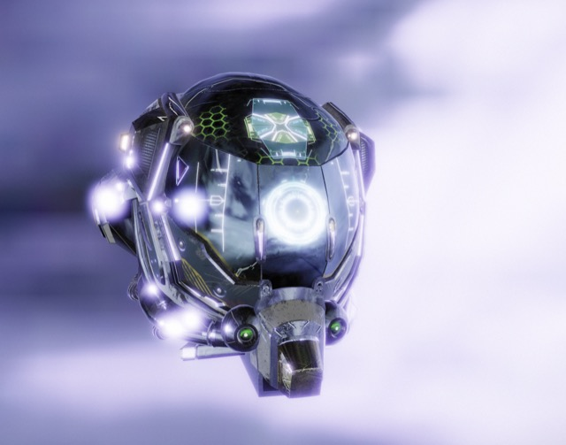

# Small World Engine



**Small World Engine** is the "Preact of 3D Engines". It is an ultra-lightweight, high-performance, and strict TypeScript 3D game engine for the web. Built for the era of WebGPU and Playable Ads, it provides a modern Physically Based Rendering (PBR) pipeline and a robust Behavior System—delivering the architectural elegance of a real game engine at a fraction of the bundle size of traditional frameworks.

Read our full [Vision & Strategy (VISION.md)](VISION.md).

<br clear="right"/>

## 🚀 Features

- **Hybrid PBR Rendering:** High-performance rendering pipeline supporting **WebGPU**, **WebGL 2**, and **WebGL 1** with industry-standard physically based shading (Cook-Torrance BRDF).
- **Linear Lighting Workflow:** All lighting calculations are performed in linear space with automatic sRGB gamma correction for realistic color falloffs and high visual fidelity.
- **Advanced Materials:** Includes standard PBR (Metallic/Roughness), but also physical **Glass/Dielectric** materials with real-time **Screen-Space Refraction**, Index of Refraction (IOR), and Beer's Law for volumetric light absorption.
- **Advanced Camera System:** Unified camera setup where controllers (e.g., `OrbitController`, `FPSController`, `ZoomController`) are standard `Behavior` components attached via `camera.addBehavior()`. Features procedural effects like camera shake and flash.
- **High-Performance Architecture:** Optimized for memory efficiency through **Object Pooling** (`MathPool`), BindGroup & Pipeline Caching (WebGPU), and zero-allocation hot paths to eliminate Garbage Collection pressure.
- **Lighting & Shadows:** Supports Ambient, Directional, Point, Spot, and Area lights. Features robust **Shadow Mapping** (WebGL 2) with Hardware Shadow Sampling and Percentage-Closer Filtering (PCF) for buttery-smooth soft shadows.
- **Planar & Conformal Reflections:** Real-time planar floor reflections (virtual mirror geometries) and dynamic sphere inversion reflections ($P' = C + V \cdot \frac{R^2}{d^2 - r^2}$) for PBR objects.
- **Component Behaviors & State Machines:** Robust, callback-driven behavior system to attach complex logic (`FlickerBehavior`, `PulsatingBehavior`, `ProximitySensorBehavior`, `RainbowBehavior`, `BobbingBehavior`, `RotatorBehavior`, `HoverBehavior`, `DraggableBehavior`, `EnemyBehavior`, `YadController`, etc.) directly to 3D objects, cameras, or materials. Includes a built-in, type-safe, zero-allocation **Finite State Machine (FSM)** framework (`StateMachine` & `StateMachineBehavior`) to cleanly manage game actor lifecycles.
- **Interactions & Gamification:** A built-in `InteractionManager` allowing objects to instantly react to mouse/touch pointer events (`onPointerEnter`, `onPointerClick`, `onPointerDown`, `onPointerMove`, etc.). Pickable elements are queried via highly performant $O(\log n)$ **Octrees** and resolved to exact pixels via the **Möller-Trumbore** intersection algorithm. 
- **Stylized Post-Processing Pipeline:** Built-in cinematic and retro filters (Phosphor Green Night Vision, Film Noir with chromatic aberration, Cyber Glitch, VHS Tape tracking, Amber/Sepia Underworld, Old Projector scratching/hair spots, and Thermal Vision). Configured via static parameter specialization for optimal compilation without dynamic uniform cost.
- **Scene Graph:** Hierarchical scene management using a clean `Object3D` architecture.
- **2D/2.5D Support:** First-class support for Sprites, Billboard rendering, and Pixel-Perfect Isometric perspectives.
- **Audio System:** Built-in `AudioSystem` with 3D Spatial Audio (HRTF), a procedural Retro Synthesizer (footsteps, lasers, drones, fire), and a built-in Mixer with procedural Reverb.
- **Geometry & Asset Loaders:** Dynamic terrain generation, comprehensive primitive library, and async loaders for OBJ models, MTLLib materials, and textures (via unified static factories like `Texture.fromUrl()`).

### ⚡ Under the Hood (Hardcore Engineering)

- **Zero-Allocation Render Loop:** The critical path is strictly structured to ensure **zero memory allocations** (garbage) during the main render loop. This eliminates unpredictable Garbage Collection (GC) pauses, guaranteeing consistently smooth framerates.
- **Custom Math Engine from Scratch:** We don't rely on massive external math libraries like `glMatrix`. Small World features a bespoke, highly-optimized mathematics library for vectors and matrices, tailored exactly for our right-handed coordinate system.
- **Advanced Rendering & Post-Processing:** Consistent linear space math through the entire pipeline, featuring a highly efficient, unified final pass for Tone-Mapping, Color-Grading, Vignette, and sRGB Gamma Correction.
- **WebGPU Compute Shaders:** True utilization of compute shaders, including workgroup memory for complex spatial operations—features that many traditional engines are still struggling to retrofit.
- **Absolute "Zero Dependency" Philosophy:** No Three.js, no Babylon.js. We built a complete 3D engine—including Frustum Culling (`frustum.intersectsVolume(obj.bounds)`), Scene Graph, and Resource Management—entirely from scratch. This keeps the footprint tiny and performance at the absolute maximum.

## 📦 Installation

Install the package via NPM:

```bash
npm install small-world
```

## 🎮 Quick Start

The engine provides an `Application` base class that handles the render loop and hardware initialization automatically.

### 1. Configuration (`small-world.json`)

By default, the engine looks for a configuration file at `/config/small-world.json`.

```json
{
  "canvasId": "SmallWorld",
  "rendererType": "BEST",
  "projection": "PERSPECTIVE",
  "fullscreen": true,
  "renderer": [
    {
      "type": "WEB_GPU",
      "attributes": { "antialias": true }
    }
  ]
}
```

### 2. Implementation Showcase

```typescript
import { Application, Cube, Color, StandardMaterial, Object3D, OrbitController, ZoomController, Texture } from "small-world";

class MyGame extends Application {
  protected async setupScene(): Promise<void> {
    // 1. Load a texture and create a PBR material
    const albedoTex = await Texture.fromUrl("./assets/textures/diffuse.png");
    const geometry = new Cube({ size: 2 }).getGeometryData();
    const material = new StandardMaterial({
      map: albedoTex,
      color: Color.DODGERBLUE,
      metallic: 0.7,
      roughness: 0.2,
    });

    // 2. Wrap in an Object3D and add to scene
    const cube = new Object3D("MyCube");
    cube.geometry = geometry;
    cube.material = material;
    cube.position.set(0, 1, 0);

    this.scene.add(cube);

    // 3. Configure the camera and attach behaviors (controllers)
    this.camera.position.set(5, 5, 5);
    this.camera.target.set(0, 0, 0);

    // Camera controllers are now behaviors!
    this.camera.addBehavior(new OrbitController());
    this.camera.addBehavior(new ZoomController());
  }

  protected override update(deltaTime: number): void {
    // Logic executed every frame
  }
}

// Start the application
const game = new MyGame();
game.start();
```

## 🛠 Development

### Prerequisites

- **Node.js:** We recommend using the version specified in `.nvmrc`. If you use [nvm](https://github.com/nvm-sh/nvm), simply run `nvm use` in the root directory.

### Local Setup

1.  **Install dependencies:**
    ```bash
    npm install
    ```
2.  **Start development server (Vite):**
    ```bash
    npm run dev
    ```
3.  **Build the library:**
    ```bash
    npm run build:lib
    ```

### Optional: Dev Containers (VS Code)

For an isolated development environment, this project includes a **Dev Container** configuration for VS Code.

- When opening the project, VS Code should prompt you to "Reopen in Container".
- This sets up the correct Node.js version and recommended extensions (ESLint, Prettier, etc.) automatically.

## 📂 Project Structure

- `src/core`: Core engine logic (Application, Object3D, Scene, Input, Color).
- `src/core/behaviors`: Modular runtime behavior components (e.g. Proximity Sensors, Oscillators).
- `src/core/cameras`: Camera strategies, projections, effects, and modular controllers.
- `src/core/fsm`: Type-safe, zero-allocation Finite State Machine utility.
- `src/core/materials`: Material definitions and PBR shader assets.
- `src/core/lights`: Light source implementations (Standard & PBR).
- `src/geometry`: Geometric primitives and terrain logic.
- `src/math`: Linear algebra, vectors, matrices, and object pooling.
- `src/loaders`: Asset loading pipeline (OBJ, MTL, Textures).
- `src/renderers`: Implementation of WebGL1, WebGL2, and WebGPU backends.
  - `src/core/renderers/shaders/source`: Core shader assets directly bundled with the engine.
- `examples`: Interactive functional showcases showcasing engine capabilities.
- `public/engine`: Static assets including models, textures, and levels used across examples.

## 🧰 Tools

The engine includes several browser-based tools to help generate assets directly on the client side without relying on external software:

- **PBR Map Generator** (`public/tools/pbr-gen.html`): Generate Normal, Specular, AO, and Height maps from a single diffuse image.
- **Splatter Generator** (`public/tools/splatter-gen.html`): Generate procedural splatters and decals.
- **IBL Generator** (`public/tools/ibl-gen.html`): Generate Image-Based Lighting (Irradiance and Radiance) environment maps.

## 📚 Documentation

This project uses [TypeDoc](https://typedoc.org/) for automated API reference generation and [VitePress](https://vitepress.dev/) for developer guides and tutorials.

1.  **Generate API Reference:**

    ```bash
    npm run docs:api
    ```

    This automatically extracts all classes, interfaces, and methods from the TypeScript source and generates a static HTML site under `docs/public/api`.

2.  **Start the VitePress Dev Server:**
    ```bash
    npm run docs:dev
    ```
    This serves the developer documentation locally. You can browse the guides and the newly generated API documentation.

## 📄 License

This project is licensed under the MIT License.
