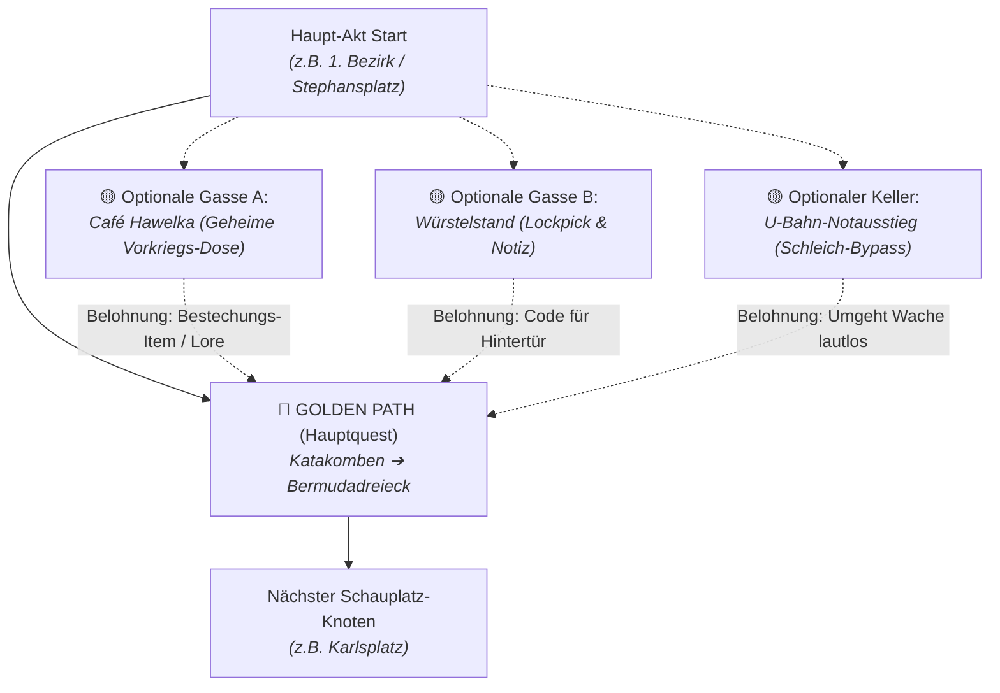
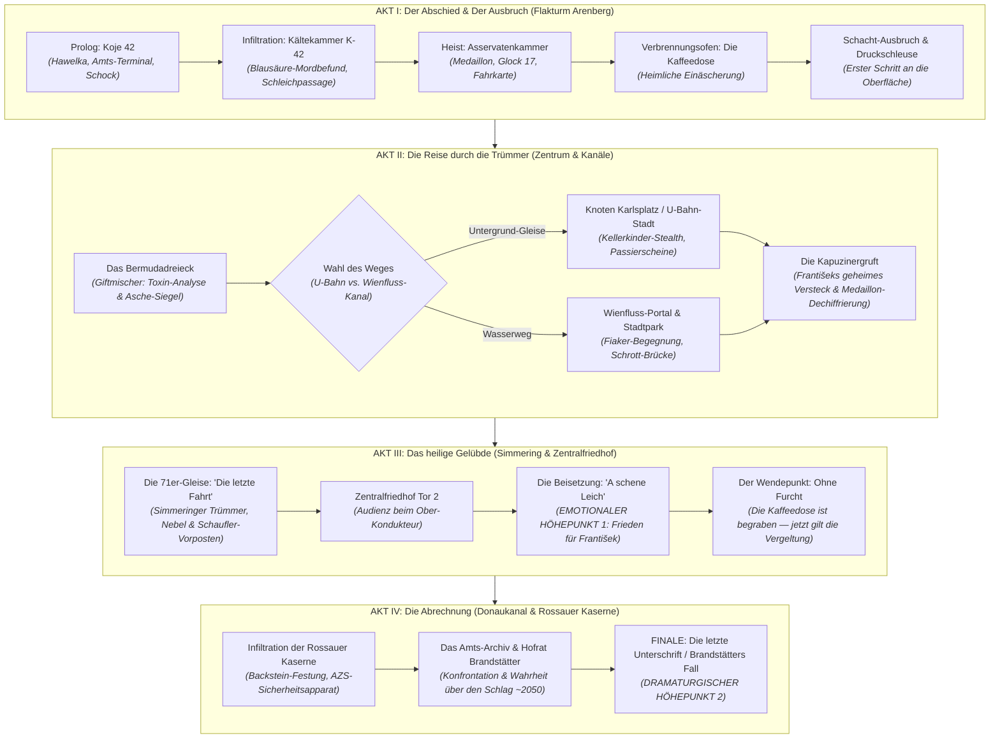
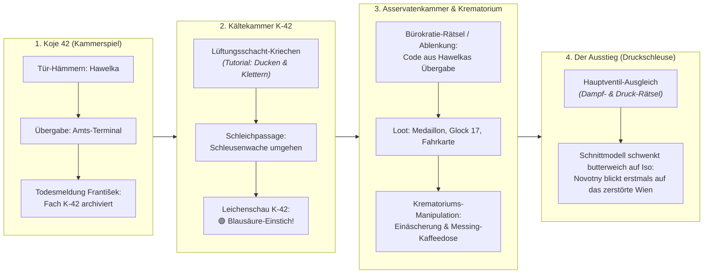

# Story-Grundgerüst: Postapokalyptisches Wien-Projekt („And Now?“)

---

## 🌟 0. Die absolute Grundfeste: Das Stray-Prinzip & Die Story-First-Doktrin

> **„Die Story ist alles. Das Technische kommt danach.“**
>
> *Stray* hat bewiesen, wie ein zutiefst atmosphärisches, emotionales und visuell stimmiges Spiel die Herzen von Millionen Menschen erobern kann — ohne 500-Mann-Armeen, ohne 8K-Texturen-Schlachten und ohne Grafikkarten-Wettrüsten.
> 
> Genau diese emotionale Kraft soll **Novotnys Odyssee** entfalten.
> 
> Weder wir noch die Spieler brauchen hunderte unbezahlbare 8K-Texturen oder seelenlosen Fotorealismus. Was dieses Spiel unvergesslich macht, sind:
> 1. **Die emotionale Wucht der Reise:** Die Asche des Großvaters in einer alten Kaffeedose durch das zerfallene Wien zu tragen, um ihm bei den Pompfinebrern am Zentralfriedhof „a schene Leich“ zu schenken.
> 2. **Der 2-Phasen-Höhepunkt (*Stray* trifft *The Last of Us*):**
>    - **Das vorletzte Ziel (Emotionale Katharsis):** Das würdevolle Begräbnis am Zentralfriedhof. Novotny erfüllt sein Versprechen und lässt die Trauer im Weihrauchnebel los.
>    - **Das letzte Ziel (Die Abrechnung):** Ohne die hemmende Angst um die Urne im Rucksack hat Novotny plötzlich *nichts mehr zu verlieren*. Die Reise gipfelt in der harten, persönlichen Abrechnung mit Hofrat Brandstätter und dem mörderischen AZS-System in der Rossauer Kaserne.
> 3. **Lichtstimmung, Schatten und Melancholie:** Malerisches Chiaroscuro, warmer Funkenflug, dichter Nebel und intime Guckkasten-Momente.
> 4. **Der unverwechselbare Wiener Schmäh & Ton:** Morbider Galgenhumor, Kaffeehaus-Sehnsucht und kafkaeske Bunker-Bürokratie als Kontrast zur rauen Endzeit.
> 5. **Eiserne Prioritätensetzung:** Bevor neue technische Systeme gebaut werden, werden alle narrativen Knotenpunkte, Begegnungen, moralischen Dilemmata und emotionalen Höhepunkte von Novotnys Odyssee unerschütterlich geklärt.

---

## 🌟 1. Die Kernsäulen des Konzepts

*   **Der Ton ("Der Tod muaß a Wiener sein")**
    *   Morbider Wiener Galgenhumor als Bindeglied zwischen ernster Postapokalypse (Metro) und politisch-gesellschaftlicher Satire (Fallout).
    *   Trotz des bitteren Ernstes der Endzeit verleiht der Wiener Schmäh dem Setting eine völlig eigene, tragikomische Identität.

*   **Reale Wiener Anker**
    *   Einbettung der Fiktion in reale Schauplätze der Stadt: Die Flaktürme (z.B. Arenbergpark) als Bunkerfestungen.
    *   Der Zentralfriedhof als spirituelles und physisches Zentrum des Todes und des Respekts.
    *   Die **UNO-City (IAEA)** als stiller, jenseits der Donau liegender Horizont – nicht das Ziel der Reise, sondern Heimstatt großer Vorkriegs-Technologie und des ungelösten Rätsels, wer einst den Knopf gedrückt hat.

*   **Die Zeitleiste (2050 ➔ 2100) & Retro-Futurismus**
    *   *Der Tag des Schlags (~2050)*: Eine Welt mit fortgeschrittener Technologie – autonome KI-Protokolle, Robotik, Kybernetik und experimentelle Energieforschung.
    *   *Die Gegenwart der Spielwelt (~2100)*: 50 Jahre nach der Katastrophe. Während an der Oberfläche bereits seit Jahrzehnten ein hartes, etabliertes Fraktions- und Schmuggel-Ökosystem (Pompfinebrer, Giftmischer, Prater-Syndikat) existiert, war **Novotny persönlich** ihr/sein ganzes Leben lang in den tiefen Schächten des Bunkers Arenberg isoliert und hat noch nie den echten Himmel gesehen oder die Oberwelt betreten.
    *   *Technische Relikte*: Fragmente von künstlichen Intelligenzen (z.B. defekte automatische Konsulats-Attachés, AZS-Verwaltungs-KIs mit zynischen Glitches, automatisierte IAEA-Sicherheitssysteme).

*   **Der visuelle Art-Style (Die 2-Ebenen-Dramaturgie)**
    *   **Ebene 1: Die Baseline-Welt (85–90% des Spiels — Morbid-Malerischer Graphic-Noir)**:
        *   *Die Synthese*: Eine atmosphärische Verschmelzung aus **Dishonored** (viktorianisch/k.u.k.-Architektur, stilisierte Pinselstrich-Texturen, überzeichnete Charakter-Silhouetten), **Disco Elysium** (ölmalerei-artige Farbpalette, melancholischer Verfall, literarische Dichte) und **Little Nightmares** (groteskes Chiaroscuro-Lichtspiel, beklemmende Maßstäbe, wachsartig-morbide Texturen und Theaterkulissen-Vibe).
        *   *Atmosphärische Farbpalette*: Kein steriles Schwarz-Weiß als Dauerzustand, sondern reichhaltige, desaturierte Wiener Nuancen — veroneser Patinagrün kupferner Kuppeldächer, tiefes Petrol des nächtlichen Donaukanals, bernsteinfarbenes Gaslaternen- & Röhrenlicht, schmutziges Kaisergelb und feuchter Kopfsteinpflaster-Schimmer.
    *   **Ebene 2: Der Dramaturgische Eingriff (10–15% Schlüsselmomente — Sin-City Colorkey)**:
        *   *Grundsatz: „Farbe ist Drama, keine Dekoration“*: Der radikale Sin-City Look (reinschwarze Tuscheschatten, weiße Kanten und **genau eine isolierte Schlüsselfarbe**) wird als **gezielte Regie-Zäsur** für Schockmomente, Indizien, Traumata und tödliche Konfrontationen eingesetzt:
            1. **Koje 42 / Prolog (Trauma-Echo):** Reines Schwarz/Weiß — isoliertes 🟡 **Bernsteingold** (Großvaters Kerosin-Laterne & die zuckende Röhre des Amts-Terminals) als letzter Schein menschlicher Wärme.
            2. **Kältekammer K-42 (Der Mord-Beweis):** Reines Schwarz/Weiß — der winzige, eisige 🟢 **Blausäure-Smaragdtupfer** am Hals des Großvaters zur Entlarvung des Giftmordes.
            3. **Stufe-3-Nahkampf (Glock FM 78 Messer):** Reines Schwarz/Weiß — das blendende 🔴 **Karminrot** an Klinge und Händen bei tödlicher Intimität.
            4. **Das Bermudadreieck (Alchemie-Gewölbe):** Reines Schwarz/Weiß — das leuchtende 🟢 **Smaragdgrün** brodelnder Narkotika und Gift-Injektoren im Rauschzustand.
            5. **Das Tribunal Rossauer Kaserne (Akt IV Finale):** Reines Schwarz/Weiß — das stechende 🔴 **Karminrot** des AZS-Sperrstempels und Brandstätters Dienstsiegel.
    *   *Das „Wiener Guckkasten-Prinzip“ (Duale Kameraperspektive & Nahtloser Übergang)*:
        *   **Oberwelt & Außenbezirke (Isometrisch / Top-Down wie *Disco Elysium*)**: Weitsicht, Orientierung, Navigation zwischen Schuttbergen, Platzübersichten, Dialoge und Straßenkämpfe aus erhabener, malerischer Diorama-Perspektive.
        *   **Innenräume, Bunker & Unterwelt (2.5D Schnittmodell / Theaterbühne wie *Little Nightmares*)**: Beklemmende Chiaroscuro-Enge, Klettern, Verstecken unter Mobiliar, Schleichpassagen und intime Raum-Rätsel in seitlich aufgeschnittenen Guckkasten-Kulissen.
        *   **Der nahtlose Kameraschwenk (Seamless Transition)**: Beim Betreten eines Gebäudes oder Bunkers (z.B. Druckschleuse Flakturm Arenberg) erfolgt kein harter Lade-Schnitt. Die 3D-Kamera schwenkt und senkt sich butterweich von der schrägen Isometrie auf Augenhöhe nach vorne-unten, während Außenwände wie Theaterkulissen transparent werden und den Blick in das mehrstöckige, atmosphärisch ausgeleuchtete Schnittmodell freigeben.

*   **Das diegetische Reisesystem & Die Weltkarte (Großvaters Faltplan 2026 ➔ 2100)**
    *   *Diegetische Entscheidung*: Absage an sterile Cyberpunk-PDAs oder Pip-Boys. Novotny trägt einen mehrfach gefalteten, abgegriffenen Vorkriegs-Stadtplan (Falk-Plan Wien 2026) mit sich, den Großvater František 50 Jahre lang mit Rötelstift-Notizen, Kaffeerändern, Warnungen (*„Hawelka schläft nie“*, *„Schaufler-Patrouille“*) und Schleichrouten annotiert hat.
    *   *Diegetischer Schnellreise-Transit*: Das Reisen zwischen Schauplätzen (Flakturm Arenberg, Bermudadreieck, Prater, Rossauer Kaserne, Zentralfriedhof) erfolgt über atmosphärische Chiaroscuro-Transit-Vignetten (z.B. der geflutete U-Bahn-Schacht am Karlsplatz) mit literarisch verdichteten Einzeilern.

*   **Die Spionage-Vergangenheit**
    *   Nutzt Wiens reale Historie als Drehscheibe des Kalten Krieges.
    *   Geheimdienste und Informationsnetzwerke bilden das Fundament für Fraktionen, bei denen Wissen, Geheimnisse und Passierscheine wertvoller sind als reine Munition.

---

## 👥 2. Die Fraktionen

### A. Die Pompfinebrer (Die Bestatter-Gemeinde)
*   **Hintergrund & Ästhetik**: Ansässig auf dem Wiener Zentralfriedhof. Benannt nach dem traditionellen Begriff für französische Bestattungsdiener (*pompes funèbres*). Sie tragen verwitterte, ehemals edle Fräcke und Zylinder, verwalten Ehrengräber wie heilige Reliquien und führen akribisch Buch über jeden Toten der neuen Welt.
*   **Natur**: Trotz ihrer edlen Kleidung und des hochgradig ritualisierten Auftretens sind sie eine zutiefst **grobschlächtige, raue und wehrhafte Truppe**, die ihren Friedhof mit eiserner Hand verteidigt.
*   **Hierarchie & Kasten**:
    *   *Anführung*: **Der Ober-Kondukteur / Die Zeremonienmeisterin** (Trägt die älteste Seidentracht; entscheidet über Ehrengräber 1. Klasse).
    *   *Innerer Kreis*: **Die Protokollanten / Totengräber-Ältesten** (Verwalten Kanzleibücher, Ruhefristen, Parzellen und Rituale).
    *   *Handlanger*: **Die Träger & Kutscher** (Wegebau, Grabpflege, Leichenbergung aus der Stadt).
    *   *Schläger / Brutalos*: **Die „Schaufler“ / Friedhofswächter** (Grobschlächtige Enforcer mit Spitzhacken, Schaufeln und Schrotflinten; kultiviert-höflich im Ton, gnadenlos im Vollzug).
*   **Waffen-Arsenal & Kampfstil**:
    *   *Nahkampf*: Geschliffene Eisenspaten, Spitzhacken, Grabkreuz-Klingen und schwere Grablaternen-Knüppel.
    *   *Fernkampf*: Doppelläufige Jagd- und Schrotflinten („Querflinten“), geladen mit grobem Schrot, Eisennägeln oder scharfem Granitsplitt von Grabsteinen.
    *   *Präparate & Spezial*: **Branntkalk- & Weihrauch-Granaten** (ätzender weißer Nebel, der Sicht raubt und Lungen verätzt); Leichenbalsam-Öle zur Konservierung.
*   **Ruf-System (3 bis 4 Level)**: Der Spieler kann sich über Quests stufenweise mit ihnen gut stellen.
*   **Die Beisetzung als Konstante**: Die Bestattung der Urne des Großvaters bleibt spielerisch immer möglich. Hat man einen guten Ruf, gewähren sie **„a schene Leich“** (eine feierliche, offizielle Zeremonie). Verscherzt man es sich mit ihnen, wird die Bestattung zu einer hochgefährlichen, illegalen **Nacht-und-Nebel-Aktion** gegen die Regeln der Pompfinebrer.

### B. Das Konsulat (Die Informationshändler)
*   **Hintergrund & Sitz**: Tief in den Kellern einer alten Botschaft oder diplomatischen Vertretung.
*   **Natur**: Agieren im Tonfall pragmatischer, kühler Diplomaten. Handeln nicht mit Patronen, sondern mit Passwörtern, Dokumenten, alten Akten und Reisegenehmigungen durch die verschiedenen Sektoren.
*   **Hierarchie & Kasten**:
    *   *Anführung*: **Der Doyen / Die Gesandte** (Kalt, polyglott, unnahbar; Meister des diplomatischen Protokolls).
    *   *Innerer Kreis*: **Die Attachés / Registratoren** (Dechiffrierer, Analysten und Archivare).
    *   *Handlanger*: **Die Kuriere / Zuträger** (Schattenhafte Läufer für tote Briefkästen und Depeschen).
    *   *Schläger / Brutalos*: **Das „Sicherheitspersonal“ / Die Exekutoren** (Lautlose, militärisch gedrillte Personenschützer im Stil alter Geheimdienste; keine Schläger, sondern präzise Liquidatoren).
*   **Waffen-Arsenal & Kampfstil**:
    *   *Nahkampf*: Verborgene Klingen (Stockdegen/Stilettos), Kampfmesser und Klavierdraht-Drosselschnüre.
    *   *Fernkampf*: Schalldämpfer-Pistolen (Glock 17, Walther PPK, Makarov), schallgedämpfte VSS-Scharfschützengewehre mit Unterschall-Munition.
    *   *Gifte & Spezial*: **Rizinus-Giftnadeln**, Zyankali-Kapseln, Betäubungsgifte, kompakte Blendgranaten und EMP-Minen (sauber, leise, spurlos).

### C. Die Giftmischer (Das Pharmazie-Netzwerk)
*   **Hauptquartier**: **„Das Bermudadreieck“** – tief in den riesigen, verwinkelten Kellerstrukturen, historischen Weinkellern und ehemaligen Underground-Clubs des ersten Wiener Bezirks.
*   **Akademischer Hintergrund**: Keine stumpfen Dealer. Die Fraktion bildet das intellektuelle, aber tragische Überbleibsel der alten Welt – ehemalige Medizinstudenten, Ärzte, Apotheker und Chemiker der Universität Wien. Isoliert in den Tiefen haben sie zwar ihren Verstand und ihre Moral teilweise an den Rausch verloren, nicht aber ihr unschätzbares Fachwissen.
*   **Hauptgewicht & Zweck**: Der Fokus liegt ausdrücklich **nicht auf dem reinen Drogenhandel**. Sie sind das unentastbare **pharmazeutische Rückgrat** des gesamten Untergrunds. Sie kontrollieren die Herstellung von überlebenswichtigen Schmerzmitteln, Penicillin, Antibiotika und OP-Narkotika. Drogen und Chemikalien dienen ihnen selbst lediglich als Ventil, um die Isolation zu ertragen.
*   **Hierarchie & Kasten**:
    *   *Anführung*: **Der Primar / Die Dekanin** (Brillante Koryphäe, getrieben von Schlafmangel, Rausch und chemischer Perfektion).
    *   *Innerer Kreis*: **Die Pharmazeuten / Laboranten** (Hüten Rezepturen und Synthese-Apparaturen).
    *   *Handlanger*: **Die Apotheken-Boten / Probensammler** (Kanalisations-Sammler für Pilzkulturen, Reagenzien und Kadaver).
    *   *Schläger / Brutalos*: **Die „Sanitäter“ / Versuchsträger** (Mit experimentellen Schmerzblockern und Adrenalin-Cocktails vollgepumpte Berserker; spüren keinen Schmerz, agieren als unberechenbare Wachhunde).
*   **Waffen-Arsenal & Kampfstil**:
    *   *Nahkampf*: Skalpelle, Amputationssägen, Seziermesser und Druckluft-Injektoren.
    *   *Fernkampf*: Pneumatische Nadelpistolen, Giftblasrohre und umgebaute Drucksprühlanzen (Säure- und Chemikalienwerfer).
    *   *Gifte & Präparate*: **Neurotoxine, Curare-Pfeile, ätzende Schwefelsäure-Bomben**, Chlorgasflaschen, halluzinogene Pilzsporen-Granaten sowie Aufputsch-Spritzen (Stims/Schmerzstiller).

### D. Das AZS (Amt für Zivilschutz – Die Bunker-Bürokratie)
*   **Hauptquartier (Das "Super-Amt")**: **Die Rossauer Kaserne (9. Bezirk)**. Ein gewaltiger, trutziger Festungsbau aus rotem Backstein direkt am Donaukanal. Es ist eine kafkaeske, militärisch abgeriegelte Hochburg der endlosen Bürokratie, in der alle Akten der Stadt zusammenlaufen. (Die lokale Kanzlei & Asservatenkammer von Novotny liegt hingegen als Vorposten tief im Flakturm Arenberg).
*   **Hierarchie & Kasten**:
    *   *Anführung*: **Der Bunker-Kommandant / Amtsleiter**.
    *   *Innerer Kreis*: **Die Sektionschefs** (Verwalten Quoten, Rationen und Kompostierungslisten).
    *   *Handlanger*: **Die Sachbearbeiter & Versorgungstechniker**.
    *   *Schläger / Brutalos*: **Der Ordnungsdienst / Die Schleusenwache** (Im Flakturm Arenberg angeführt von **Ober-Inspektor Pollak** – autoritärer Kanzlei-Vollstrecker und Brandstätters Schläger vor Ort, der František in Sektor 0 die Blausäure injiziert hat).
*   **Der persönliche Antagonist**: **Hofrat Brandstätter**, ein hochrangiger Beamter aus der Rossauer-Kaserne-Zentrale. Er ist ein skrupelloses Relikt der alten Welt und einer der geheimen Architekten der Katastrophe von ~2050: Er orchestrierte den Schlag gemeinsam mit korrupten IAEA-Beamten und Diplomaten aus schierer Machtgier, um im Trümmer-Vakuum aufzusteigen. František war damals sein technischer Gehilfe und sammelte 50 Jahre lang unbemerkt Schattenkopien dieser Verschwörung. Als František mit 95 Jahren im Sterben lag, gab Brandstätter den Mord in Auftrag, um das belastende Medaillon daran zu hindern, diese Wahrheit je an das Schatten-Netzwerk weiterzugeben. Doch als hübsches Schmuckstück ohne Tauschwert im hungrigen Wien fiel es in der Inventarliste nicht auf – Brandstätter erkannte nicht, was der alte Laufbursche darin versteckt hatte. Erst als Novotny es aus der Asservatenkammer stiehlt, verbindet er die Punkte; die Verfolgung von Novotny wird für ihn zur existenziellen Besessenheit.
*   **Waffen-Arsenal & Kampfstil**:
    *   *Nahkampf*: Elektroschlagstöcke (Taser-Stäbe), schwere Panzerglas-Schilde.
    *   *Fernkampf*: Repetier-Dienstpistolen (Steyr M9), modernisierte Bundesheer-Sturmgewehre (**Steyr AUG A3 M2** / StG 77 A3 M2 mit Picatinny-Schienen, NATO-Magazinschacht und integrierter Optik) – penibel gepflegt, aber mit streng rationierter 5,56mm-Munition.
    *   *Präparate & Spezial*: **Tränengas- & CS-Granaten**, Flashbangs, Dekontaminations-Schaumwerfer und standardisierte AZS-Militär-Medipacks.

### E. Das Ringelspiel-Syndikat (Die Prater-Dynastien & Kasperl-Bande)
*   **Hauptquartier**: **Der Wurstelprater & Das Riesenrad** (2. Bezirk / Leopoldstadt).
*   **Hintergrund & Natur**: Alteingesessene Schausteller-Familien, die den Vergnügungspark in eine mafiöse Festung aus Glücksspiel, Schwarzmarkt, Schutzgelderpressung und Menschenhandel verwandelt haben. Sie halten Generatoren für Karussells und Schießbuden mit gezinkten Waffen am Laufen.
*   **Hierarchie & Kasten**:
    *   *Anführung*: **Der Hutschmeister / Die Ringelspiel-Baronin** (Alteingesessene Schausteller-Patriarchen).
    *   *Innerer Kreis*: **Die Budenbesitzer / Croupiers** (Kontrollieren Wucher, Glücksspiel und Schmuggelrouten über die Donau).
    *   *Handlanger*: **Die Rekommandeure & Kulissenschieber** (Schreier, Lockvögel, Fallensteller und Mechaniker).
    *   *Schläger / Brutalos*: **Die „Wursteln“ / Kasperl-Clowns** (Grotesk geschminkte Schläger in zerrissenen Harlekin- und Kasperl-Kostümen; schlagen mit nagelbewehrten Pritschen und Schrotflinten zu, untermalt von Leierkastenmusik).
*   **Waffen-Arsenal & Kampfstil**:
    *   *Nahkampf*: Nagelbesetzte Kasperl-Pritschen (Holzprügel), gezackte Zuckerwattestäbe, Fleischerhaken aus der Geisterbahn und schwere Zirkuskeulen.
    *   *Fernkampf*: Aufgebohrte Kirmes-Luftgewehre (für Schrot/Bolzen), abgesägte Schrotflinten („Luparas“) und Nagelpistolen.
    *   *Gifte & Pyrotechnik*: **Cluster-Böller, Phosphor-Feuerwerk**, mit Altmetall gefüllte Rohrbomben sowie billige, gepanschte Methanol-Brandsätze („Schnaps-Molotows“).

### F. Die Aschenbrenner (Die Fernwärme & Müllverbrennung Spittelau – Hundertwasser-Gilde)
*   **Hauptquartier**: **Das Fernwärmewerk Spittelau (9. Bezirk / Donaukanal)**. Die bunte Müllverbrennungsanlage mit der ikonischen goldenen Kugel ragt wie eine surreale Festung aus dem Ruinenmeer des Alsergrunds.
*   **Hintergrund & Natur**: Eine verschworene Gilde aus Schornsteinfegern, Hochofen-Schmelzern und Kesseltechnikern. Sie kontrollieren den lebensnotwendigen Dampfdruck, die Warmwasserleitungen und den Schmelzstrom der Stadt. Wegen ihrer aus bunten Kacheln und Schrott zusammengeflickten Schutzkleidung werden sie im Wiener Volksmund spöttisch *„Hundertwasser-Gilde“* genannt.
*   **Hierarchie & Kasten**:
    *   *Anführung*: **Der Schornsteinfeger-Gildengroßmeister** (Ruß-Zylinder mit Messingventilen, Gehrock mit Emaille-Kacheln, kommandiert Druckschleusen).
    *   *Innerer Kreis*: **Die Kesselmeister & Heizer-Patriarchen** (Regeln Temperaturzonen, Turbinen und den Schmelzfluss).
    *   *Handlanger*: **Die Schlotkraxler / Rußfänger** (Wendige Kletterer in den Schloten; patrouillieren auf Fernwärmerohren mit Greifhaken und Aschefiltern).
    *   *Schläger / Brutalos*: **Die „Oberheizer“ / Schlackebrecher** (Gigantische Schmelzer in ledrigen Asbest-Schürzen; schlagen mit glühenden Schlackenharken und Feuerspeier-Lanzen zu).
*   **Waffen-Arsenal & Kampfstil**:
    *   *Nahkampf*: Glühende Eisenschürhaken, Schlackenharken, Kaminbesen-Hellebarden und schwere Rußzangen.
    *   *Fernkampf*: Industrielle Schlackenschleudern, Druckdampf-Lanzen und Flammenwerfer aus umgebauten Ölbrennern.
    *   *Pyrotechnik & Brandmittel*: **Kochende Pech- und Schlackekugeln, Thermit-Granaten**, giftige Schwefel-Rauchbomben und Kohlenstaub-Explosionsladungen.

### G. Das Fraktions-Geflecht (Wechselseitige Abhängigkeiten & Konflikte)
*Die Fraktionen existieren nicht im luftleeren Raum, sondern bilden ein fragiles, verstricktes Ökosystem aus Notwendigkeiten, Hehlerei, Erpressung und historischen Fehden. Aus diesen Reibungspunkten entspringen organische Side-Quests:*
1. **Die Pompfinebrer ⮀ Die Giftmischer (Bermudadreieck)**:
   * *Abhängigkeit*: Die Pompfinebrer benötigen das chemische Konservierungs- und Einbalsamierungsbalsam der Alchimisten für ihre Riten.
   * *Gegenleistung*: Die Alchimisten erhalten im Gegenzug ungestörten Zugang zu alten Gruften und Leichengewebe für pathologische Forschungen.
   * *Side-Quest-Beispiel („Die Grabräuber-Doktoren“)*: Ein junger Alchimist hat eigenmächtig die Gruft einer prominenten Familie geschändet. Der Spieler muss wählen: Den Frevler an die Schaufler der Pompfinebrer ausliefern oder die gestohlenen Proben ins Bermudadreieck schmuggeln.
2. **Die Giftmischer ⮀ Die Aschenbrenner (Spittelau)**:
   * *Abhängigkeit*: Die Laboratorien im Bermudadreieck sind auf die konstante Fernwärme und den Schmelzstrom der Verbrennungsanlage Spittelau angewiesen.
   * *Gegenleistung*: Die Alchimisten liefern Reinigungs-Katalysatoren und medizinische Schmerzblocker für die Arbeiter an den glühenden Hochöfen.
   * *Side-Quest-Beispiel („Der kalte Entzug“)*: Spittelau droht mit Abschaltung der Fernwärme, weil eine Schmerzmittel-Lieferung verunreinigt war. Der Spieler muss Saboteure im Bermudadreieck aufspüren oder Ersatzfilter besorgen.
3. **Das Konsulat ⮀ Das AZS (Bunker-Bürokratie)**:
   * *Diplomatische Reibung*: Das Konsulat spioniert die alten militärischen Vorratslisten der AZS-Bunker aus. Das AZS toleriert das Konsulat zähneknirschend, weil nur die Diplomaten Zugang zu Vorkriegs-Codierungs-Schlüsseln und Außenwelt-Depeschen haben.
   * *Side-Quest-Beispiel („Diplomatisches Gepäck“)*: Ein Konsulats-Kurier wurde an einer AZS-Schleuse festgesetzt. Der Spieler soll die versiegelte Aktentasche unbemerkt aus der Asservatenkammer schleusen.
4. **Das Ringelspiel-Syndikat ⮀ Die Gürtel-Bogen-Banden**:
   * *Harter Schmuggel & Revierkämpfe*: Das Syndikat schleust Treibstoff aus der Lobau und Schmuggelware über den Donaukanal zu den Hehlern der Gürtelbögen. Beide Seiten belauern sich misstrauisch im Kampf um Spielhöllen und Schnapskontingente.
   * *Side-Quest-Beispiel („Panscher-Krieg“)*: Eine Lieferung Prater-Methanol hat mehrere Gäste in einer Bogen-Kneipe vergiftet. Der Spieler wird angeheuert, den Schnapskurier im Kanal abzufangen oder den Wirt zu erpressen.
5. **Das Konsulat ⮀ Die Pompfinebrer**:
   * *Tote Briefkästen*: Diplomaten nutzen uralte Familiengrüfte und verwitterte Engel-Statuen am Zentralfriedhof als absolut abhörsichere tote Briefkästen für Spionageakten – wofür sie den Pompfinebrern hohe „Ruhegebühren“ in Form von Feingold und Schusswaffen zahlen.
   * *Side-Quest-Beispiel („Letzte Depesche“)*: Eine Übergabe in einem Ehrengrab ging schief, weil Plünderer die Gruft geknackt haben. Der Spieler muss die gestohlene Chiffrier-Rolle zurückholen, bevor die Schaufler den Friedhof abriegeln.

---

## 👤 3. Die Spielfigur & Das persönliche Motiv

*   **Freie Identitäts-, Vornamens- & Geschlechterwahl**:
    *   *Spielfigur*: Der Familienname **Novotny** steht fest – der **Vorname und das biologische Geschlecht / die Identität** (weiblich, männlich, non-binär/neutral) werden zu Spielbeginn vollständig frei vom Spieler gewählt oder eingegeben.
    *   *Alter der Spielfigur (~22 bis 24 Jahre)*:
        *   Geboren in den späten 2070er-Jahren (ca. 2076–2078) tief im Bunker Arenberg.
        *   Im Jahr 2100 ist die Figur **Anfang 20** – körperlich fit, reaktionsschnell, aber voller naiver Sehnsucht nach der echten Welt, die sie nur aus den Erzählungen des Großvaters kennt.
        *   Sie hat noch nie echten Regen auf der Haut gespürt, noch nie den echten Himmel ohne Betonrippen gesehen und noch nie frischen Kaffee gerochen.
    *   *In-Game-Ansprache*: NPCs, die AZS-KI „Amtsrat 4.1“ und Akten sprechen die Figur bodenständig mit *„Novotny“*, *„Bürger/in Novotny“* oder dem gewählten Vornamen an.
    *   *NPC-System*: Das biologische Geschlecht der NPCs und Begleiter wird prozessual/zufällig generiert bzw. dynamisch besetzt, um eine abwechslungsreiche, organische Spielwelt zu erzeugen.
*   **Die Familie Novotny (Wiener-Böhmische Wurzeln)**:
    *   *Der Name*: **Familie Novotny** (der Großvater **František Novotny**, der Vater **Fritz Novotny**, die Mutter **Elena Novotny** und die Spielfigur *[Vorname frei wählbar] Novotny*).
    *   *Kultureller & Historischer Bogen*:
        *   Der Großvater (**František**, geb. ~2005, also Mitte 40 beim Atomschlag) trug noch den traditionellen tschechischen Vornamen der böhmischen Vorfahren. Als bereits etablierter Erwachsener mit eigener Vorkriegs-Karriere ist er 2100, mit knapp 95 Jahren, der letzte lebende Zeuge der echten alten Welt – ihr Verlust wiegt entsprechend schwer.
        *   Der Sohn/Vater (**Fritz**, geb. ~2045, die tragische Zwischengeneration): War beim Schlag ~2050 ein etwa fünfjähriges Kind. Er besaß noch blasse, prägende Kindheitserinnerungen an echtes Sonnenlicht, Sommerregen und den Wiener Stadtpark. Dieser nie gestillte Phantomschmerz trieb ihn zeitlebens an, als AZS-Kanalspäher die Tunnel und Schächte zu kartieren und Františeks geheimes Schatten-Netzwerk zu unterstützen.
    *   *Statur, Physis & Ausstrahlung*:
        *   *Körperbau*: Tendenziell schlank, drahtig, fast etwas hager – geprägt von 20 Jahren Mangelernährung, künstlicher UV-Beleuchtung und dem kargen Leben in den engen Wartungsschächten des Flakturms. Keine heroischen Muskelberge.
        *   *Ausstrahlung*: Macht einen eher melancholischen, traurigen und suchenden Eindruck als furchteinflößend („a armer Hund im Bunker“). 
        *   *Visuelle Wirkung*: Der schwere Arbeits-Trenchcoat und die Kapuze wirken an der schlanken Gestalt fast eine Nuance zu wuchtig – was die Verletzlichkeit und Isolation in der monumentalen Betonwelt visuell perfekt verstärkt.
    *   *Visuelles Design & Kleidung („Der Schacht-Trench & Loop-Hoodie“)*:
        *   *Kopfbedeckung & Basisschicht*: Ein dunkler **Hoodie mit Kapuze** (kann tief ins Gesicht gezogen oder lässig im Nacken getragen werden).
        *   *Mundschutz & Schal*: Ein dicker, grober **Loop-Schal (Schlauchschal / Snood)** aus dunkler Wolle. Dient im Alltag als flexibler Staub- und Kälteschutz über Mund und Nase, sodass nur die suchenden Augen sichtbar sind.
        *   *Toxischer Atemschutz*: Eine klassische **Filtermaske mit rundem Schraubfilter** (wird in toxischen Außenzonen / Sektor 0 über den Schal gespannt).
        *   *Hauptkleidung*: Ein knielanger, schwerer Arbeits-Trenchcoat aus dunkelgrauem, gewachstem Vorkriegs-Loden mit hochgeschlagenem Kragen gegen die feuchte Bunkerkälte. Die Silhouette ist markant und bietet durch die wehenden Mantelschöße eine dynamische Bewegung in der 2.5D- und Iso-Perspektive.
        *   *Darunter / Beine*: Robuste, dunkelgraue **Cargohose mit ordentlichen Blasebalgtaschen** an den Oberschenkeln, darüber geschnallte **Motorrad-Knieschützer / Hartschalen-Protektoren** (unverzichtbar beim Hinknien und Kriechen in scharfkantigen Lüftungsschächten und Gleisschotter), breite Lederkoppel mit Messingschnalle, schwere Schachtstiefel mit Profilsohle, fingerlose Arbeitshandschuhe.
        *   *Die 3 Trage-Modi*:
            1. *Staubschutz-Modus:* Kapuze aufgesetzt + Loop-Schal über Mund & Nase hochgezogen.
            2. *Bunker-Modus:* Kapuze im Nacken, Loop-Schal locker um den Hals (Gesicht frei mit wuscheligen Haaren).
            3. *Sektor-0-Modus:* Gasmaske mit runden Glotzaugen über dem Schal.
        *   *Geschlechts-Adaption*: Bei Wahl einer weiblichen Hauptfigur bleibt die praktische, abgewetzte Bunker-Ästhetik $100\%$ identisch, mit dezent tailliertem Schnitt und leicht angepassten anatomischen Proportionen ohne unpraktische Klischees.
    *   *Das Schicksal der Eltern (Ungeschminkte Endzeit-Realität)*:
        *   *Mutter (Elena Novotny)*: Starb früh an der chronischen „Bunkergrippe/Lungenfäule“ durch verunreinigte Umluft-Filter im feuchten Flakturm-Winter – eine alltägliche Tragödie des Mangels an echten Medikamenten.
        *   *Vater (Fritz Novotny)*: Gehörte in den 2080ern zu den frühen AZS-Kanalspähern. Sein 4-köpfiger Bergungstrupp kehrte von einer Erkundung der U-Bahn-Schächte Richtung Stadtpark/Wienfluss nie zurück. Die Akte vermerkt trocken: *„Status: Vermisst im Dienst (§ 8 Verschollenheitsgesetz)“*.
        *   *Umwelt-Erzählung (Environmental Lore)*: Das Schicksal der Eltern und weiterer Familienmitglieder bleibt ein stiller, spekulativer Hintergrund. Fragmente tauchen nur optional über vergilbte Tagebucheinträge, alte Tonband-Kassetten oder gefundene Erkundungsberichte in verlassenen Schaltkästen auf.
*   **Der interaktive 60-Sekunden-Prolog: Hawelkas Schuld, Panik & Unsichtbares Tutorial**:
    *   *Phase 1: Das Tür-Kammerspiel (Tutorial 1: Dialog-System & Intuition)*:
        *   Die Spielfigur sitzt in der schummerigen Wohnkoje im Bunker Arenberg. Brutale Schläge gegen die rostige Stahltür reißen sie aus der Erstarrung.
        *   Der AZS-Blockwart **Herr Hawelka** öffnet die Tür einen Spaltbreit. Im Flurlicht sieht man seinen nervösen Blick. Er schiebt das schwere, zerkratzte **AZS-Handgerät („Amts-Terminal 2100“)** herein:
            > *„Novotny... nimm das. Sie haben František vorhin im unteren Maschinenstrang aufgelesen. Er ist hinüber. Eigentlich müsste ich das Gerät in der Kanzlei abgeben. Aber dein Großvater hat mich damals bei der Schachtflutung rausgezogen, als alle anderen weggeschaut haben. Eine alte Schuld.“*
        *   *Spieler-Interaktion (2 aus 3 Fragen wählbar)*:
            1. *„Wer hat ihn gefunden? Wo lag er genau?“* ➔ Hawelka: *„Unten bei den Kühlleitungen... aber er sah nicht gut aus. Da waren dunkle Flecken am Hals...“*
            2. *„Warum gibst du mir das Gerät, statt es der Kanzlei zu melden?“* ➔ Hawelka: *„Weil die AZS-Schergen jeden Speicherchip löschen, Novotny! Behalt es!“*
            3. *„Weiß die Bunkerleitung davon?“* ➔ Hawelka: *„Der Amtsrat weiß alles. Du hast 24 Stunden, bevor sie die Koje räumen!“*
        *   *Der Panik-Abbruch*: Schweres Stiefeldröhnen einer AZS-Sicherheitspatrouille hallt durch den Betonkorridor. Hawelka zuckt zusammen, zischt *„Ich war nie hier, hörst du?!“* und schlägt die Tür hastig ins Schloss.
    *   *Phase 2: Die Stille & Die Handgeräte-Inspektion (Tutorial 2: UI, Akten-Scan & Auto-Journal)*:
        *   *Atmosphäre*: Totenstille in der Koje. Nur das Summen der Lüftung. Die Kamera zoomt sanft in eine haptische Nahansicht des Handgeräts in deinen Händen.
        *   *Interaktion*: Der Spieler schaltet den mechanischen Drehschalter ein ➔ Bernstein-Röhre summt und flackert auf.
        *   *Die Todesmeldung*: Zeilen rattern über den Screen:
            > *„GZ 2100-AZS/Sektor-3/Sterbefall-0815. Bürger František Novotny aus Register gelöscht. Überreste überstellt nach Sektor 0 / Kältekammer Fach K-42. Zuführung zur chemischen Verwertung/Kompostierung in 48 Stunden terminiert.“*
        *   *Auto-Journaling*: Das Display blendet kurz die Notiz-Kategorie ein: Der Spieler sieht, wie *„Fach K-42“* und *„Ammoniak-Kühlstrang“* automatisch im intelligenten Amts-Logbuch archiviert werden.
        *   *Freigabe*: Die Nahansicht öffnet sich nahtlos zurück in die 2.5D-Bühnensteuerung – der Spieler hat volle Bewegungsfreiheit in der Koje und fasst den Entschluss zur Infiltration von Sektor 0.
*   **Die Infiltration von Sektor 0 (Kältekammer Fach K-42)**:
    *   Die Spielfigur schleicht in die tiefgefrorenen Katakomben des Bunkers, um heimlich Abschied zu nehmen.
    *   *Der Schock*: Offiziell heißt es, der Großvater sei eines natürlichen Todes gestorben. Doch am Hals der nackten, eiskalten Leiche findet sich ein winziger Einstichpunkt mit einem schwachen Blausäure-/Bittermandelgeruch. Es war Mord – vollstreckt von **Ober-Inspektor Pollak** auf direkte Weisung von **Hofrat Brandstätter** aus der Rossauer-Kaserne-Zentrale. Novotny weiß zu diesem Zeitpunkt nur, dass hier etwas gewaltig vertuscht wird.
    *   *Die leeren Hände*: Wie von der Bürokratie erwartet, hat die Leiche nichts mehr bei sich. Die gesamte Habe von František wurde penibel katalogisiert und in der Asservatenkammer der AZS-Kanzlei weggesperrt.
*   **Der Einbruch in die Asservatenkammer (Der erste Heist)**:
    *   Um zu verstehen, warum der Großvater sterben musste, muss der Spieler in die streng bewachte Registratur / Asservatenkammer des Bunkers einbrechen.
    *   *Die Ausbeute*: Zwischen den konfiszierten Sachen findet Novotny das alte Medaillon von František, ein Relikt (die alte „Straßenbahn-Fahrkarte der Linie D“ zur Kapuzinergruft) sowie **Františeks alte Glock 17 (Pistole 80, 9×19mm)** samt einem letzten vollen Magazin.
    *   *Kein bloßer Schmuck*: Beim genaueren Untersuchen des Medaillons löst sich ein winziges, verborgenes Scharnier – im Inneren offenbart sich ein hochkomplexes technisches Innenleben: **Františeks geheime Schattenkopie der Verschwörung von ~2050**. Es ist sein stilles Vermächtnis: Er wusste, dass er Brandstätter aufhalten musste, war aber zu klein dafür – also bewahrte er die Wahrheit. Wofür es gedacht ist und wie man es entschlüsselt, erfährt Novotny erst in der Kapuzinergruft. Aber es erklärt, warum Brandstätter und Pollak bereit waren, dafür über Františeks Leiche zu gehen.
*   **Die heimliche Einäscherung & Die Kaffeedosen-Urne (Das Wiener Relikt)**:
    *   *Gegen das Massengrab*: Um zu verhindern, dass die sterblichen Überreste in den Säure-Bottichen des AZS-Komposters aufgelöst werden, manipuliert der Spieler den thermischen Bunker-Verbrennungsofen.
    *   *Die Urne*: Die Asche wird in eine schwere, geprägte alte **Messing-Kaffeedose** gefüllt – eine zutiefst wienerische, intime Urne, die fortan im Rucksack der Spielfigur mitreist.
*   **Der Aufbruch (Die Tat & Das 2-Phasen-Ziel)**:
    *   Der Bruch mit dem AZS-System ist besiegelt. Novotnys Reise folgt einer zweistufigen dramaturgischen Klimax:
        1. **Das vorletzte Ziel (Der emotionale Schutz-Bogen):** Den Großvater unversehrt durch die verstrahlte Trümmerstadt zum Zentralfriedhof bringen, um ihm bei den Pompfinebrern „a schene Leich“ zu ermöglichen. Solange die Urne im Rucksack liegt, steht Schutz und Vorsicht im Vordergrund.
        2. **Das letzte Ziel (Die Abrechnung & Katharsis):** Sobald die Asche in geweihter Friedhofserde ruht, fällt die hemmende Angst ab. Mit dem entschlüsselten Medaillon dreht sich Novotny um, marschiert direkt in die trutzige Rossauer Kaserne und rechnet persönlich mit Hofrat Brandstätter und der mörderischen Bunker-Bürokratie ab.
*   **Die Brücke zu den Giftmischern**: Um das Toxin am Einstichpunkt zu analysieren und ein schützendes Konservierungssiegel für die Asche zu erhalten, führt der erste Weg ins Bermudadreieck.

---

## 🛠️ 4. Gameplay-Systeme, Quests & Erkundung

*   **Das Quest- & Progressions-Gefüge (Gegen die „Bringe X nach Y“-Tretmühle)**:
    *   *Die Design-Philosophie*: Keine austauschbaren Botengänge („Hol mir 5 Dosen Bohnen“) und kein stupider Dauer-Shooter. Jede Quest ist ein dramatisches, psychologisches oder mechanisches Dilemma mit Tiefgang.
    *   *Kognitive & Haptische Agency*: Fortschritt entsteht nicht durch das Abgrasen von Questmarkern, sondern durch das Kombinieren von Hinweisen in der Welt, das Dechiffrieren alter Akten, das Lösen von handgefertigten Maschinen- und Chemierätseln und das Aushandeln moralischer Deals mit den Fraktionen.
    *   *Hauptquest-Strang*: Die lineare, emotionale Reise von Bunker Arenberg über das Bermudadreieck und den Zentralfriedhof bis zur Abrechnung in der Rossauer Kaserne („A schene Leich fürn Großvater“).
    *   *Modulare Nebenquests (Side-Quests)*: Dienen der freien Erkundung, dem Aufdecken intimer Schicksale, dem Freischalten von Geheimgängen und dem gezielten Looten seltener Ressourcen (seltene Schusswaffen, Munition, Rationen, Chemikalien, Handwerks-Materialien). Side-Quests öffnen alternative Lösungswege (z.B. ein Schloss knacken vs. einen Wachmann mit gefälschten Konsulats-Papieren täuschen vs. die Stromzufuhr lahmlegen).
*   **Das dynamische Ruf- & Gunst-System (Fraktions-Reputation)**:
    *   *Entscheidungen mit Konsequenzen*: Jede Entscheidung in Haupt- und Nebenquests beeinflusst direkt die Gunst bei den beteiligten Fraktionen (z.B. *Pompfinebrer*, *Giftmischer*, *Konsulat*, *AZS*, *Ringelspiel-Syndikat*).
    *   *Die 5 Ruf-Stufen*:
        *   **Erzfeind / Vogelfrei**: Wachen und Enforcer eröffnen sofort das Feuer; Kopfgelder werden ausgesetzt; Händler verweigern die Bedienung.
        *   **Misstrauisch**: Schikanen an Kontrollpunkten, saftige Preisaufschläge auf dem Schwarzmarkt.
        *   **Neutral**: Standard-Zugang zu öffentlichen Sektoren und reguläre Handelspreise.
        *   **Respektiert**: Rabatte bei Händlern, Zugang zu exklusiven Fraktions-Waffen, Rezepturen und Abkürzungen.
        *   **Verbündet / Ehrenbürger**: Eskort-Unterstützung, Fraktions-Unikate (z.B. der Prunk-Zylinder der Pompfinebrer oder Diplomaten-Tarnanzüge des Konsulats), freier Durchmarsch und feierliche Rituale („A schene Leich“).
    *   *Nullsummen-Dilemma*: Hilft man einer Fraktion, verliert man fast immer das Wohlwollen der gegnerischen Partei (z.B. Schmuggel für die Gürtelbögen verärgert das Prater-Syndikat).
*   **Skalierbare Schauplatz-Hierarchie (Von Makro-Zonen bis Mikro-Locations)**:
    *   *Makro-Zonen*: Gewaltige Schauplätze (Wurstelprater, Zentralfriedhof, Gürtelbögen, Donauauen).
    *   *Meso-Locations*: Spezifische Gebäude und Stationen (U-Bahn-Knoten Karlsplatz, Narrenturm, Spittelau, Bogen-Kneipen).
    *   *Mikro-Locations*: Winzige, atmosphärische Entdeckungen in den Ruinen (z.B. eine zerschossene rote Wiener Bushaltestelle mit verstaubtem Fahrplan, ein versiegelter Würstelstand, ein zerbeulter Kiosk, ein einzelner U-Bahn-Notausstieg oder ein aufgebrochener Bankomat).
*   **Environmental Storytelling & Seltene Zeugen (Lebendig & Tot)**:
    *   *Verstreute Puzzlesteine*: Neben den Haupt-NPCs trifft der Spieler auf einsame Gestalten – z.B. einen sterbenden AZS-Kurier an einer Bushaltestelle, eine Einsiedlerin in einem U-Bahn-Schaltkasten oder eine mumifizierte Leiche in einem verschütteten Keller.
    *   *Extrem seltene Lore-Fragmente*: Diese Begegnungen und Funde (z.B. Tonbandkassetten, handgeschriebene Briefe, verschlüsselte USB-Sticks) enthüllen schrittweise persönliche Geheimnisse des Großvaters oder rare Einblicke in die Hintergründe des Atomschlags von ~2050.
*   **Das Strahlungs- & Toxizitäts-System (Dosimetrie & Strahlenkrankheit)**:
    *   *Dynamischer Rad-Level*: Verstrahlte Zonen (z.B. Donauauen, Bombentrichter am Gürtel, IAEA-Trümmer) vergiften den Körper kontinuierlich.
    *   *Auswirkungen auf die Gesundheit*: Strahlung senkt nicht nur die maximalen Lebenspunkte (HP-Cap), sondern verursacht Halluzinationen, Zittern beim Zielen und verlangsamte Ausdauerregeneration.
    *   *Behandlung & Gegenmittel*: *Jod-Präparate*, Bleiwesten, spezielle *Schutzkaffee-Konzentrate* der Alchimisten und AZS-Dekontaminations-Duschen.
*   **Das Dialog-System & Die Hard-Boiled Monolog-Doktrin (Kinetischer Graphic Noir statt Psycho-Simulation)**:
    *   *Die bewusste gestalterische Abgrenzung*: Wo literarische Meisterwerke wie *Disco Elysium* auf 24 psycho-analytische Stimmen, Textberge und komplexe Skill-Kabinette setzen, schlägt *„And Now?“* den Weg des **kinetischen, ungeschminkten Graphic Noir** ein:
        *   **Eine einzige, lakonische Off-Stimme („Sin City Caption Box“)**: Novotny denkt nicht in 24 facettierten Persönlichkeitsdebatten, sondern in trockenen, messerscharfen 1- bis 2-Zeilern (z.B. *„Hawelka schwitzt. Entweder lügt er, oder die Schleusenwache steht schon im Gang.“*).
        *   **Wiener Bauchgefühl & Schmäh statt Würfel-Checks**: Dialoge leben von Timing, Deeskalation, Verhandlung und trockenem Galgenhumor.
        *   **Flüssiges Tempo**: Keine statischen Lesepausen – die Atmosphäre entsteht im Chiaroscuro-Lichtspiel, in der Mimik, im Sounddesign und in den pointierten Gedanken.
    *   *Verzweigte Multiple-Choice-Dialoge*: Dienen der Informationsgewinnung, der diplomatischen Deeskalation, dem Feilschen oder dem Überreden von Wachen und Fraktionsführern.
    *   *Wiener Tonalität*: Von schneidender k.u.k.-Bürokratie über giftigen Zynismus bis zu gemütlichem, aber doppelbödigem Kaffeehaus-Schmäh.
    *   *Einfluss von Ruf & Identität*: Hoher Fraktionsruf oder mitgeführte Passierscheine/Medaillons schalten neue, gewaltfreie Dialogoptionen und Abkürzungen frei.
*   **Das AZS-Handgerät („Amts-Terminal 2100“) & Das Intelligente Amts-Logbuch**:
    *   *Taktisches Non-Touch-Handheld*: Ein robustes, industrielles Vorkriegs-Gerät (gepanzertes Metallgehäuse, wie ein schwerer taktischer Feldcomputer). **Absolut kein Touchscreen** (unbrauchbar im Bunkerschlamm), sondern **harte, klickende Tasten, gummierte Dichtungen, Rändelräder und mechanische Drehschalter**.
    *   *Flachbildschirm mit Pixelfehlern*: Ein monochromes, stromsparendes LC-Display mit authentischen Pixelfehlern, Scanlines und Glitches.
    *   *Dient als*: Taktisches Inventar, Dosimeter/Geigerzähler, Akten-Scanner, Relais-Funke und Statusanzeige. (Die **handgezeichnete Papierkarte des Großvaters** bleibt das emotionale Haupt-Medium zur Orientierung).
    *   *Die Sub-KI „Amtsrat 4.1“*: Trockene bürokratische KI, die Daten verwaltet und bei Františeks Akte gelegentlich zynische oder unterdrückte System-Glitches zeigt.
    *   *Das Intelligente Amts-Logbuch (Kein Notizblock-Zwang)*:
        *   **Automatisches Mitschreiben (Auto-Journal)**: Alle im Spiel gehörten Passwörter, Tresorkombinationen, Funkfrequenzen, Notizen und wichtigen Gesprächsfetzen werden **automatisch und kontextbezogen im Logbuch abgelegt**.
        *   **Kontext-Transfer am Schloss**: Steht der Spieler vor einem Zahlenschloss oder Terminal und hat den passenden Code zuvor irgendwo gehört oder gelesen, blendet das Handgerät den vermerkten Code automatisch ein oder erlaubt das direkte Einfügen per Knopfdruck.
        *   **Das Tagebuch des Großvaters**: Enthält archivierte Skizzen, alte Wiener Stadtbahn-Karten und handschriftliche Erinnerungen von František, die sich im Verlauf der Reise mit neuen Erkenntnissen abgleichen.
*   **Das Prinzip der räumlichen Kompression (World-Scale & Urban Compression)**:
    *   *Kompression statt 1:1-Kopie*: Wie Boston in *Fallout 4* oder Washington D.C. in *Fallout 3* wird Wien um den Faktor ~1:10 bis 1:15 gestaucht. Unspezifische Wohnblocks und generische Straßenzüge werden verdichtet, während Landmarken in ihrer relativen Himmelsrichtung zueinander erhalten bleiben.
    *   *Barrikaden & Blockaden als Spielfluss-Lenker*: Eingestürzte Gründerzeithäuser, gigantische Bombentrichter, toxische Nebelsenken und AZS-Straßensperren verhindern endloses Vorpreschen und formen natürliche Pfade (Korridore), die den Spieler leiten.
    *   *3-Ebenen-Topologie (Vertikales Wien)*:
        *   **Ebene +1 (Dächer & Hochtrassen)**: Flachdächer, Gerüste und die Otto-Wagner-Stadtbahntrassen am Gürtel.
        *   **Ebene 0 (Straßenschluchten & Ruinen)**: Zerstörte Ringstraße, verbarrikadierte Gassen, Plätze und Parks.
        *   **Ebene -1 (Das Unterwelt-Netz)**: U-Bahn-Röhren (U1, U3, U4), Wienfluss-Kanalisation, Weinkeller des 1. Bezirks und Katakomben.
    *   *Schnellreise-Knoten*: Einmal entdeckte U-Bahn-Stationen oder AZS-Relaisstationen dienen als Fast-Travel-Punkte (unter Verbrauch von Rationen oder Schmiergeld).
*   **Das diverse, kontextsensitive Rätsel-System (Die „Myst & 7th Guest“-Philosophie)**:
    *   *Anti-Fließband-Prinzip*: Bewusster Verzicht auf monotone Copy-Paste-Minigames (wie die 1000 immer gleichen Terminals in *Fallout*). Stattdessen haptische, handgefertigte und thematisch im Wiener Setting verwurzelte Denk- und Mechanik-Rätsel mit dem Charme klassischer Adventure-Meilensteine (*The 7th Guest*, *The Beast Within: A Gabriel Knight Mystery*, *Myst*).
    *   *Die 6 Wiener Rätsel-Klassen*:
        1. **Mechanisch-Physikalische Bühnen-Rätsel (2.5D)*: Flaschenzüge tarieren mit Bleigewichten (Arenberg), Dampfdruck-Kaskaden und Überdruckventile ausbalancieren (Spittelau), Wasserpegel und Schotts fluten für Treibgut-Brücken (Hochquellenwasserleitung).
        2. **Wiener Amts- & Bürokratie-Chiffren (AZS & Konsulat)*: Generierung von „Passierschein 7b“ über Siegel-, Aktenzeichen- und Stempel-Kombinatorik auf dem Amts-Terminal; Klapptafel-Steckfelder und historische Lochkarten-Abgleiche.
        3. **Akustisch-Frequenzbasierte Spionage-Rätsel*: Sinuswellen und Amplituden auf Oszilloskopen abgleichen, Abfangen sowjetischer Zahlensender am Kahlenberg, Feingehör beim Safe-Knacken (Zahnrad-Klicks).
        4. **Chemisch-Alchimistische Misch-Rätsel (Bermudadreieck)*: Säure-Base-Titration zum Wegätzen alter Vorhängeschlösser, Indikator-Farbreaktionen zur Reinigung von Nervengift-Antidots, exaktes Dosieren explosiver Reagenzien.
        5. **K.u.k.-Uhrwerk- & Sakral-Rätsel (Pompfinebrer & Steffl)*: Sonnenstands- & Schattenwurf-Spiegelung auf kaiserliche Adelswappen in Gruften, Orgelpfeifen-Resonanzen, Zifferblätter im Uhrenmuseum.
        6. **Prater-Mechanik & Jahrmarkt-Kuriositäten (Syndikat)*: Getriebe-Kaskaden und Übersetzungsverhältnisse für das Riesenrad-Notaggregat, Sequenz-Schießbuden-Trigger zur Entriegelung geheimer Hehlerfächer.
*   **Das haptische Werkzeug- & Waffen-Arsenal (Klasse statt Masse & Modding)**:
    *   *Die Anti-Loot-Spam-Philosophie*: Keine 20 belanglosen Schwerter und keine 20 austauschbaren Pistolen mit +2% Schadenswerten. Waffen und Werkzeuge sind seltene, bedeutungsvolle Begleiter mit echtem Charakter und physischer Wucht.
    *   *Die 4 ikonischen Grund-Waffen & Werkzeuge*:
        1. **Die Glock 17 des Großvaters (Pistole 80, Kaliber 9×19mm Parabellum)**: Františeks treue Vorkriegs-Dienstwaffe aus Deutsch-Wagram. Polymerrahmen von Jahrzehnten im Bunker glattpoliert, Schlitten mit Kantenabnutzung und verblasstem Bundesadler/Zivilschutz-Wappen. Unverwüstlich im Schlamm und Bunkerdreck. Modbar an Werkbänken: Schalldämpfer aus Ölfilter („Kanal-Flüsterer“), TU-Vermessungslaser und 33-Schuss-AZS-Magazin („Wiener Stange“).
        2. **Die Schaufler-Querflinte (Abgesägte Doppelflinte der Pompfinebrer)**: Rohe Gewalt auf kurze Distanz. Modbar mit Choke für Granitsplitt-Streuung, Branntkalk-Ladungen oder Bajonett-Klinge.
        3. **Das modifizierte Kirmes-Luftgewehr (Prater-Spezial)*: Lautlos. Verschießt Narkosepfeile, Gift-Ampullen der Alchimisten oder panzerbrechende Wolfram-Bolzen.
        4. **Das multifunktionale Bergungswerkzeug („Der Wiener Hebel“)*: Brecheisen, Isolierzange und Nahkampfwaffe in einem. Unverzichtbar zum Aufhebeln von Lüftungsschächten, Durchtrennen von Starkstromkabeln oder leisen Ausschalten von Wachen.
    *   **Das 3-Stufen-Nahkampfsystem (Psychologische Wucht, Brutalität & Non-Lethal)**:
        *   *Die Grundhaltung: Nahkampf als emotionaler und physischer Horror*: Novotny ist kein abgebrühter Elitesoldat, sondern ein schmaler 22-jähriger Schacht-Inspektor. Nahkampf ist im Graphic-Noir-Stil niemals saubere Akrobatik, sondern ein verzweifeltes Ringen im Dreck, Schweiß und Atem des Gegners.
        *   *Stufe 1 (Non-Lethal / Stealth) — Der Elektroschocker / AZS-Viehtreiber*: Lautlose, nicht-tödliche Betäubung aus dem Schatten. Kalt, technisch, bürokratisch. Ein kurzes zuckendes Muskelkrampfen im bläulich-weißen Chiaroscuro-Lichtbogen – der Gegner geht lautlos zu Boden, ohne dass Blut fließt oder Alarm ausgelöst wird.
        *   *Stufe 2 (Brutale Abwehr / Werkzeug) — Der Totschläger & Der „Wiener Hebel“*: Stumpfe Knochengewalt und Rüstungsbrecher. Der klassische Wiener Totschläger (biegsamer Federstahl mit lederummanteltem Bleikopf) bricht mit dumpfem Knochenschlag Schlüsselbeine und Handgelenke; der spitz geschliffene „Wiener Hebel“ hebelt Schachtgitter auf und bricht die Haltung gepanzerter Schleusenwachen.
        *   *Stufe 3 (Die letzte Verzweiflung / Tödliche Intimität) — Das Glock Feldmesser 78 (FM 78)*: Letzte, irreversible Konsequenz im Ringen auf zehn Zentimeter Abstand. Das Messer erfordert grausamen Nahkontakt: Man riecht den Atem, spürt das Reißen von Stoff und den Widerstand an Rippenknochen. Im Sin-City-Stil bleibt die Szene rein schwarz-weiß – bis auf das aufspritzende, isolierte **Karminrot** an Novotnys zitternden Händen. Nach jedem Messerkampf ist Novotny psychisch erschüttert und ringt nach Luft.
    *   *Tiefes, mechanisches Modding an Werkbänken*: Statt Waffen wegzuwerfen, rüstet man seine wenigen Stücke situativ um (z.B. Gift-Injektoren der Giftmischer, Blei-Ummantelungen gegen Strahlungsstörungen oder Infrarot-Optiken für U-Bahn-Schächte).
    *   *Gadgets, Gifte & Köpfchen (Non-Lethal & Taktik)*:
        *   *Betäubungs- & Schlafgase*: Lüftungsschächte mit Alchimisten-Rauch fluten.
        *   *Akustische Lockvögel*: Aufziehbare Spieluhren aus dem Prater platzieren, um *Kellerkinder* oder Patrouillen wegzulocken.
        *   *Säure-Ampullen*: Türen lautlos entriegeln oder Rüstungen zersetzen.

---

## 🗺️ 5. Schauplätze & Zonen (Makro bis Mikro)

### 1. Flakturm Arenbergpark (Bunker Arenberg)
*   **Rolle**: Startpunkt und Heimat des Protagonisten.
*   **Vibe**: Enge, hierarchische Betonfestung des AZS mit rigider Bürokratie, Schimmel, sterilem Licht und dem Massengrab/Komposter („Sektor 0“).

### 2. Der Stephansdom („Der Steffl“) & Katakomben
*   **Rolle**: Das steinerne Herz der Ruinenstadt; neutraler Boden und Landmarke.
*   **Vibe**: Teils eingestürztes Dach, die Pummerin als potenzielles Sturm-/Warnsignal. In den Tiefen: Knochenwände, Pestgräber und verborgene Durchgänge.

### 3. Das Bermudadreieck (1. Bezirk)
*   **Rolle**: Hauptquartier der *Giftmischer*.
*   **Vibe**: Verschachteltes System aus mittelalterlichen Weinkellern, ehemaligen Clubs und illegalen Laboren. Feucht, von chemischen Dämpfen und Schwarzlicht erleuchtet.

### 4. Die Kapuzinergruft
*   **Rolle**: Sakrale kaiserliche Nekropole und **der geheime tote Briefkasten der Widerstandslinie Novotny** (handschriftliche Notiz auf der Linie-D-Fahrkarte).
*   **Narrative Relevanz**: Hinter einem der kaiserlichen Metallsarkophage barg František das Dechiffrier-Gegenstück / den Code-Schlüssel für das Medaillon sowie verschlüsselte Notizen zu einem **aufkeimenden, geheimen Schatten-Netzwerk** von Dissentern gegen Brandstätters Machthunger (der perfekte spekulative Keim für spätere DLC-Expeditionen in den Wienerwald oder an den Semmering).
*   **Vibe**: Schwere, verzierte Metallsarkophage der Habsburger im flackernden Kerzenschein; feuchter Weihrauchgeruch und morbide Ruhe. Zankapfel zwischen den *Pompfinebrern* und versprengten Kaisertreuen.

### 5. Karlskirche & TU Wien (Campus des Wissens)
*   **Rolle**: Zuflucht der Ingenieure, Techniker und Physiker.
*   **Vibe**: Barocke Kuppel über ausgetrocknetem Becken neben den wuchtigen Betonbauten der TU (Bibliothek mit der Steineule). Hier wird an Geigerzählern, Funkstationen und alter Rechentechnik geforscht.

### 6. Der Naschmarkt
*   **Rolle**: Der zentrale Basar des Überlebens.
*   **Vibe**: Jugendstil-Marktstände entlang der Wienzeile, umfunktioniert zum pulsierenden Schwarzmarkt für Nahrung, Schrott, Pilze, getrocknete Donaufische und gefälschte AZS-Marken.

### 7. Der Wienfluss / Das Tunnelportal (Stadtpark)
*   **Rolle**: Die unterirdische Hauptverkehrsader.
*   **Vibe**: Monumentale Jugendstil-Gewölbe, feucht, hallend und voller Ausgestoßener. Ermöglicht das Queren der Stadt abseits verstrahlter oder bewachter Straßen.

### 8. Der Hauptbahnhof
*   **Rolle**: Stählernes Niemandsland und Tor nach Simmering.
*   **Vibe**: Skelettiertes Rautendach, verrostete Railjet-Waggons als Barrikaden. Gefährlicher Umschlagplatz von Plünderern und Karawanen.

### 9. Das AKH (Neues Allgemeines Krankenhaus am Gürtel)
*   **Rolle**: Die weiße Festung des medizinischen Verfalls.
*   **Vibe**: Monumentale Betten-Doppeltürme am Gürtel. Endlose Stationen, Notstrom-Aggregate, Rohrpostschächte und verlassene Operationssäle.
    *   *Psychiatrie-Trakt*: Psychologischer Horror; verlassene Isolierzellen, Aktenberge und Traumatisierte der Katastrophe.

### 10. Der Narrenturm (Altes AKH / Pathologisch-anatomisches Bundesmuseum)
*   **Rolle**: Die kreisrunde Festung des anatomischen Schreckens.
*   **Vibe**: Der weltweit erste Rundbau zur Unterbringung von Geisteskranken („Guglhupf“). Ein fünfstöckiger Zylinder mit engen Zellen. Heute vollgestopft mit Formaldehyd-Gläsern, Wachsmoulagen seltener Missbildungen, historischen Sezierbestecken und Skeletten. Ein hochgradig unheimlicher Ort verbotener Experimente, eventuell Sitz eines Einsiedler-Chirurgen oder Ursprung der radikalsten Alchemisten.

### 11. Das U-Bahn-Netz & Die Knotenstation Karlsplatz
*   **Rolle**: Das unterirdische Adernetz Wiens – mit dem **Karlsplatz als unterirdischem Schmelztiegel**.
*   **Vibe**:
    *   *Knoten Karlsplatz*: Die gigantische Dreifach-Kreuzung (U1/U2/U4) mit der berühmten Karlsplatz-Passage (Opernpassage) als überdachte Untergrund-Stadt. Hier treffen alle Welten aufeinander: Musiker, Händler, Aussteiger und zwielichtige Gestalten.
    *   *Weitere Schlüssel-Stationen*:
        *   *Stephansplatz*: Tiefste Tunnel, direkt unter den Katakomben.
        *   *Volkstheater / Museumsquartier*: Zuflucht von Künstlern, Poeten und Plakatmalern.
        *   *Schottenring*: Wasserüberflutete Gleise durch die Nähe zum Donaukanal.
    *   *Gefahr*: Finsternis, blinde Weichen, Rattenrudel und eingestürzte Röhren.

### 12. Müllverbrennungsanlage Spittelau
*   **Rolle**: Das bunte Fegefeuer am Kanal.
*   **Vibe**: Grotesker Kontrast zwischen farbenfroher Hundertwasser-Architektur und glühenden Hochöfen. Sitz der **„Aschenbrenner“** (wegen der Fassade auch spöttisch „Hundertwasser-Gilde“ genannt), die Schutt einschmelzen, seltene Metalle gewinnen und Fernwärme liefern.

### 13. Zentralfriedhof & Bestattungsmuseum (Simmering)
*   **Rolle**: Domäne der *Pompfinebrer* und emotionales Ziel der Hauptquest („Die schöne Leich’“).
*   **Vibe**: Unendliche Alleen verwilderter Gräber, Ehrengräber als Heiligtümer. Das Museum als Waffen- und Schatzkammer für historische Prunksärge, Klappsärge und Totenmasken.

### 14. Der Wurstelprater & Das Riesenrad
*   **Rolle**: Sündenpfuhl, Schwarzmarkt und Territorium des Ringelspiel-Syndikats.
*   **Vibe**: Flackernde Glühbirnenketten, klappernde Geisterbahnen mit echten Todesfallen und das Riesenrad als knarrende Schrott-Zitadelle. Ein bitterer Kontrast zu den wehmütigen Kindheitserzählungen des Großvaters.

### 15. Restaurant am Kahlenberg
*   **Rolle**: Adlerhorst und Horchposten im Wienerwald.
*   **Vibe**: Schneidender Wind, Weitblick über das gesamte Wiener Becken. Abhörstation oder Refugium isolierter Eliten.

### 16. Tiergarten & Schloss Schönbrunn (Die kaiserliche Menagerie)
*   **Rolle**: Verwilderter Kaiser-Dschungel, Refugium von Bestienzähmern und Großwildjägern.
*   **Vibe**: Barocke Pavillons, deren eingestürztes Palmenhaus von wucherndem Gestrüpp überwuchert ist. Der Neptunbrunnen als trübe Tränke. Heimat des „Menagerie-Kults“ (ehemalige Tierpfleger), die mit Raubkatzen, Schlangengiften und Häuten handeln.

### 17. UNO-City / IAEA (Donauplatte)
*   **Rolle**: Der stille Horizont der Spielwelt – kein Ziel der Reise, sondern das bewusst ungelöste Rätsel der katastrophe fühlbar hinter den Trümmern.
*   **Vibe**: Jenseits der Donau gelegen und nie betreten. Autonome Verteidigung, versiegelte Konferenzsäle und das nukleare IAEA-Archiv. Hier, so sagt man, ruht die letzte große Frage der alten Welt: **wer einst den Knopf gedrückt hat.** Die korrupten IAEA-Beamten, mit denen Brandstätter konspirierte, sind Teil seiner persönlichen Vergangenheit – ihr volles Wirken bleibt jedoch ein offenes Weltgeheimnis.

### 18. Die Gürtelbögen (Die Rotlicht- & Vergnügungs-Schneise)
*   **Rolle**: Der verruchte Schmelztiegel für Kleinkriminalität, Nachtleben, Prostitution, illegale Kneipen und Straßenmusik.
*   **Vibe & Architektur**:
    *   *Die historischen Stadtbahnbögen (Otto-Wagner-Backstein)*: Die kilometerlange Hochtrasse entlang des Gürtels. Die einzelnen Ziegelbögen sind mit rostigen Wellblechtüren, Vorhängen und flackerndem Rot- und Neonglas abgedichtet.
    *   *Treibendes Nachtleben*: Zwischen Josefstädter Straße, Thaliastraße und Alser Straße pulsiert ein anarchisches, dreckiges Treiben.
    *   *Angebote & Verruchtheit*:
        *   **„Die Bogen-Lokale“**: Illegale Schnapsbrennereien (*„Gürtel-Fusel“*), staubige Billardtische, verzerrte Live-Konzerte mit selbstgebauten E-Gitarren und Leierkästen.
        *   **Das Rotlicht-Milieu**: Bordelle in umfunktionierten Stadtbahn-Gewölben, Schutzgeld-Erpressung durch lokale Zuhälter-Gangs („Die Bogen-Partie“) und Hehler-Märkte für gestohlenes AZS-Werkzeug und Schmuck.
        *   **Gefahren**: Taschendiebe, Messerstechereien um Rationen, gepanschte Schnäpse und Razzien des AZS-Ordnungsdienstes oder Überfälle der Prater-Kasperln.

### 19. Der Ölhafen Lobau (Das rostige Tanklager in den Auen)
*   **Rolle**: Industrieller Albtraum im Naturschutzgebiet; Treibstoff-Mekka und Schauplatz hochgradig explosiver Gefechte.
*   **Vibe & Absurdität**:
    *   *Grotesker Kontrast*: Ein gigantischer Erdöl-Verladehafen mit riesigen, teils lecken zylindrischen Tanks, Pipelines und Verladepiers – mitten im dichten, wild überwucherten Dschungel des Nationalparks Donauauen.
    *   *Schwarzes Gold der Endzeit*: Die letzten zähflüssigen Schweröl- und Benzinreserven lagern hier in verrosteten Großtanks. Wer Generatoren, Schmelzöfen (Spittelau) oder Boote betreiben will, muss die Lobau plündern.
    *   *Gefahren & Atmosphäre*:
        *   Schillernde, pechschwarze Ölteiche zwischen Schilfrohr und Weiden, brennende Fackeltürme und explosive Dämpfe.
        *   Gekreuzte Fronten: Umkämpft zwischen den primitiven, fallenstellenden *Aupacklern* (die das Areal als ihr Jagdrevier betrachten) und bewaffneten Treibstoff-Söldnern oder Schmugglern des Ringelspiel-Syndikats.
        *   *Umweltgefahr*: Schusswechsel mit Projektilen bergen die ständige Gefahr verheerender Kettenexplosionen.

### 20. Das Haus des Meeres (Flakturm Esterházypark / Der vertikale Ozean)
*   **Rolle**: Schauriges Tropen- und Tiefsee-Mausoleum im Betonmonolithen; Refugium für seltene Algen, Gifte und unheimliche Mutationen.
*   **Architektur & Geschichte**:
    *   Der zweite große Wiener Flakturm (Leitturm im Esterházypark, 6. Bezirk), vor dem Krieg in einen 11-stöckigen Zoo und Schauaquarium umgewandelt.
*   **Was nach 50 Jahren überdauerte (Biologische Isolation)**:
    *   *Geborstene Riesenbecken & Stalaktiten*: Viele der gewaltigen 300.000-Liter-Haibecken sind bei Erschütterungen geborsten – das Erdgeschoss ist ein brackiger, von Kalk-Stalaktiten überwucherter Sumpf voller Glasscherben und Algen.
    *   *Die Schlamm- & Kiemen-Mutationen*: In isolierten, abgedichteten Tiefenbecken und den verwinkelten Tropenhäusern haben sich überlebende Reptilien, Panzerechsen, Giftfrösche und blinde Höhlenfische unter dem Einfluss von Notstrom-Lecks und Biosphären-Düngern zu bizarren, amphibischen Höhlenjägern weiterentwickelt.
    *   *Die Dachplattform & Das Hängebrücken-Nest*: Auf dem Dach (Café-Terrasse) nisten mutierte Riesen-Fledermäuse und Geier-Schwärme, die Jagd auf Wanderer auf der Mariahilfer Straße machen.
*   **Gameplay & Loot**:
    *   Hochgradig gefährlicher vertikaler Dungeon (11 Stockwerke feuchter Treppenschächte, glitschige Stege und Notleitern).
    *   *Belohnungen*: Seltene medizinische Algenextrakte (für die Giftmischer), UV-Leuchtmittel, Biosphären-Filtersysteme und der spektakuläre Rundumblick über ganz Wien von den alten Flak-Geschützständen.

### 21. Die Rossauer Kaserne (Das „Super-Amt“ des AZS & Finale)
*   **Rolle**: Das uneinnehmbare Backstein-Hauptquartier des AZS am Donaukanal (9. Bezirk); persönlicher Sitz von **Hofrat Brandstätter** und Ort des Akt-IV-Finales.
*   **Architektur & Atmosphäre**: Gewaltige, neugotische Festungsanlage aus rotem Backstein mit Zinnen, Ecktürmen und kilometerlangen, staubigen Kanzleigängen. Tausende Aktenregale, ratternde Röhren-Terminals, Stempelstellen und schwere Panzerschotts prägen das kafkaeske Machtzentrum der Stadt.
*   **Gameplay & Finale**:
    *   *Infiltration & Verhandlung*: Schleichen durch die Aktenarchive, Umgehen von Wachpatrouillen der Schleusenwache oder Deeskalation über gestohlene Passierscheine.
    *   *Das Tribunal*: Der finale Showdown mit Hofrat Brandstätter im holzgetäfelten Kommandanten-Saal – Konfrontation mit Františeks dechiffriertem Medaillon und Enthüllung der wahren Hintergründe des Schlags von ~2050.

### 22. Café Hawelka & Dorotheergasse (Das versiegelte Kaffeehaus-Mausoleum)
*   **Rolle**: Eine unberührte, staubige Zeitkapsel der Wiener Kaffeehaus-Kultur (1. Bezirk); Ort für geheime Verhandlungen und kostbare Relikte.
*   **Architektur & Atmosphäre**: Dunkle Holzvertäfelung, verstaubte Thonet-Stühle, schwere Samtvorhänge, vergilbte Vorkriegszeitungen in Holzhaltern und der schwache, geisterhafte Duft von geröstetem Kaffee, der sich über Jahrzehnte im Holz festgesetzt hat.
*   **Gameplay & Relevanz**:
    *   *Kammerspiel-Momente*: Schutzraum für geheime Unterredungen abseits der Augen der AZS-Spitzel und Schaufler.
    *   *Der Mythos des echten Kaffees*: Auffinden einer letzten, originalverpackten Vorkriegs-Dose ganzer Kaffeebohnen – ein unbezahlbarer Schatz, der bei den Pompfinebrern oder dem Konsulat als mächtiges Bestechungsmittel für Sondergenehmigungen dient.

### 23. Der Prunksaal der Nationalbibliothek (Hofburg – Das Archiv des Vergessens)
*   **Rolle**: Monumentaler Wissensspeicher der alten Welt (1. Bezirk / Hofburg); Zuflucht historischer Dokumente, Chiffrier-Kataloge und Vorkriegs-Karten.
*   **Architektur & Atmosphäre**: Überwältigender barocker Kuppelsaal mit verblassten Deckenfresken, goldenen Stuckaturen, riesigen Nussbaum-Bücherwänden und Marmorstatuen kaiserlicher Herrscher, die stumm auf die Trümmer herabblicken. Sonnenstrahlen brechen durch rissige Kuppelfenster in den staubigen Raum.
*   **Gameplay & Puzzles**:
    *   *2.5D-Plattform & Kletterei*: Rollende Bibliotheksleitern, Balancieren über brüchige Holzgalerien und Geheimgänge hinter Bücherwänden.
    *   *Archiv- & Dechiffrier-Rätsel*: Auffinden historischer Lochkarten und Chiffrier-Schlüssel, um Františeks verschlüsselte Medaillon-Daten und alte Wiener Stadtbahn-Netzpläne freizuschalten.

---

## 🤝 6. Gefährten & Begleiter (Wiener Archetypen)

*Begleiter dienen als narrative Spiegel, Transportmittel für den Wiener Schmäh, Gameplay-Unterstützung und Katalysatoren für Fraktions-Interaktionen.*

### 1. Der grantige Fiaker / Totenkutscher (Nahkampf & Packesel / Ex-Pompfinebrer)
*   **Persönlichkeit**: Kettenraucher alter, filterloser Stummel. Spricht im tiefen Wiener Raunzen oder lautem Fluchen. Kennt jeden Winkel der Friedhöfe, hat sich aber mit dem Ober-Kondukteur überbrieft.
*   **Das makabre Detail (Die Pferdekutsche ohne Pferde)**: Es gibt im Wien des Jahres 2100 keine Pferde mehr (sie wurden in den harten Asche-Wintern längst zu Pferdeleberkäse verarbeitet). Die heutigen Fiaker ziehen ihre schweren, historischen Zweirad-Karren aus schierer Armut und Not mit reiner, schwitzender Muskelkraft selbst durch den Schutt.
*   **Fähigkeiten & Perks**:
    *   *Tragekapazität*: Zieht seinen Schrott-Karren keuchend selbst, bietet dem Spieler dadurch aber massiven Loot-Transport.
    *   *Kampf*: Wuchtige Hiebe mit dem Eisenkrummstab und panzerbrechende Schrot-Salven.
*   **Persönliche Quest**: Ein altes Familien-Ehrengrab restaurieren, das von Plünderern geschändet wurde.

### 2. Die abtrünnige Pharmazeutin (Chemie & Support / Ex-Giftmischer)
*   **Persönlichkeit**: Nervös, hyper-intelligent, zynisch und ständig auf der Suche nach seltenen Schimmel- und Pilzkulturen in den Katakomben. Verabscheut das AZS-System ebenso wie den Drogenrausch ihrer ehemaligen Kollegen.
*   **Fähigkeiten & Perks**:
    *   *Feldforschung*: Stellt unterwegs Heilmittel, Stimulanzien und Gegengifte her.
    *   *Kampf*: Betäubungspfeile (Druckluft) und Giftwolken-Granaten zur Massenkontrolle.
*   **Persönliche Quest**: Das Gegenmittel für einen neurotoxischen Kampfstoff finden, den sie einst selbst mitentwickelt hat.

### 3. Der Botschafts-Chauffeur (Stealth, Infiltration & Scharfschütze / Konsulat)
*   **Persönlichkeit**: Trägt einen abgewetzten, aber akkurat gebürsteten Chauffeursanzug mit Lederhandschuhen. Spricht geschliffenes, altmodisches Hochdeutsch mit Wiener Färbung. Kennt die Diplomaten-Geheimnisse und Protokolle der Vorkriegszeit.
*   **Fähigkeiten & Perks**:
    *   *Infiltration*: Knackt elektronische Schlösser und Sicherheitskonsolen; spürt versteckte Akten/Schmuggelverstecke auf.
    *   *Kampf*: Schallgedämpfte Präzisionsschüsse und lautlose Takedowns mit Klavierdraht.
*   **Persönliche Quest**: Eine versiegelte diplomatische Aktentasche aus einer verseuchten Botschafts-Ruine bergen, bevor das Konsulat sie vernichtet.

### 4. „Strizzi“ – Der Donaukanal-Terrier (Tierischer Begleiter)
*   **Persönlichkeit**: Einäugiger, drahtiger Promenadenmischung-Terrier. Loyal, gerissen und strahlungserprobt.
*   **Fähigkeiten & Perks**:
    *   *Spürnase*: Knurrt bei nahenden Feinden, Radioaktivität und Giftgaslecks; apportiert seltene Schrottteile.
    *   *Kampf*: Verbeißt sich in Beine von Angreifern, um sie für kritische Schläge festzuhalten.

### 5. Der gescheiterte Kasperl / Puppenspieler (Fallen & Täuschung / Ex-Ringelspiel)
*   **Persönlichkeit**: Tragikomischer Exzentriker mit zerrissenem Zirkuskostüm und einer verstörenden Holz-Bauchrednerpuppe namens „Pepi“. Hasst die Brutalität der Prater-Mafia, vermisst aber das Rampenlicht.
*   **Fähigkeiten & Perks**:
    *   *Ablenkung*: Wirft mechanische Lärm- und Leierkasten-Köder aus, die Gegner verwirren und in Schusslinien locken.
    *   *Kampf*: Pyrotechnische Knallkörper, Blendgranaten und Nagel-Pritschen.
*   **Persönliche Quest**: Den letzten funktionierenden Vorkriegs-Drehorgel-Kasten aus der Geisterbahn retten.

---

## 🐾 7. Die Tierwelt Wiens (Mutierte Fauna, Raubtiere & Helfer)

### A. Raubtiere & Menagerie-Bestien (Zoo Schönbrunn / Auwälder)
*   **Schönbrunner Prachtkatzen (Löwen & Panther)**: Verwilderte Spitzenprädatoren mit Narben und verfilztem Fell, die den Schlosspark Schönbrunn und den Wienerwald durchstreifen.
*   **Donau-Panzernashörner & Riesenflusspferde**: Unberechenbare Kolosse in den Donauauen und Schlossteichen – massive biologische Rammböcke mit extrem dicker Haut.
*   **Hietzinger Dach-Paviane**: Aggressive Affenbanden auf Dächern und in Baumkronen, die Schrott, Steine und Säurebeutel werfen.

### B. Die urbane Ruinen-Pest (Kanal & U-Bahn)
*   **U-Bahn-Ratten („Wienfluss-Biber“)**: Bis zu meterlange, tollwütige Nager in Rudeln, die Jagd auf Wanderer in Tunneln machen.
*   **Pest-Tauben („Luft-Ratten“)**: Aasfresser-Schwärme mit ätzendem Kot, die in Schwärmen über geschwächte Beute herfallen.
*   **Gift-Kröten & Riesenegel**: In überfluteten Stationen (z.B. Schottenring) und im brackigen Donaukanal.

### C. Domestizierte Helfer & Nützlinge
*   **Lainzer Lasten-Keiler**: Zähe, domestizierte Riesen-Wildschweine für Warentransport und Zugkarren; weitgehend immun gegen Pflanzengifte.
*   **Spür-Marder & Friedhofs-Füchse**: Von den *Pompfinebrern* und Schmugglern für das Aufspüren von Leichen, Giftlecks und vergrabenen Vorräten abgerichtet.
*   **Zentralfriedhofs-Rehe**: Ungestörte, friedliche Wildpopulation auf dem Friedhofsgelände – eine respektierte Nahrungs- und Lederressource unter strenger Aufsicht der Pompfinebrer.

---

## 🧬 8. Die Degenerierten / Die Verwachsenen (Menschliche Strahlenfolgen)

*Keine übernatürlichen Zombies oder Fantasy-Guhle, sondern die grausame, biologisch plausible Folge von 50 Jahren akuter Strahlung, Bleiwasser, Isolation und Inzucht (Stil: „The Hills Have Eyes“).*

### 1. „Die Aupackler“ (Die Donauauen-Sippe)
*   **Lebensraum**: Die dichten, sumpfigen Schilfgürtel und Auwälder der Donauauen jenseits der Donauinsel.
*   **Erscheinung & Zustand**: Grobschlächtiger Körperbau, asymmetrische Schädelknochen, verkrümmte Gliedmaßen, lichtempfindliche Hornhäute. Gekleidet in Lumpen, Tierfelle, verrostete Blechteile und Drahtschlingen.
*   **Verhalten & Kampfstil**:
    *   *Verwildert & Territorial*: Extrem fremdenfeindlich; kommunizieren über verstümmelte Dialekt-Laute, Grunzen und Pfeifsignale.
    *   *Fallensteller*: Bauen brutale Schlingfallen, Fallgruben mit angespitzten Moniereisen und Stolperdrähte mit scharfen Granitsplittern.
    *   *Bewaffnung*: Knochenbeile, schwere Bleirohr-Knüppel, Schleudern mit Schrottkugeln und primitive Harpunen.
    *   *Tabu*: Betreiben aus bitterster Hungersnot rituellen Kannibalismus an verirrten Wanderern und Plünderern.

### 2. „Die Kellerkinder“ (Die Blinden der Tiefschächte)
*   **Lebensraum**: Unbeleuchtete, verschüttete U-Bahn-Totstrecken, Kabelkanäle und die tiefsten Keller unter den Bezirken. Haben seit Generationen kein Tageslicht erblickt.
*   **Erscheinung & Zustand**: Kreidebleiche, pergamentartige und feuchte Haut; verkümmerte, getrübte oder blinde Augen; stark geschärftes Gehör und Geruchssinn.
*   **Verhalten & Kampfstil**:
    *   *Geräuschjäger*: Bewegen sich lautlos und auf allen Vieren über Rohre und Gleisbetten; orientieren sich durch Klicklaute.
    *   *Licht-Phobie*: Extrem empfindlich gegen Scheinwerfer, Fackeln und Magnesium-Flares (Licht blendet und versetzt sie in Panik).
    *   *Hinterhalt*: Greifen blitzschnell im Rudel aus Luftschächten und Deckenöffnungen an, bewaffnet mit geschliffenen Glasscherben und rostigen Eisenstangen.

### 3. „Die Ausgedingten“ (Die Verstoßenen der Bunker)
*   **Hintergrund**: Menschen, die vom AZS-Ordnungsdienst wegen beginnender Strahlenkrankheit, chronischer Infektionen oder kleiner Regelverstöße gnadenlos aus den Bunkern an die Oberfläche verbannt („ausgebunkert“) wurden.
*   **Zustand & Rolle**:
    *   Körperlich von Strahlenbrand, Geschwüren und Haarausfall gezeichnet, aber bei vollem Verstand.
    *   Wandern einsam oder in kleinen, verzweifelten Zweckgemeinschaften durch die Randbezirke und Zwischenzonen.
    *   *Narrativer Wert*: Dienen oft als tragische Questgeber, Informationsquellen und emotionale Zeugen für die Grausamkeit des AZS-Bunker-Regimes.

---

## 🏔️ 9. DLC- & Erweiterungs-Konzepte (Beyond Vienna)

*Vorausschauende Weichenstellung für spätere Erweiterungen außerhalb des städtischen Beckens.*

### DLC 1: „Das Flüstern des Wienerwalds“ (Lainzer Tiergarten & Kahlenberg-Kamm)
*   **Setting**: Der gewaltige Waldgürtel westlich der Stadt. Uralte Buchenwälder, verfallene Jagdschlösser (Hermesvilla), überwucherte Weinterrassen und nebelverhangene Bergrücken.
*   **Thematik**: Survival & Jagd. Kampf gegen verwilderte Wolfsrudel, mutierte Lainzer Riesenkeiler und isolierte Einsiedler-Gemeinschaften.
*   **Atmosphäre**: Grüner, bedrohlicher Natur-Horror im Kontrast zum klaustrophobischen Beton der Stadt.

### DLC 2: „Der Weiße Quell“ (Die Hausberge: Semmering, Rax & Schneeberg)
*   **Die Prämisse**: Das ultimative Lebenselixier – das letzte reine, unverstrahlte Gebirgswasser.
*   **Die 1. Wiener Hochquellenwasserleitung (Der Highway der Finsternis)**:
    *   *Die Route*: Die über 100 Kilometer lange, historische Aquädukt- und Stollenleitung aus dem Rax-Schneeberg-Gebiet bis nach Wien (über Mödling und Baden).
    *   *Gameplay*: Eine zermürbende, pechschwarze und klaustrophobische Untergrund-Expedition durch enge Steinkanäle, Aquädukt-Brücken und trockengelegte Stollen.
*   **Die Bergwelt (Semmering, Rax, Schneeberg)**:
    *   *Alpines Endzeit-Setting*: Verlassene Jugendstil-Luxushotels am Semmering (Südbahnhotel, Panhans) als verbarrikadierte Bergfestungen, verschneite Hochebenen, Seilbahn-Ruinen und eisige Kalksteingrate.
    *   *Fraktionen*: Verrohte Berg-Hirten, Holzfäller-Sippen und Einsiedler, die die Bergquellen mit schwerem Bergbau-Gerät und Lawinen-Fallen verteidigen.

---

## 🎬 10. Die Master-Dramaturgie & Der Golden Path (Die 4 Akte)

> **„The Last of Us trifft Stray im postapokalyptischen Wien.“**
> 
> Keine unbezahlbare, verwässerte Open-World, sondern eine fokussierte, hochemotionale und handgefertigte Erzähl-Odyssee. Jeder Akt besitzt klare, kuratierte Schauplätze, handgefertigte Denk- und Umwelt-Rätsel sowie eine geschliffene Balance aus Schleichpassagen, Deeskalation und Noir-Dialogen.

### A. Das „Wide-Linear“ Hub-and-Spoke-Prinzip (Kuratierte Führung mit Mikro-Erkundung)

Um die perfekte Balance zwischen emotionaler Regieführung (*The Last of Us / Stray*) und spielerischer Entdeckerfreude zu schaffen, folgt *And Now?* dem bewährten **Wide-Linear-Prinzip** (*Dishonored / Deus Ex / Metro Exodus*):

1. **Glasklare Führung (Kein Verlaufen / Kein Grind):**
   - Das übergeordnete Ziel ist stets eindeutig im *Amts-Terminal 2100* hinterlegt (z.B. *„Infiltriere das Alchemie-Gewölbe der Giftmischer im Bermudadreieck“*).
2. **Kompakte, dichte Mikro-Hubs (2–3 Straßenzüge):**
   - Schuttberge, Barrikaden und Strahlensenken begrenzen das Areal natürlich auf intime, hochgradig detaillierte Schauplätze.
3. **Erkundung belohnt mit „Smart Solutions“:**
   - *Direkter Durchmarsch:* Frontale Schleichpassage oder Deeskalations-Verhandlung.
   - *Mikro-Erkundung (3–5 Min.):* Finden von alternativen Lüftungsschächten, Türcodes in verlassenen Kiosken (*Café Hawelka*) oder Schmiergeld-Objekten, die Hindernisse gewaltfrei lösen.

---

### B. Das 4-Akte-Übersichtsdiagramm

---

### B. Akt I Deep-Dive: Flakturm Arenberg (Prolog & Ausbruch)

#### Die detaillierten Stationen von Akt I:

1. **Station 1: Das Kammerspiel in Koje 42 (Atmosphärischer Auftakt)**
   - *Szene*: Gedämpftes Licht, feuchter Beton, das monotone Summen der defekten Umluft. Novotny starrt auf das vergilbte Vorkriegsfoto des Großvaters.
   - *Ereignis*: Das plötzliche, panische Klopfen von Blockwart Hawelka. Übergabe des verbotenen *Amts-Terminals 2100*.
   - *Mechanik*: Dialog-System mit Wiener Tonalität; Einführung der Bernstein-Röhrenanzeige und des Auto-Journals.
   - *Emotionaler Impuls*: Schock über den bürokratisch kalten Eintrag: *„Bürger František Novotny aus Register gelöscht. Zuführung zur Verwertung in 48 Stunden.“*

2. **Station 2: Infiltration von Sektor 0 & Kältekammer K-42 (Stealth & Enthüllung)**
   - *Szene*: 2.5D-Guckkasten-Schnittmodell. Eiszapfen an Ammoniakrohren, Atemwolken im Chiaroscuro-Licht.
   - *Gameplay*: Erstes Schleichen im Schatten, Geräusch-Vermeidung (keine Schritte auf klappernden Blechen).
   - *Der Schockmoment (Colorkey 🟢)*: Das Licht schaltet dramaturgisch auf reines Schwarz/Weiß mit isoliertem Smaragdgrün: Novotny entdeckt den Einstichpunkt mit Blausäure-Geruch am Hals des Großvaters. Der Tod war kein Altersschwäche-Fall, sondern gezielter Mord.

3. **Station 3: Der Heist in der Asservatenkammer & Die Kaffeedose (Rätsel & Relikt)**
   - *Gameplay*: Haptisches Kombinations-Rätsel an der Kanzleitür (Code-Abgleich über das Amts-Terminal).
   - *Der Fund*: Novotny sichert Františeks geheimes Medaillon, die alte Kapuzinergruft-Fahrkarte der Linie D und die historische Glock 17.
   - *Das Krematorium*: Manipulation des Verbrennungsofens, um die Überreste vor dem Säure-Komposter zu retten. Die Asche wird in die schwere Messing-Kaffeedose gefüllt.

4. **Station 4: Das Schleusen-Rätsel & Der Schritt ans Licht (Klimax Akt I)**
   - *Gameplay*: Mechanisches 2.5D-Druckschleusen-Rätsel (Ventile ausbalancieren, um das schwere Außentor ohne Sirenenalarm zu entriegeln).
   - *Der visuelle Übergang*: Die Schleuse öffnet sich mit zischendem Druckabfall. Die 2.5D-Kamera schwenkt nahtlos nach oben-außen in die malerische Isometrie. Vor Novotny erstreckt sich die stumme, nebelverhangene Silhouette der Wiener Ruinen im schwachen Morgenlicht.

