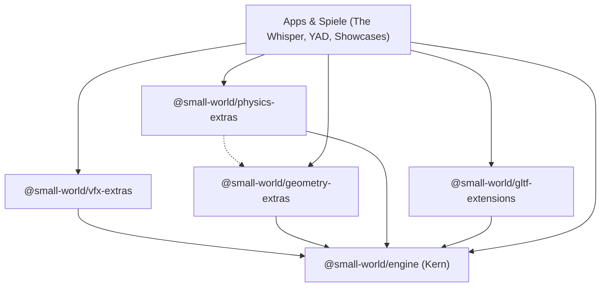

# Erweiterungen & Ökosystem

Small World verfolgt eine strikte Modularisierungsstrategie (siehe [ADR 0014](/adr/0014-modular-ecosystem-and-domain-layering), [ADR 0018](/adr/0018-gltf-data-level-extensions-and-ecosystem-package), [ADR 0021](/adr/0021-ecosystem-packages-exotic-geometry-and-physics) und [ADR 0022](/adr/0022-gpu-instanced-vfx-pipeline-and-extras-package)).

Die Kern-Engine (`@small-world/engine`) bleibt ultraleicht und enthält ausschließlich universelle Kernsysteme: Mathematik, Szenengraph, Kameras, Renderer, Passes, Standard-Shader, Kern-Primitive und Basiskollisionen. Alle domänenspezifischen, fortgeschrittenen oder datenintensiven Funktionen werden als **Ökosystem-Pakete** über NPM Workspaces bereitgestellt.

## Verfügbare Erweiterungspakete

| Paket | Verzeichnis | Beschreibung |
|---|---|---|
| [**`@small-world/vfx-extras`**](./vfx-extras.md) | `packages/vfx-extras/` | GPU-instanziierte Partikelsysteme, `ParticleMeshRenderer`, 10 universelle Kraftfeld-Affektoren, Akkretionsscheiben-Simulation und thermodynamische Strahlungskühlung. |
| [**`@small-world/geometry-extras`**](./geometry-extras.md) | `packages/geometry-extras/` | Exotische und prozedurale 3D-Geometrien: Supershapes, Torus-Knoten, Lathe-Drehkörper, Platonische Körper, Voronoi-Zellen, Marching Cubes und parametrische Flächen. |
| [**`@small-world/physics-extras`**](./physics-extras.md) | `packages/physics-extras/` | Höherstufige physikalische Zerstörungs- und Fraktursysteme (Voronoi-Bruch mit konvexen Kollisionskörpern). |
| [**`@small-world/gltf-extensions`**](./gltf-extensions.md) | `packages/gltf-extensions/` | Datenebenen-Dekoder und Kompressions-Plugins für glTF 2.0 (`KHR_draco_mesh_compression`, `KHR_texture_basisu`). |

---

## Architektur-Prinzipien

1. **Einseitige Abhängigkeiten:** Erweiterungspakete hängen von `@small-world/engine` ab — der Kern kennt seine Erweiterungen niemals direkt.
2. **Azyklische Kopplung:** Erweiterungspakete dürfen untereinander interagieren (z. B. `physics-extras` nutzt `geometry-extras`), sofern keine zirkulären Abhängigkeiten entstehen.
3. **Zero Tree-Shaking Waste:** Entwickler binden nur die Erweiterungen ein, die ihre Anwendung tatsächlich benötigt.
