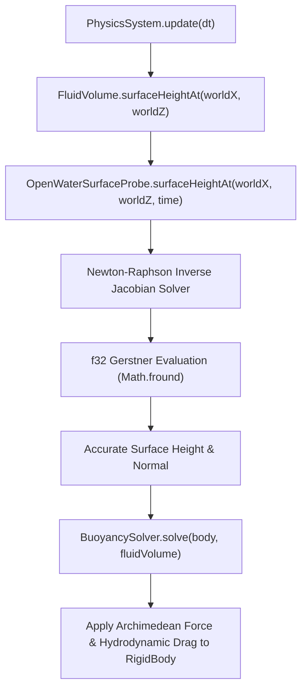

# Liquid Wave Data Model & Surface Simulation

This document provides the canonical specification for the wave data model, mathematical formulations, shader architecture, CPU surface probing, interactive splat propagation, and physics buoyancy integration across Small World.

---

## 1. Mathematical Foundation: Gerstner Wave Cascade

Small World implements an analytical Gerstner wave cascade formulation supporting true 3-backend parity (**GLSL 3.00 ES / WebGL2**, **GLSL 1.00 ES / WebGL1**, and **WGSL / WebGPU**).

### 1.1 Deep-Water Dispersion Relation

For gravity-driven deep-water surface waves, angular frequency $\omega$ is governed by the dispersion relation:

$$\omega = \sqrt{g \cdot k}, \quad g = 9.81 \, \text{m/s}^2$$

Where:
- Wave vector length (wavenumber): $k = \frac{2\pi}{\max(\lambda, 0.001)}$ (with wavelength $\lambda$ in meters)
- Normalized propagation direction: $\mathbf{d} = (d_x, d_z)$ with $\|\mathbf{d}\| = 1$
- Steepness parameter: $S \in [0, 1]$
- Wave amplitude: $a = \frac{S}{\max(k, 0.001)}$
- Phase argument: $\phi = k(\mathbf{d} \cdot \mathbf{p}_{xz}) - \omega \cdot \text{speed} \cdot t$

### 1.2 Analytical Displacement & Jacobian Derivatives

For a single wave component $i$, the displacement vector $\Delta \mathbf{p}_i$ applied to an initial rest vertex $\mathbf{p} = (x, y_0, z)$ is:

$$\Delta \mathbf{p}_i = \begin{pmatrix} d_{i,x} \cdot a_i \cdot \cos \phi_i \\ a_i \cdot \sin \phi_i \\ d_{i,z} \cdot a_i \cdot \cos \phi_i \end{pmatrix}$$

Total vertex position after summing $N$ waves is:

$$\mathbf{p}' = \mathbf{p} + \sum_{i=1}^N \Delta \mathbf{p}_i$$

The surface tangent $\mathbf{t} = \frac{\partial \mathbf{p}'}{\partial x}$ and bitangent $\mathbf{b} = \frac{\partial \mathbf{p}'}{\partial z}$ are computed analytically in shader chunk `liquid_gerstner_wave`:

$$\mathbf{t} = \begin{pmatrix} 1 - \sum d_{i,x}^2 \cdot S_i \cdot \sin \phi_i \\ \sum d_{i,x} \cdot S_i \cdot \cos \phi_i \\ -\sum d_{i,x} d_{i,z} \cdot S_i \cdot \sin \phi_i \end{pmatrix}, \quad \mathbf{b} = \begin{pmatrix} -\sum d_{i,x} d_{i,z} \cdot S_i \cdot \sin \phi_i \\ \sum d_{i,z} \cdot S_i \cdot \cos \phi_i \\ 1 - \sum d_{i,z}^2 \cdot S_i \cdot \sin \phi_i \end{pmatrix}$$

The analytical surface normal $\mathbf{n}$ is obtained via the normalized cross product:

$$\mathbf{n} = \text{normalize}(\mathbf{b} \times \mathbf{t})$$

### 1.3 6-Wave Cascade Composition ($2+1+2+1$)

To minimize uniform traffic while preventing directional repetition, the cascade derives 6 coherent wave components from 3 primary uniform inputs:

1. **Primary Waves ($w_1, w_2$):** Dominant directional swell supplied via uniforms `u_wave1` and `u_wave2` ($\text{dir}_x, \text{dir}_z, \text{steepness}, \lambda$).
2. **Harmonic Wave ($w_3$):** High-frequency secondary wave supplied via `u_wave3`.
3. **Perpendicular Detail Waves ($w_4, w_5$):** Derived in the vertex stage by rotating $w_1$ and $w_2$ by $90^\circ$ with scaled amplitude and wavelength:
   $$w_4 = (w_{1.y}, -w_{1.x}, w_{1.z} \cdot 0.45, w_{1.w} \cdot 0.42)$$
   $$w_5 = (-w_{2.y}, w_{2.x}, w_{2.z} \cdot 0.35, w_{2.w} \cdot 0.35)$$
4. **Cross-Swell Wave ($w_6$):** Derived in the vertex stage by rotating $w_1$ by $60^\circ$:
   $$w_6 = (w_{1.x} \cdot 0.5 - w_{1.y} \cdot 0.866, \, w_{1.x} \cdot 0.866 + w_{1.y} \cdot 0.5, \, w_{1.z} \cdot 0.25, \, w_{1.w} \cdot 0.22)$$

---

## 2. Crest & Foam Metrics

### 2.1 Analytical Jacobian Crest Detection

Wave crest sharpness and physical self-intersection (wave breaking) are determined using the vertical determinant of the surface Jacobian matrix:

$$J = t_x \cdot b_z - t_z \cdot b_x$$

- When $J > 0$, the surface is smooth and non-overlapping.
- When $J \to 0$ or $J < 0$, the wave crest is folding over itself.

The normalized crest factor $v_{\text{crest}}$ passed to the fragment stage is:

$$v_{\text{crest}} = \text{clamp}\left(\frac{1.0 - J}{\max(\sum S_i, 0.001)}, -1.0, 1.0\right)$$

In the fragment shader, crest foam is evaluated smoothly:

$$\text{foam}_{\text{crest}} = \text{smoothstep}(\text{CREST\_FOAM\_LOW}, \text{CREST\_FOAM\_HIGH}, v_{\text{crest}}) \cdot \text{noisePattern} \cdot \text{CREST\_FOAM\_INTENSITY}$$

---

## 3. Interactive Dynamics: Splats & Boundary Clapotis

### 3.1 S2 Surface Splat Ripples

Dynamic point disturbances (falling rain, footsteps, projectile impacts) are emitted via `liquid.emitSplat(worldX, worldZ, time, energy)`:

- **Transport:** Packed into the registered `u_styleA` lane as $\mathbf{s} = (x_0, z_0, t_{\text{spawn}}, E)$.
- **Vertex Evaluation:** Computes an outward-propagating, decaying ring wave:
  $$r = \|\mathbf{p}_{xz} - \mathbf{s}_{xz}\|$$
  $$\Delta t = \max(t - \mathbf{s}_t, 0.0)$$
  $$\text{front} = \Delta t \cdot v_{\text{wave}}$$
  $$\text{disp} = \sin((r - \text{front}) \cdot \omega_{\text{splat}}) \cdot e^{-\gamma \Delta t} \cdot \mathbf{s}_E \cdot \text{mask}(r, \text{front})$$

```mermaid
flowchart LR
    Event["Gameplay / Drop Impact"] -->|emitSplat(x, z, t, E)| Mat["LiquidWaveMaterial"]
    Mat -->|getRenderManifest()| UBO["ObjectUniforms (u_styleA)"]
    UBO -->|GPU Vertex Stage| Vert["OpenWater.vert.* / StylizedWater.vert.*"]
    Vert -->|Ring Wave Displacement| Surface["Displaced Water Surface"]
```

### 3.2 S3 Boundary Clapotis (Wall Reflections)

Enclosed basins and pool walls cause standing waves (*clapotis*). Rather than requiring additional uniforms or dynamic FBO ping-ponging, wall reflections are computed analytically in vertex shaders from `u_worldBounds`:

1. Surface bounds $[x_{\min}, z_{\min}, x_{\max}, z_{\max}]$ define wall planes with normals $\mathbf{n}_{\text{wall}}$.
2. For wave direction $\mathbf{d}_{\text{inc}}$, the reflected wave direction is:
   $$\mathbf{d}_{\text{ref}} = \mathbf{d}_{\text{inc}} - 2(\mathbf{d}_{\text{inc}} \cdot \mathbf{n}_{\text{wall}})\mathbf{n}_{\text{wall}}$$
3. Reflected wave contributions are faded based on distance to the boundary wall, forming standing wave nodes and antinodes ($2A$ amplitude near the wall).

---

## 4. CPU Surface Probing & Buoyancy Data Flow

To allow gameplay objects and physics bodies to float realistically without GPU readback latency, the CPU implements an exact mirror of the vertex shader mathematics.



### 4.1 Precision Alignment (`Math.fround`)

Because JavaScript uses 64-bit float numbers (`double`) while GPU shaders evaluate in 32-bit floats (`highp f32`), the `OpenWaterSurfaceProbe` enforces single-precision semantics using `Math.fround`:

- Parity tolerance between `OpenWaterSurfaceProbe` and GPU transform feedback is verified at $< 0.12 \, \text{mm}$ across standard test suites (`npm run probe:gpu-parity`).

### 4.2 Horizontal Inverse Solving (Newton-Raphson)

Because Gerstner waves displace vertices horizontally as well as vertically:

$$\mathbf{x}_{\text{world}} = \mathbf{x}_{\text{rest}} + \mathbf{D}_{xz}(\mathbf{x}_{\text{rest}}, t)$$

To find the surface height at an arbitrary horizontal position $(x_{\text{target}}, z_{\text{target}})$, `surfaceHeightAt` solves for the rest position $\mathbf{x}_{\text{rest}}$ using Newton-Raphson iteration with the analytical Jacobian matrix:

$$\mathbf{x}_{n+1} = \mathbf{x}_n - \mathbf{J}^{-1}(\mathbf{x}_n) \cdot (\mathbf{x}_n + \mathbf{D}_{xz}(\mathbf{x}_n) - \mathbf{x}_{\text{target}})$$

---

## 5. 256-Byte Uniform Moat & Memory Layout

In compliance with **ADR 0026**, the per-object uniform buffer (`ObjectUniforms`) is capped at exactly 256 bytes (16 `vec4` registers).

| Reg | Offset | Name | Type | OpenWater Semantic | StylizedWater Semantic | FluidSurface Semantic |
|---|---|---|---|---|---|---|
| `0..3` | `0..63` | `u_modelMatrix` | `mat4` | World Transform Matrix | World Transform Matrix | World Transform Matrix |
| `4..7` | `64..127` | `u_normalMatrix` | `mat4` | Normal Transform Matrix | Normal Transform Matrix | Normal Transform Matrix |
| `8` | `128..143` | `u_color` | `vec4` | `shallowWaterColor` (RGB) + $\alpha$ | `shallowWaterColor` (RGB) + specMult | `baseColor` (RGBA) |
| `9` | `144..159` | `u_specColor` | `vec4` | `deepWaterColor` (RGB) + $\alpha$ | `deepWaterColor` (RGB) + causticStrength | `specularColor` (RGBA) |
| `10` | `160..175` | `u_texOffsetRepeat` | `vec4` | `[edgeColor.rg, edgeColor.b, edgeSoftness]` | `[edgeColor.rg, edgeColor.b, edgeSoftness]` | `[uvOffset.xy, uvRepeat.xy]` |
| `11` | `176..191` | `u_matParamsA` | `vec4` | `[refrStr, abs.r, abs.g, abs.b]` | `[refrStr, abs.r, abs.g, abs.b]` | `[shininess, emissiveMask, pulseAmp, pulseSpeed]` |
| `12` | `192..207` | `u_matParamsB` | `vec4` | `[foam.r, foam.g, foam.b, foamCutoff]` | `[foam.r, foam.g, foam.b, foamCutoff]` | `[softness, shadeStr, normalStr, absorption]` |
| `13` | `208..223` | `u_matParamsC` | `vec4` | `[foamScale, foamSpeed, foamDist, pad]` | `[foamScale, foamSpeed, foamDist, pad]` | `[rimStr, specStr, normalScale, pad]` |
| `14` | `224..239` | `u_styleA` | `vec4` | `[splatX, splatZ, spawnTime, splatEnergy]` | `[rampSoft, washAmt, lineDensity, lineWidth/splat]` | `[emissive.r, time, flowSpeed, noiseScale]` |
| `15` | `240..255` | `u_styleB` | `vec4` | `[pad0, pad1, pad2, pad3]` | `[foamSoft, skyTint, glitterStr, styleId]` | `[pad0, pad1, emissive.g, emissive.b]` |

### 5.1 Ramp LUT (`StylizedWaterMaterial.rampMap`)

Route (a) of ADR 0026: a 256×1 colour ramp texture instead of more uniforms. Build it with `new RampLUT(stops)` (sRGB stops, baked by the pure function `bakeRamp`) and assign `material.rampMap = lut.texture`; `lut.setStops(...)` re-bakes in place. Notes:

- While a ramp is bound (`USE_RAMP_LUT`), it replaces the shallow/mid/deep blend at a constant weight of 0.6 and `rampSoftness` is ignored. Without a ramp the shader output is unchanged.
- Sampled at texel centres; filtering is always linear, wrapping always clamp (WebGPU shares one sampler per material).
- WebGL1 indexes the ramp by a view-angle (Fresnel) term, WebGL2/WebGPU by water depth, so the look differs between WebGL1 and the others by design.
- `quality.disableTextures` turns every texture white, so a bound ramp renders bleached there.
- WebGPU: `u_rampMap` always occupies binding 18 (white fallback when unset); OpenWater ignores it.

---

## 6. Architectural Guardrails & Invariants

1. **256-Byte Uniform Moat (ADR 0026):**
   - The per-object uniform buffer is strictly capped at 256 bytes (16 `vec4` registers) to guarantee WebGL1 fragment uniform compliance.
   - Any parameter addition must pass through registered lane repurposing or compile-time shader constants.
2. **Zero-Allocation Manifests:**
   - Calling `getRenderManifest()` on any `LiquidWaveMaterial` or `FluidSurfaceMaterial` executes without heap allocations on hot render loops (`LiquidZeroAlloc.test.ts`).
3. **No Global State:**
   - Surface probes and fluid volumes are tied to specific `Scene` and `PhysicsSystem` instances, supporting multi-engine and split-screen setups without shared singletons.
