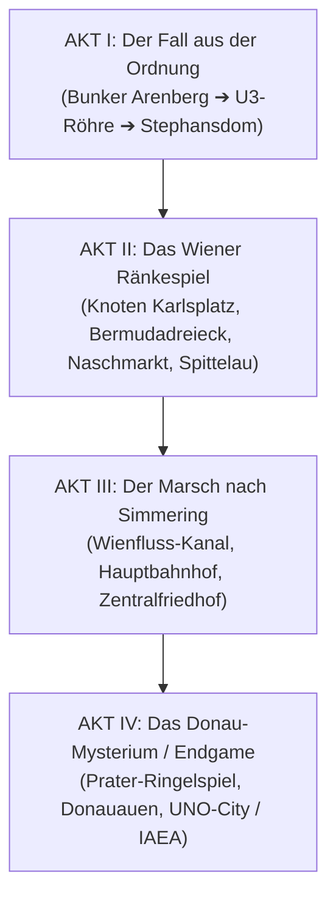

# Master-Dramaturgie: „A schene Leich fürn Großvater“ (And Now?)

> **Kanonischer Handlungsbogen für das postapokalyptische Wien-Projekt.**
> Verbindung der persönlichen Motivation (die Beisetzung des Großvaters) mit dem politischen Fraktionsgefüge und dem übergeordneten nuklearen Weltgeheimnis der IAEA.

---

## 🌟 Übersicht & Dramaturgie-Diagramm

---

## 🏛️ AKT I: Der Fall aus der Ordnung
*Schauplätze: Bunker Arenberg (Flakturm), U3-Tunnel (Schlachthausgasse / Rochusgasse), Stephansdom & Katakomben.*

### 1. Prolog & Die Tat im Bunker Arenberg
* **Der Verlust:** Der Großvater stirbt im stickigen, von Schimmel und sterilen Neonröhren erleuchteten Bunker Arenberg. Er war die letzte Verbindung der Spielfigur zur Erinnerung an die alte Welt (Kaffeehauskultur, Prater, echter Sommerregen).
* **Die bürokratische Schikane:** Das Amt für Zivilschutz (AZS) ordnet nach *§44/B („Effizienz in der Biomasse-Verwertung“)* die sofortige Überstellung des Leichnams in die chemischen Zersetzungsbecken von „Sektor 0“ an.
* **Der unumkehrbare Bruch:** Die Spielfigur verweigert die Entehrung, bricht nachts in die Asservatenkammer ein und stiehlt die Buntmetall-Urne / die sterblichen Überreste.
* **Die Flucht:** Verfolgt vom AZS-Ordnungsdienst flieht die Spielfigur durch einen vergitterten Notüberlauf in den alten U3-U-Bahn-Schacht.

### 2. Die Finsternis der U3 & Der erste Gefährte
* **Gefahren im Tunnel:** Dunkelheit, eingestürzte Betonträger und das erste Aufeinandertreffen mit mutierten *Wienfluss-Bibern / U-Bahn-Riesenratten*.
* **Begegnung mit „Strizzi“:** In einer verlassenen Stations-Kantine rettet die Spielfigur den einäugigen, drahtigen Donaukanal-Terrier vor einem Rattenrudel. Strizzi schließt sich als treuer Spür- und Kampfbegleiter an.

### 3. Ankunft im Herzen der Ruinenstadt (Stephansplatz)
* **Der Durchbruch:** Der Schacht mündet in die Katakomben des teils eingestürzten **Stephansdoms („Steffl“)**.
* **Die Erkenntnis:** Der Weg nach Simmering zum Zentralfriedhof ist lang, toxisch und von Fraktionen abgeriegelt. Zudem erfährt die Spielfigur von einem Wanderprediger: Ohne spezielles **Einbalsamierungs-Balsam** wird der Leichnam die Hitze der Tunnel nicht überstehen, und die *Pompfinebrer* verweigern verwesenden Kadavern die Aufnahme.

---

## 🎭 AKT II: Das Wiener Ränkespiel
*Schauplätze: Karlsplatz-Passage, Bermudadreieck, Narrenturm, Neues AKH, Naschmarkt, Müllverbrennung Spittelau, TU Wien & Kahlenberg.*

### 1. Die Untergrund-Metropole Karlsplatz
* **Der Schmelztiegel:** Die Opernpassage unter dem Karlsplatz ist der neutrale Hauptknotenpunkt Wiens. Händler, Musiker, Kuriere und Spione treffen hier aufeinander.
* **Neue Verbündete:**
  * **Ignaz (Der grantige Totenkutscher):** Ein verstoßener Ex-Pompfinebrer mit zweirädrigem Lastenkarren, der im Suff über den Ober-Kondukteur schimpft, aber jeden Geheimpfad nach Simmering kennt.
  * **Alois (Der Botschafts-Chauffeur):** Ein nobler Konsulats-Spion im abgewetzten Chauffeursfrack, der diskrete Hilfe anbietet – gegen Gegenleistung.

### 2. Der Pakt im Bermudadreieck (Die Giftmischer)
* **Abstieg in den 1. Bezirk:** In den tiefen Kellergewölben und Clubs des Bermudadreiecks residiert die akademische Pharmazie-Elite.
* **Die Quest des Primars:** Das rituelle Konservierungs-Öl gibt es nur gegen seltene Chemikalien und Reagenzien:
  * *Formaldehyd & historische Proben* aus dem gespenstischen **Narrenturm** (Altes AKH).
  * *Narkotika-Reste & OP-Ausrüstung* aus den verseuchten Betten-Türmen des **Neuen AKH** am Gürtel.
* **Rekrutierung von Dr. Valerie:** Die desillusionierte Chef-Pharmazeutin schließt sich der Gruppe an, um dem Drogenrausch des Bermudadreiecks zu entkommen.

### 3. Die Diplomatie des Konsulats & Der Naschmarkt-Passierschein
* **Die Blockade:** Die oberirdische Wienzeile und der **Naschmarkt-Basar** sind vom Konsulat und AZS-Schleusen abgeriegelt.
* **Die Spionage-Gefälligkeit:** Der *Doyen* des Konsulats verlangt die Beschaffung alter Abhörbänder von der **TU Wien / Karlskirche** sowie aus der Relaisstation am **Kahlenberg**.
* **Entscheidungskonflikt in Spittelau:** Die *Wächter von Spittelau* drohen, dem Bermudadreieck die Fernwärme abzudrehen, falls keine Schrottfilter aus dem Naschmarkt geliefert werden. Der Spieler muss Allianzen ausbalancieren.

### 4. Der Abstecher an den Gürtel (Die Gürtelbögen)
* **Die Jagd nach Schwarzmarkt-Präparaten & Kontakten:** Auf dem Weg zwischen dem Alten AKH (Narrenturm) und dem Neuen AKH muss die Spielfigur die berüchtigten **Gürtelbögen** (Stadtbahnbögen) durchqueren.
* **Rotlicht & Glücksspiel:** In den verrauchten Bogenlokalen trifft die Spielfigur auf Hehler, Zuhälter, Straßenmusiker und Informanten. Hier kann man illegales Destillat (*„Gürtel-Fusel“*) gegen Informationen tauschen oder im Hinterzimmer an gezinkten Würfelspielen teilnehmen.
* **Der Schutzgeld-Konflikt:** Die Spielfigur gerät zwischen die Fronten einer Schlägerei zwischen der lokalen Bogen-Bande und Schlägern des Prater-Ringelspiel-Syndikats.

### 5. Der vertikale Ozean (Das Haus des Meeres)
* **Die Algen-Expedition:** Für das rituelle Konservierungs-Öl verlangen die Giftmischer eine extrem seltene Tiefsee-Algenart, die nur in den überfluteten, brackigen Tiefbecken des **Hauses des Meeres (Flakturm Esterházypark)** überlebt hat.
* **Der 11-Stockwerke-Aufstieg:** Kletterpartie vorbei an geborstenen Haibecken, schleimigen Amphibien-Jägern und Geier-Schwärmen auf der Geschütz-Dachterrasse.

---

## ⚰️ AKT III: Der Marsch nach Simmering
*Schauplätze: Jugendstil-Wienfluss-Portal (Stadtpark), Hauptbahnhof-Trümmerfeld, Zentralfriedhof & Bestattungsmuseum (Simmering).*

### 1. Durch die Eingeweide der Stadt
* **Der Wienfluss-Tunnel:** Mit Ignaz' Karren, der frisch einbalsamierten Urne und der Ausrüstung zieht die Gruppe durch die monumentalen, hallenden Jugendstil-Kanalbögen unter dem Stadtpark hindurch.
* **Schlachtfeld Hauptbahnhof:** Das skelettierte Rautendach des Hauptbahnhofs ist ein gefährliches Niemandsland aus Plünderern und Railjet-Barrikaden.

### 2. Ankunft am Zentralfriedhof (Tor 2)
* **Die Pforten der Pompfinebrer:** Unendliche Alleen verwilderter Gräber, neblige Monumente und bewaffnete „Schaufler“ in staubigen Fräcken.
* **Die Prüfung des Ober-Kondukteurs:**
  * **Pfad A („A schene Leich“ - Hoher Ruf):** Die Spielfigur säubert geschändete Ehrengräber von Plünderern und birgt Prunksärge aus dem Bestattungsmuseum. Belohnung: Eine feierliche, sakrale Beisetzungszeremonie in der Friedhofskirche zum Hl. Karl Borromäus mit Weihrauch und Geleit.
  * **Pfad B („Nacht-und-Nebel-Begräbnis“ - Niedriger Ruf / Verfeindet):** Eine hochdramatische Schleich- und Feuerkampf-Operation bei Nacht, um die Urne heimlich in der Familiengruft zu vergraben.

### 3. Die Enthüllung an der Gruft
* **Das Vermächtnis:** Beim Einsetzen der Urne in die Grabnische öffnet sich ein verborgener Doppelboden der Urne (oder der Familiengruft).
* **Der Fund:** Eine versiegelte, strahlungssichere **Diplomaten-Keycard der IAEA** und ein handgeschriebenes Tagebuch des Großvaters.
* **Die Wahrheit:** Der Großvater war vor dem Schlag leitender Sicherheitselektroniker der UN-Atomenergiebehörde im Vienna International Centre. Auf der Keycard befindet sich der Master-Zugangscode für das versiegelte Hauptarchiv der **UNO-City** jenseits der Donau.

---

## 🎡 AKT IV: Das Donau-Mysterium & Das Endgame
*Schauplätze: Wurstelprater & Riesenrad, Donauauen & Reichsbrücke, UNO-City / IAEA (Donauplatte).*

### 1. Der Sündenpfuhl Prater & Das Ringelspiel-Syndikat
* **Die einzige Donau-Passage:** Die Reichsbrücke und Fährrouten werden von der Schausteller-Mafia des Ringelspiel-Syndikats kontrolliert.
* **Infiltration der Geisterbahn:** Gemeinsam mit dem abtrünnigen Kasperl-Puppenspieler schleicht sich die Gruppe durch die mit tödlichen Fallen gespickten Kulissen des Wurstelpraters.
* **Der Showdown am Riesenrad:** Verhandlung oder Gefecht mit der *Ringelspiel-Baronin* in den schaukelnden Waggons des Riesenrads, um Boote für die Donauüberquerung freizuschalten.

### 2. Die Donauauen, der Ölhafen Lobau & Die Aupackler
* **Die Wildnis & das rostige Tanklager:** Überquerung der Donau und Durchquerung der Auen. 
* **Der Treibstoff-Heist im Ölhafen Lobau:** Um Energiegeneratoren für die schweren Panzertüren der UNO-City oder Treibstoff für Boote zu sichern, muss die Spielfigur den schwer umkämpften **Ölhafen Lobau** infiltrieren.
* **Konfrontation in den Schilfgürteln:** Konfrontation mit den fallenstellenden, wilden *Aupacklern* und mutierten *Schönbrunner Prachtkatzen* zwischen leckenden Öltanks und brennenden Fackeltürmen.

### 3. Die Festung UNO-City (IAEA)
* **Die verbotene Zone:** Die futuristischen Y-Bauten der UNO-City stehen unberührt und unheimlich auf der Donauplatte, gesichert durch noch aktive autonome Geschütze und Protokoll-Roboter.
* **Das nukleare Archiv:** Die Spielfigur nutzt die Keycard des Großvaters und dringt in das tiefste Sicherheits-Gewölbe der IAEA vor.
* **Die Enthüllung des Tages des Schlags:** 
  * Das Archiv lüftet das Geheimnis der Katastrophe: Kein gezielter feindlicher Erstschlag hat die Welt vernichtet, sondern ein kaskadierender **automatisierter Fehlalarm der nuklearen Frühwarnsysteme**, der von den verbarrikadierten Mächten bis zuletzt vertuscht wurde.
  * Das Archiv birgt zudem die vollständigen Geodaten über saubere Wasserquellen, funktionierende Reaktoren und Saatgut-Tresore in ganz Mitteleuropa.

### 4. Epilog: Der Blick vom Donauturm
* **Das Schicksal Wiens:** Die Spielfigur entscheidet, wem dieses unschätzbare Wissen anvertraut wird:
  * *Dem Konsulat* (Reorganisation der Diplomatie und Ordnung).
  * *Den Alchimisten / der TU Wien* (Wissenschaftlicher Wiederaufbau und Heilung).
  * *Verteilung an alle Fraktionen am neutralen Stephansplatz*.
* **Schlussbild:** Die Spielfigur steht auf der Aussichtsplattform des Donauturms. Im Abendlicht liegt das zerschundene, aber stolze Wien. Ein Schluck Muckefuck-Kaffee, Strizzi bellt den Wind an. Der Großvater hat seinen Frieden gefunden.
